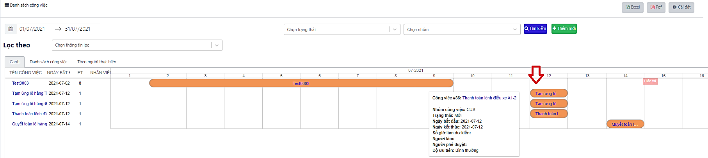

# PHỤ LỤC

<table data-header-hidden><thead><tr><th width="199.33333333333331"></th><th></th><th></th></tr></thead><tbody><tr><td><strong>Kí hiệu</strong></td><td><strong>Diễn giải</strong></td><td><strong>Chú ý</strong></td></tr><tr><td>*</td><td>Các nội dung bắt buộc</td><td>00000000</td></tr><tr><td></td><td>Xem chi tiết</td><td></td></tr><tr><td></td><td>Cập nhật thông tin</td><td></td></tr><tr><td></td><td>Xóa thông tin</td><td></td></tr><tr><td></td><td>Xuất file excel</td><td></td></tr><tr><td></td><td>Xuất file PDF</td><td></td></tr><tr><td></td><td>In</td><td></td></tr><tr><td>

</td><td>
Cài đặt thông tin hiển thị trên màn hình

Bao gồm:
<ul><li>Ẩn hiện cột:</li><li>Sắp xếp vị trí:</li><li>Thay đổi độ rộng:</li></ul></td><td></td></tr></tbody></table>
