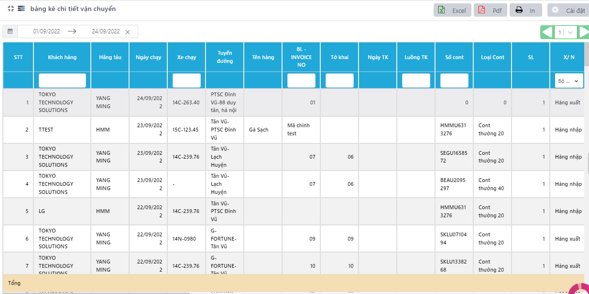
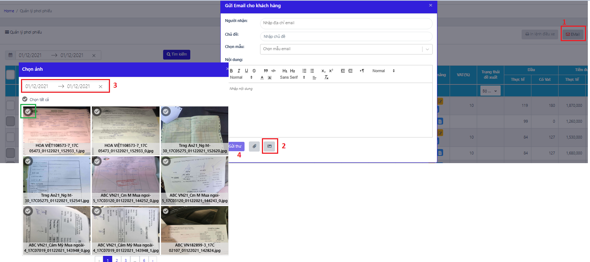

# 1. HÀNH CHÍNH

### 1.1 **Cài đặt công việc** 

Là chức năng phụ trợ, cho phép người dùng cài đặt: nhóm công việc, loại công việc, mức độ

\+ Các nhóm công việc: phụ thuộc vào các đặt của công ty, doanh nghiệp - theo bộ phận, dự án, …; quản lý người dùng trong từng nhóm công việc.

.png>)

Mỗi một nhóm công việc sẽ có 1 nhóm người dùng tương ứng, có quyền được truy cập và thêm thông tin công việc vào nhóm. Cách quản lý người dùng trong nhóm công việc:

Bước 1: Tại cột Số lượng người dùng, nhấn vào dòng người dùng tương ứng nhóm muốn quản lý

Bước 2: Nhấn nút Thêm người dùng vào nhóm 🡪 Tích chọn người dùng trong danh sách hiển thị🡪 Lưu

Bước 3: Xóa người dùng khỏi nhóm (nếu cần).

.png>)

\+ Loại công việc: phụ thuộc vào các đặt của công ty, doanh nghiệp- mặc định: hợp đồng, tạm ứng, thanh toán, báo giá

<figure><figcaption>
<em><strong>Màn hình cài đặt loại công việc</strong></em>
</figcaption></figure>

\+ Các mức độ ưu tiên: phân chia thứ tự ưu tiên để hoàn thành công việc- Cực cao, cao, bình thường, thấp, cực thấp, …

<figure><figcaption>
<em><strong>Màn hình cài đặt các mức độ ưu tiên</strong></em>
</figcaption></figure>

### **1.2 Danh sách công việc** 

Bao gồm 3 màn hình chính: Biểu đồ gantt quản lý tiến độ chung công việc chung của một dự án/ bộ phận, Bảng danh sách công việc chi tiết, Biểu đồ gantt thể hiện tiến độ công việc theo từng cá nhân.

<figure><figcaption>
<em><strong>Biểu đồ gantt theo công việc</strong></em>
</figcaption></figure>

Người dùng quản lý các đầu công việc và tiến độ của từng công việc theo biểu đồ.

\- Có thể di chuyển chuột tới từng nội dung để xem thêm chi tiết

<figure><figcaption>
<em><strong>Màn hình Danh sách công việc</strong></em>
</figcaption></figure>

#### **1.2.1 Thêm mới công việc** 

Công việc có thể tạo mới theo 2 cách: trực tiếp tại Quản lý công việc hoặc gián tiếp chuyển từ các bảng khác vào.

* _**Cách 1: Thêm mới trực tiếp**_

Bước 1: Nhấn vào nút Thêm mới

Bước 2: Nhập thông tin trong bảng thêm mới công việc🡪 Lưu.

* Nhập các trường bắt buộc \*
* Công việc cha: Được hiểu như 1 Công việc bao quát chung/ 1 dự án/ 1 mục của dự án. Khi chọn Công việc cha, có nghĩa là Công việc thêm mới là một trong số những công việc nhỏ nằm trong Công việc cha.
* Nhập file: Cho phép người dùng đưa lên 1 file bất kỳ có liên quan tới công việc đang tạo.

.png>)

* _**Cách 2: Thêm mới gián tiếp**_

Người dùng có thể thêm mới công việc gián tiếp từ các bảng:

#### **1.2.2 Cập nhật nội dung** 

Có 4 cách để cập nhật nội dung công việc.

<figure><figcaption>
<em><strong>Màn hình lịch sử thay đổi</strong></em>
</figcaption></figure>

* **Cách 3:** Trong màn hình Gantt🡪 Nhấn chuột vào nội dung công việc trên thanh gantt 🡪 Nhấn nút cập nhật .png>)
* **Cách 4:** Đối với công việc tạo gián tiếp từ tạm ứng và phơi phiếu, người dùng có thể sửa đổi trực tiếp trong chi tiết tạm ứng lô hàng và trong lệnh điều xe và nhấn lại nút đề xuất🡪 phần mềm tự tạo thêm 1 file cập nhật đưa vào lịch sử thay đổi của lô hàng.

#### **1.2.3 Lá»c thông tin** 

Người dùng có thể lọc các thông tin theo:

* Người phê duyệt/ Người thực hiện tại ô 1
* Theo trạng thái công việc tại ô số 2
* Theo nhóm công việc tại ô số 3

Người dùng cũng có thể theo dõi công việc cho từng cá nhân và tiến độ công việc của họ bằng cách nhấn sang tab Theo người thực hiện

### **1.3 Phê duyệt** 

#### **1.3.1 Quản lý đỠxuất** 

<figure><figcaption>
<em><strong>Màn hình quản lý đỠxuất</strong></em>
</figcaption></figure>

Bước 1: Trong chức năng **Phê duyệt**, chọn tab **Đề xuất**

Bước 2: Nhấn nút Thêm mới🡪 Nhập thông tin cần phê duyệt, tải file đính kèm bằng cách nhấn nút .png>) (nếu có).

Bước 3: nhấn Lưu để chuyển tiếp đề xuất sang người phê duyệt.

.png>)

#### **1.3.2 Phê duyệt đỠxuất** 

Bao gồm các đề xuất mà người đăng nhập là: Người yêu cầu hoặc người duyệt.

.png>)

Để thêm nội dung phê duyệt, người dùng chá»n nút  và nhập nội dung.

Để duyệt đề xuất, người dùng nhấn nút .png>) để chuyển trạng thái phê duyệt, chuyển duyệt.
