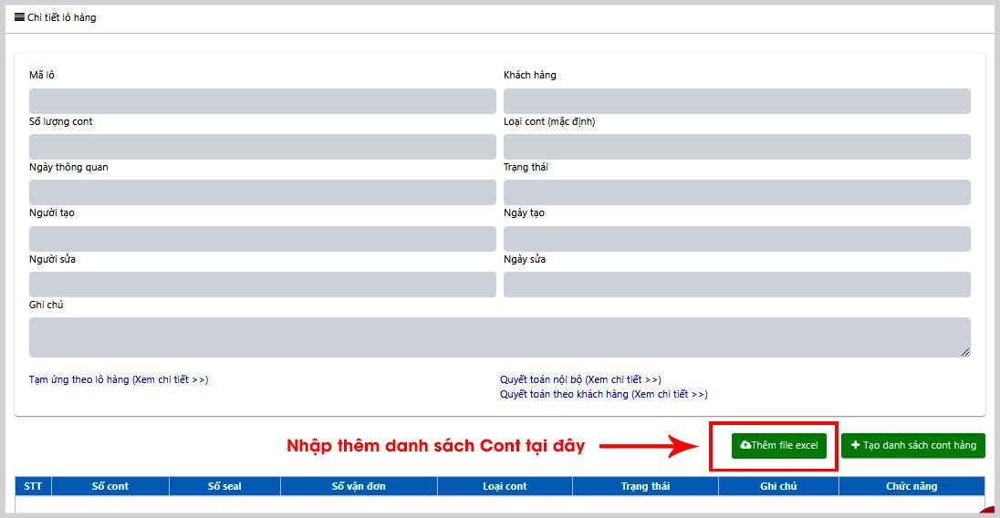
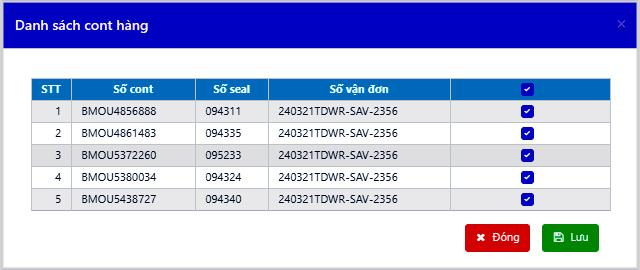
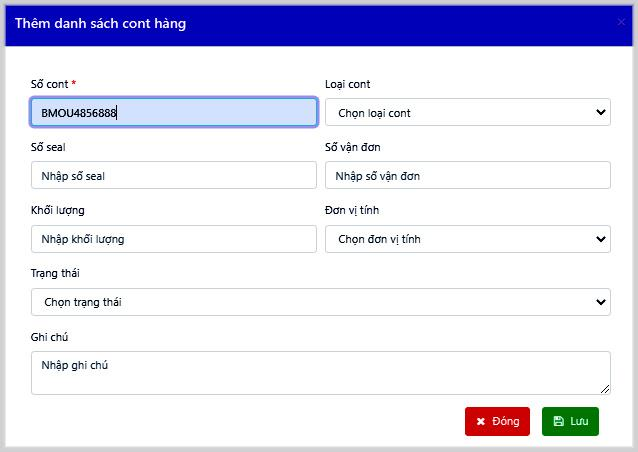
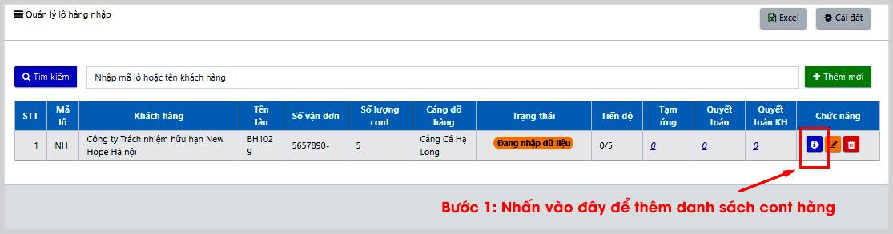
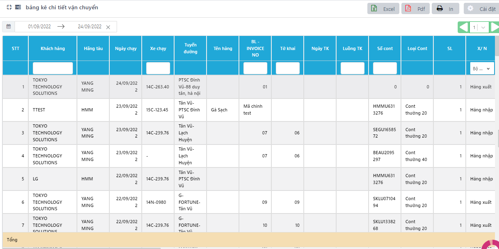

# 2. BỘ PHẬN CUS

### **2.1 Quản lý lô hàng đủ/ rút gọn** 

Nghiệp vụ quản lý lô hàng của bộ phận CUS được chia làm 2 loại, quản lý lô hàng (đủ) và quản lý lô hàng (rút gọn). Tùy tính chất của từng lô hàng mà bộ phận CUS có thể tạo lập lô hàng mới ở từng mục quản lý cho phù hợp.

Sự khác biệt của Quản lý lô hàng (đủ) và Quản lý lô hàng (rút gọn):

<table data-header-hidden><thead><tr><th width="125.33333333333331"></th><th></th><th></th></tr></thead><tbody><tr><td></td><td><strong>Quản lý lô hàng (đủ)</strong></td><td><strong>Quản lý lô hàng (rút gọn)</strong></td></tr><tr><td>Trường hợp sử dụng</td><td>Lô hàng xuất-nhập có liên quan đến thông quan. Doanh nghiệp vận tải quản lý từ bước lên tạm ứng, làm thông quan cho lô đến quyết toán lô</td><td>Lô hàng khu CN, hàng rời,...(thường là hàng nội địa), không liên quan đến cảng, doanh nghiệp vận tải không phụ trách phần thông quan lô đó</td></tr><tr><td>Thông tin</td><td>
Kiểm soát thông tin chi tiết hơn: Loại hàng, Tên hàng, Hãng tàu (hàng cont), Tên tàu (hàng rời), ...

Các loại lô hàng quản lý:
<ul><li>Hàng KD nhập</li><li>Hàng KD xuất</li><li>Hàng nội địa (*Thông tin bắt buộc nhập ít nhất)</li></ul></td><td>
Kiểm soát ít thông tin chi tiết hơn.

Các loại lô hàng quản lý:
<ul><li>Hàng KCN Nhập</li><li>Hàng KCN Xuất</li><li>Hàng nội địa</li></ul></td></tr><tr><td>Mối quan hệ với kế hoạch điều xe</td><td>Trạng thái mặc định là <strong>Đang nhập dữ liệu</strong> (trạng thái chưa thể điều xe), khi nhập đủ thông tin, bộ phận CUS chuyển thủ công trạng thái lô hàng sang <strong>Có thể vận chuyển</strong></td><td>Trạng thái lô hàng khi tạo mới mặc định là <strong>Có thể vận chuyển</strong>, người dùng có thể lên kế hoạch điều xe ngay sau khi tạo xong lô hàng</td></tr></tbody></table>

#### **2.1.1 Tạo mới lô hàng** 

Sau khi ký hợp đồng, nhân viên dịch vụ khách hàng (CUS) bắt đầu nhập thông tin lô hàng vào hệ thống. Thông tin lô hàng sẽ được tự động đồng bộ sang các bộ phận khác ở quy trình sau như điều xe, kế toán, điều hành, ...

Bước 1: Trong thanh menu bên trái, tại mục **Điều hành**🡪 nhấn chọn **Quản lý lô hàng đủ/ rút gọn** tùy theo mục đích quản lý

Bước 2: Nhấn nút .png>) 🡪 Điền các thông tin vào bảng thêm mới. Nhập các thông tin lô hàng bằng cách nhấp chuột và chọn dữ liệu.

.png>) .png>)

_Màn hình thêm mới thông tin lô hàng đủ_

* _**Nhập thông tin chi tiết:**_
* Mục khách hàng: Lấy dữ liệu của bảng Đối tác trong Thông tin chung (sau đây được viết tắt là TTC)
* Mã lô: là tên viết tắt của khách hàng+ năm, bộ phận CUS có thể đặt thêm số thứ tự sau tên viết tắt để phân biệt các lô của cùng 1 công ty

(VD: mã lô LH22\_0101 trong đó LH22 = Lạc Hồng+ 2022, 0101 = ngày 01 tháng 01)

* Hình thức vận chuyển hàng: Lựa chọn hàng cont hoặc hàng rời hoặc hàng kiện
* Nếu là hàng cont: Lựa chọn Loại cont, Số lượng cont
* Nếu là hàng rời: Nhập khối lượng hàng, Tỉ lệ mặc định là 35.000 kg/xe, chọn Đơn vị tính, phần mềm tự tính ra số lượng xe cho lô hàng đó.
* Nếu là hàng kiện: Nhập trọng lượng, Số kiện, Số lượng xe.
* Cảng xuất: sẽ lấy theo toàn bộ danh sách Cảng, Depot
* Nơi lưu giữ hàng hóa (điểm đi) và Điểm về: Lấy mặc định theo khai báo điểm lấy – giao hàng với từng khách hàng theo khai báo trong TTC- bảng Đối tác. Trường hợp chưa có mặc định, người dùng lựa chọn trực tiếp các địa chỉ trong danh sách.
* Hãng tàu, Loại hàng, Tên hàng, Hải quan giám sát và Nơi mở tờ khai, Nơi lấy vỏ, hạ vỏ: Lấy từ TTC – bảng Địa chỉ. Trường hợp địa chỉ chưa có trong danh sách chọn🡪 Nhập địa chỉ trong ô🡪 Nhấn vào dòng chữ Tạo mới “….”.
* _**Thông tin mở rộng**_

Tùy thuộc vào yêu cầu của từng doanh nghiệp vận tải mà có thể nhập hoặc để trống các thông tin tại này.

* Số tờ khai: Cho phép người dùng nhập nhiều số tờ khai cùng lúc, phân tách nhau bởi dấu “,”
* VAT: Khi nhập % VAT, phần mềm tự động tạo ra 2 mẫu lệnh điều xe nội bộ và có Vat trong Quản lý phơi phiều; đồng thời làm cơ sở tính chi phí trong một số mẫu báo cáo (Bảng kê chi phí làm hàng, QTKH, …)
* Tính theo? Dùng cho hàng rời, lựa chọn tính cước của cả lô hàng theo lượng lái xe nhận/ giao. Dữ liệu được lấy mặc định từ khai báo đối tác🡪 Quản lý lô hàng 🡪 Tự động tính cước sau khi điều xe.

#### **2.1.2 Thêm mới danh sách cont** 

Mục thêm danh sách Cont hàng được áp dụng cho đơn hàng nguyên cont. Không áp dụng để tính đơn hàng rời hay hàng kiện. Các cách thêm cont hàng:

* _**Cách 1:**_ Người dùng khai báo danh sách cont cùng lúc tạo lô (Có sẵn danh sách cont đi kèm theo lô)

Bước 1: Sau khi điền các thông tin về lô hàng🡪 Nhấn vào dòng chữ Chi tiết>>> ở góc trái màn hình thêm mới.

Bước 2: Dưới phần thông tin chi tiết về lô hàng, người dùng thực hiện nhập danh sách cont hàng theo:

* Nhập cùng lúc nhiều Cont hàng theo danh sách từ file excel sẵn có bằng cách nhấn **Thêm file excel** .png>)🡪 Chọn file excel sẵn có trên máy người dùng 🡪 Nhấn **Lưu** và xác nhận yêu cầu lưu.
* Link file mẫu để tải số cont: [https://bitly.com.vn/p0qvk7](https://bitly.com.vn/p0qvk7)

<figure><figcaption>
<em><strong>Giao diện màn hình thêm danh sách Cont</strong></em>
</figcaption></figure>

* Hoặc: Nhập từng Cont hàng trực tiếp vào phần mềm: Nhấn chọn .png>)🡪 nhập thông tin từng cont hàng🡪 nhấn **Lưu.** Thông tin về cont hàng của lô được hiển thị trên phần mềm.

* _**Cách 2:**_ Người dùng nhập danh sách cont sau khi có lô hàng. (Không có sẵn danh sách cont khi tạo lô).

Bước 1: Sau khi có lô hàng tạo trên phần mềm, tại cột **Chức năng**, người dùng thêm mới danh sách cont hàng bằng cách nhấn nút .png>)

Bước 2: Thực hiện như trong cách 1.

<figure><figcaption>
<em><strong>Màn hình quản lý lô hàng vận chuyển</strong></em>
</figcaption></figure>

* _**Cách 3:**_ Nhập số cont khi điều xe (chỉ dành cho hàng cont)

Bước 1: Vào chức năng Điều xe 🡪 Thêm mới

Bước 2: Nhập trực tiếp số cont vào kế hoạch 🡪 Lưu. Khi đó, số cont cũng được quản lý vào trong lô hàng tương ứng.

.png>)

#### **2.1.3 Chuyển trạng thái lô hàng** 

Sau khi nhập xong thông tin lô hàng, để chuyển lô sang cho bộ phận điều xe, Cus thực hiện chuyển trạng thái của lô hàng- Dành riêng cho lô hàng đủ:

Bước 1: Tại bảng Quản lý lô hàng 🡪 Chọn lô hàng cần điều vận 🡪 kích vào biểu tượng .png>)

Bước 2: Trên bảng chỉnh sửa thông tin quản lý lô hàng 🡪 kéo chuột xuống ô Trạng thái lô hàng ở dưới cùng 🡪 nhấn vào thay đổi trạng thái lô hàng sang có thể vận chuyển 🡪 Nhấn Lưu để kết thúc.

### **2.2 Danh sách lô hàng** 

Mục danh sách cont hàng giúp người dùng theo dõi được danh sách các lô hàng đã được bên DVKH-CUS tạo, giúp điều vận dễ dàng theo dõi tiến độ và tạo kế hoạch điều xe, danh sách chi tiết từng cont hàng và trạng thái cont hàng (Vận chuyển, đã bán, …); đưa ra cảnh báo quá hạn lưu cont/ lưu vỏ/ lưu bãi.

.png>)

#### **2.2.1 Quản lý trạng thái cont hàng** 

Người dùng cập nhật trạng thái cùng từng cont hàng bằng cách nhấn vào .png>) 🡪 Nhập thông tin về cont.

Trường hợp cont bán, người dùng có thể nhập thêm Đơn giá mua/ bán để quản lý thêm.

#### **2.2.2 Quản lý cảnh báo** 

Người dùng quản lý cảnh bảo cược vỏ bằng cách nhập Ngày lưu cont/ lưu vỏ/ lưu bãi khi thêm mới lô hàng – Tab Thông tin mở rộng.

Cảnh báo cược vỏ

\- Hạn cược vỏ= Ngày lưu cont/ lưu vỏ/ lưu bãi (lấy 1 trong 3 ngày, nếu điền cả 3 thì lấy ngày gần ngày hiện tại nhất)&#x20;

\- Cột cảnh báo:&#x20;

&#x20;       \+ Sắp hết hạn/ Đến hạn (TH không có ngày trả vỏ): chưa trả vỏ & (hạn trả vỏ >= today hoặc today +1- cảnh báo trước 1 ngày)

&#x20;       \+ Đúng hạn: ngày trả vỏ <= hạn trả vỏ

&#x20;       \+ Quá hạn: TH có ngày trả vỏ: (ngày trả vỏ - hạn trả vỏ) > 0

&#x20;                          TH không có ngày trả vỏ (chưa trả vỏ): 0 < (today - hạn trả vỏ) < 3

&#x20;       \+ Quá hạn xử lý: chưa trả vỏ && quá hạn trả vỏ từ 3 ngày trở lên

### **Quản lý tạm ứng lô hàng** 

#### **Tạo tạm ứng lô hàng** 

Bước 1: Trong mục danh sách lô hàng (đủ), tại cột Tạm ứng, nhấn vào con số 0 tương ứng với lô hàng

.jpeg>)

Bước 2: Nhấn .png>), các chi phí tạm ứng định mức của lô hàng được hiển thị. Chỉnh sửa trực tiếp vào các ô số lượng, đơn giá tạm ứng, thêm ghi chú nếu cần 🡪 Nhấn nút Lưu cuối bảng.

.png>)

Bước 3: Trường hợp cần thêm chi phí 🡪 nhấn nút **Thêm mới**🡪 Nhập thông tin vào bảng🡪 Nhấn **Lưu.**

.jpeg>)

#### **Thêm tạm ứng phát sinh** 

Trong trường hợp đã làm quyết toán nội bộ cho hóa đơn tạm ứng ban đầu của lô hàng (đóng tạm ứng) nhưng lại có phát sinh các chi phí tạm ứng khác sau đó, phầm mềm cho phép người dùng tạo thêm hóa đơn tạm ứng mới để quản lý.

Điều kiện thêm mới tạm ứng phát sinh: Kế toán 🡪 Ql QTNB ở trạng thái Mở.

.png>)

Bước 1: Trong mục danh sách lô hàng, tại cột Tạm ứng, nhấn vào con số (gạch chân, màu xanh) tương ứng với lô hàng cần tạo thêm tạm ứng.

<figure><figcaption></figcaption></figure>

Bước 2: Tại Màn hình Quản lý danh sách tạm ứng, nhấn vào **Thêm mới**🡪Chọn loại Tạm ứng🡪 Nhấn **Lưu.**

<figure><figcaption></figcaption></figure>

Bước 3: Nhấn vào mã tạm ứng vừa thêm🡪 Xuất hiện màn hình Quản lý thông tin tạm ứng 🡪 Nhấn **Thêm mới** để thêm các khoản chi phí nếu cần🡪 **Lưu**.

_Lưu ý:_

* _Chi phí tại các tạm ứng được đưa vào quản lý chung trong 01 QTNB._
* _Trong trường hợp đã tạo QTNB mà vẫn có phát sinh thêm phí thêm tại tạm ứng, cần nhấn nút Cập nhật DL trong QTNB để cập nhật chi phí mới bổ sung._
* _Thông tin cược vỏ sẽ không có trong QTNB mà quản lý riêng trong bảng Quản lý cược vỏ._

Sau khi lên xong tạm ứng lô hàng, bộ phận OPS đi làm chi phí và gửi chứng từ về để Kế toán thực hiện quyết toán. Quy trình làm quyết toán được hướng dẫn tại mục Quản lý Quyết toán nội bộ (Quản lý QTNB)
