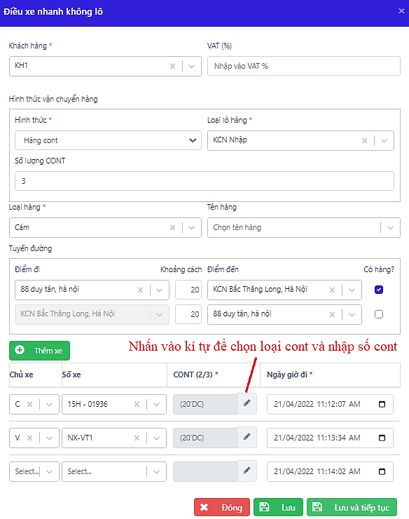
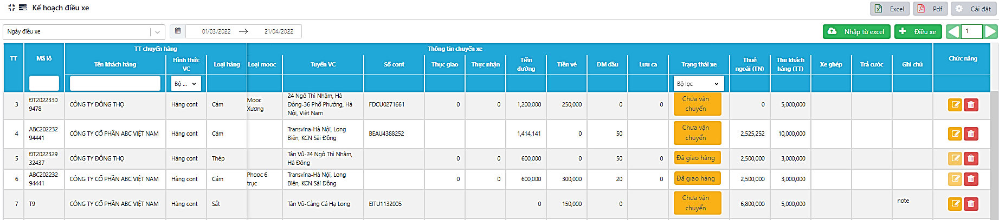
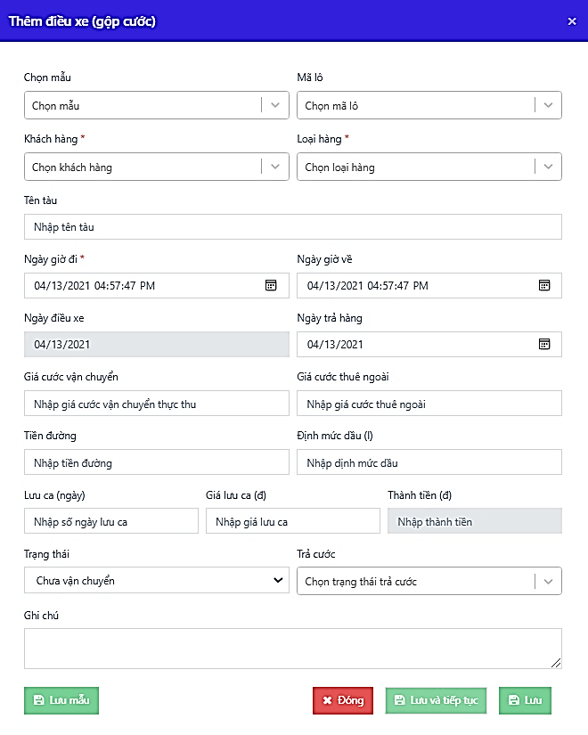
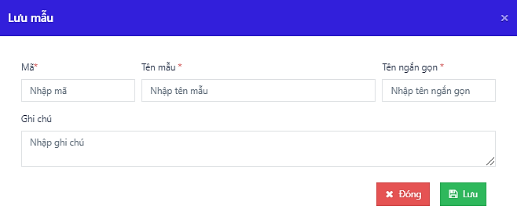
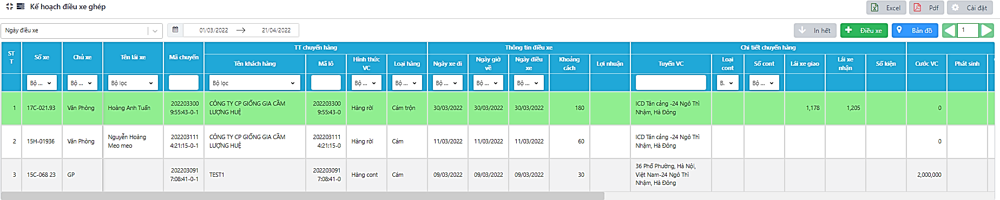
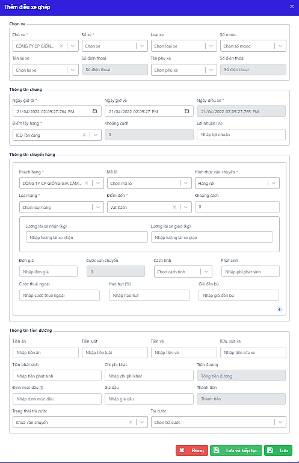

# 3. BỘ PHẬN ĐIỀU VẬN – TRUCKING

Sau khi bộ phận CUS nhập xong thông tin lô hàng lên hệ thống, bộ phận Trucking sẽ lên kế hoạch điều xe, điều xế cho các lô hàng. Kế hoạch vận chuyển, số cont/ xe trong một lô hàng sẽ được trừ dần cho đến khi đủ số lượng đã khai báo.

### **3.1 Kế hoạch vận chuyển** 

Là chức năng quản lý kế hoạch của bộ phận điều xe theo ngày và tháng. Phân bổ và quản lý lượng xe điều theo các thông tin lô hàng được đưa sang từ bộ phận CUS.

#### **3.1.1 Tạo kế hoạch vận chuyển** 

.png>)

_Màn hình Kế hoạch vận chuyển_

Bước 1: Trong mục **Điều hành**, chọn **Kế hoạch vận chuyển**🡪 Nhấn nút Thêm mới

Bước 2: Nhập thông tin vào bảng thêm mới

* Mã lô: Lấy từ Quản lý lô hàng đủ/ rút gọn (các lô ở trạng thái Có thể vận chuyển)
* Các thông tin khác: Phần mềm tự động lấy theo thông tin đã khai báo trong lô, nhưng người dùng vẫn có thể thay đổi. Nếu bên lô chưa có thông tin thì người dùng nhập trực tiếp trên kế hoạch.
* Thời gian cắt máng và thời gian đóng hàng: thời gian cắt máng sẽ phải nhập đủ ngày và giờ cụ thể, còn thời gian đóng hàng sẽ nhập giờ đóng hàng cụ thể, còn ngày đóng hàng sẽ lấy theo trường ngày vận chuyển
* Số lượng xe điều vận, Tấn: Người dùng nhập theo thực tế kế hoạch
* Trong TH hàng cont, người dùng có thể nhập thêm/ lựa chọn số cont đã có của lô.
* Ngoài ra, nếu chưa có lô hàng, người dùng vẫn có thể chọn Khách hàng và lên kế hoạch vận chuyển như bình thường. Lô hàng tự tạo sau đó được lưu sang Ql lô rút gọn. Nút tắt  được dùng để tải file danh sách cont lên phần mềm.

Bước 3: Phầm mềm cũng hỗ trợ tạo điều xe từ kế hoạch vận chuyển với nút tắt .png>). Điều kiện sử dụng nút tắt:

* Hàng nhập: Có số cont khi lên kế hoạch vận chuyển. Mỗi cont tương ứng với 01 chuyến được tạo trong màn hình Điều xe.
* Hàng xuất: Nhập số lượng xe điều vận, không cần nhập số cont. Mỗi xe tương ứng với 01 chuyến được tạo trong màn hình Điều xe.

.png>)

_Màn hình thêm mới Kế hoạch vận chuyển_

#### **3.1.2 Theo dõi lịch điều xe** 

Theo dõi số lượng xe điều, lượng hàng vận chuyển trong 01 tháng theo từng lô hàng, cập nhật tiến độ điều xe hàng ngày.

.png>)

_Màn hình Kế hoạch điều xe_

Bảng thông tin hiển thị dưới dạng bảng liệt kê, lưu trữ thông tin điều xe. Tuy nhiên, người dùng vẫn có thể sửa trực tiếp số lượng điều xe dự toán trong ngày bằng cách:

Bước 1: Trong mục Kế hoạch điều xe, chọn tab Lịch điều xe

Bước 2: Nhấn chuột vào sửa cột thời gian tương ứng với ngày dùng phần mềm 🡪 Nhập liệu🡪 Lưu

.png>)

_Lưu ý:_

_- Số liệu hiển thị trong ngày tương ứng với Số lượng xe điều thực tế/ Số lượng theo kế hoạch._

_- Người dùng chỉ có thể sửa được số liệu kế hoạch điều xe của ngày hiện tại dùng phần mềm._

### **3.2 Điều xe thường** 

Phần mềm cung cấp 3 lựa chọn cho chức năng điều xe thường:

* Điều 1 xe: Dùng cho lô sẵn có, điều từng xe theo từng cung đường vận chuyển riêng biệt.
* Điều n xe: Dùng cho lô sẵn có, điều nhiều xe khác nhau cho cùng 1 cung đường vận chuyển.
* Điều xe không lô: Dùng cho kế hoạch lẻ, chưa tạo lô, điều nhiều xe khác nhau cho cùng 1 cung đường vận chuyển.

#### **3.2.1 Điều 1 xe** 

Bước 1: Tại mục **Điều hành 🡪** chọn **Điều xe**

Bước 2: Nhấn nút Điều xe 🡪 Chọn 1 xe

.png>)

Bước 3: Nhập thông tin vào bảng thêm mới điều 1 xe 🡪 Nhấn lưu.

* Trong trường hợp có chuyến ghép, người dùng chọn _Mã chuyến ghép_ – là mã các chuyến có cùng Ngày xe đi.
* Loại rơ mooc được gán liền theo số mooc, nếu muốn thay đổi cần vào TTC – Danh sách Rơ-mooc để đổi loại.
* Trường hợp sử dụng xe ngoài chưa khai báo trong danh sách xe. Nhấn chọn thêm xe .png>) tại bảng Thêm kế hoạch điều xe. Sau đó điền thông tin xe muốn điều.

(Chức năng này chỉ sử dụng cho xe thuê ngoài. Đối với xe của công ty, người dùng thêm mới xe tại **Danh sách xe** của mục TTC)

* Nhấn .png>) nếu muốn điều thêm một xe khác với cùng thông tin lô.

_Lưu ý:_

.png>) .jpeg>)

_Màn hình thêm mới điều 1 xe Màn hình thêm xe thuê ngoài_

#### **3.2.2 Điều nhiều xe** 

Bước 1: Trong mục Điều xe, nhấn Thêm mới 🡪 chọn n xe

Bước 2: Chọn Mã lô 🡪 Nhập các thông tin vào bảng.

.png>) .png>)

_Màn hình điều n xe – lô hàng đủ Màn hình điều n xe – lô rút gọn_

#### **3.2.3 Điều xe không lô** 

Bước 1: Trong mục Điều xe, nhấn Thêm mới 🡪 chọn Không cần lô

Bước 2: Chọn Khách hàng 🡪 Nhập các thông tin vào bảng.

_Màn hình thêm mới điều không lô_

_Lưu ý: Lô hàng được tạo tự động từ điều không lô sẽ được quản lý trong lô rút gọn._

### **3.3 Điều xe gộp cước** 

Chức năng này giúp người dùng lên kế hoạch điều xe và quản lý cước phí trên cùng một màn hình. Phù hợp với các doanh nghiệp có thao tác quản lý đơn giản, không quá chi tiết vào từng chi phí nhỏ.

_Màn hình Điều xe gộp cước_

#### **3.3.1 Thêm mới kế hoạch điều gộp cước** 

Bước 1: Tại mục Điều hành, chọn Điều xe (gộp cước)

Bước 2: Nhấn nút Thêm mới🡪 Nhập thông tin kế hoạch, cước vận chuyển, tiền đường, lượng dầu.

Bước 3: Nhấn Lưu.

_Màn hình điều xe gộp cước_

#### **3.3.2 Nhập từ excel** 

Thay vì phải nhập từng chuyến cậ chuyển, phần mềm cung cấp thêm chức năng tải kế hoạch điều xe gộp cước từ file excel, giúp tiết kiệm thời gian nhập liệu tối đa cho người dùng.

Bước 1: Tại màn hình điều xe gộp cước, nhấn nút 

Bước 2: Chọn file điều xe trên máy tính 🡪 nhấn Mở để tải file lên phần mềm.

* Link file mẫu: [https://bitly.com.vn/yy129u](https://bitly.com.vn/yy129u)

_Lưu ý: Các dữ liệu nhập vào file excel phải đứng với thông tin và định dạng đã khai báo trong phần TTC của doanh nghiệp._

#### **3.3.3 Lưu mẫu** 

Với một số loại lô hàng đặc trưng, có tính chất vận chuyển và tính cước trùng lặp hoặc nhiều tương đồng, người dùng có thể sử dụng chức năng Lưu mẫu để tối ưu thời gian nhập liệu.

Chức năng Lưu mẫu cho phép người dùng lấy dữ liệu mẫu tạo kế hoạch vận chuyển. Các dữ liệu được tham khảo bao gồm: Giá cước vận chuyển, giá cước thuê ngoài, tiền đường, định mức dầu, lưu ca, giá lưu ca.

**Cách tạo mẫu:**

Bước 1: Nhập thông tin kế hoạch điều xe gộp cước

Bước 2: Nhấn nút Lưu mẫu🡪 Tạo thông tin mẫu🡪 Nhấn Lưu

_Màn hình lưu mẫu điều gộp cước_

Lưu ý: Danh sách mẫu được ghi nhớ trong dữ liệu của phần mềm. Khi thực hiện điều xe không lô, người dùng có thể chọn mẫu đã lưu để lấy thông tin cước tham khảo.

### **3.4 Điều xe ghép** 

Điều xe ghép là có chức năng tương tự với điều xe gộp cước, quản lý toàn bộ các chi phí trên cùng một màn hình. Điểm khác biệt là cách điều xe từ 1 điểm, đi giao cho nhiều khách hàng hoặc tới nhiều điểm khác nhau.

_Màn hình điều xe ghép_

#### **3.4.1 Thêm mới điều xe ghép** 

Bước 1: Tại mục Điều hành, chọn Điều xe ghép

Bước 2: Nhấn nút Điều xe 🡪 nhập thông tin vào bảng thêm mới 🡪 Lưu.

_Màn hình thêm mới điều xe ghép_

\- Cách tính: Có 4 cách tính khác:

\+ Cước = giá định mức theo khoảng cách (< 5km – 100.000 VNĐ, 5 \<kc < 20km…)

\+ Cước = đơn giá\*trọng lượng giao/ nhận

\+ Cước = đơn giá\*km theo dạng bậc thang (<= 5km- 65,000 VNĐ, 5< kc< 10km- 250vnđ…) + Cước = giá định mức theo địa chỉ (Hải Phòng – 2,000,000 VNĐ …)

\- Phát sinh cước: Tính vào tiền thanh toán cho lái xe

#### **3.4.2 Kiểm soát lộ trình xe qua bản đồ** 

Người dùng có thể theo dõi trạng thái của các xe, chuyến xe qua chức năng định vị kết nối với phần mềm.

Bước 1: Trong mục điều hành, chọn Điều xe ghép

Bước 2: Nhấn nút  🡪 Lựa chọn thêm Khách hàng, số xe nếu muốn xem chi tiết 1 xe.

Bước 3: Nếu muốn gán kế hoạch, nhấn đúp chuột vào biểu tượng xe tương ứng trên bản đồ 🡪 Nhập nội dung điều xe 🡪 Lưu.

_Màn hình bản đồ định vị các xe_

*
  1. **Vận tải biển**

Chức năng giúp hỗ trợ người dùng quản lý nghiệp vụ bán cước biển và điều vận các chuyến hàng kết hợp có vận tải biển.

Các tiện ích được xây dựng bao gồm:

* Tạo/Sửa/Xóa các chuyến điều vận vận tải biển
* Tìm kiếm theo nội dung
* Cập nhật lại giá cước
* Xuất file lưu trữ

_Màn hình điều vận vận tải biển_

* **Thao tác tạo mới chuyến điều vận:**

_**Bước 1**_: Nhấn nút  → Nhập thông tin vào bảng thêm mới

* Hãng tàu: Được hiểu là hãng tàu sẽ thực hiện vận chuyển các cont hàng trong chuyến
* Mã lô: Lấy theo mã lô đã tạo từ Quản lý lô hàng ( có tích chọn Vận tải biển và nhập thông tin trong tab)
* Tuyến vận chuyển/Tên tàu: Lấy theo thông tin đã khai báo trong Quản lý lô hàng – tab Vận tải biển
* Số cont: lấy theo danh sách cont của lô, cho phép người dùng chọn nhiều số cont cùng lúc
* Loại cont-vỏ/Số seal/Số vận đơn: đi theo cont
* Chi phí phát sinh: Nhập số liệu theo thực tế chuyến vận chuyển nếu có phát sinh chi phí ngoài cước.

_**Bước 2**_: Nhấn Lưu

_Màn hình thêm mới/cập nhật lại chuyến điều vận vận tải biển_

* **Thao tác cập nhật lại cước biển:**

Trong trường hợp có phát sinh vấn đề cần cập nhật lại giá cước biển, người dùng sử dụng nút: . Thông tin cước sẽ được cập nhật lại theo dữ liệu hiện có trong Thông tin chung-Định mức cước biển.

### **3.6 Quản lý Cước vận chuyển** 

Quản lý các loại chi phí:

* Lượng nhận – giao hàng hóa, hao hụt, đơn giá bù hao hụt
* Cước thuê xe ngoài, cước thực thu, cước hợp đồng theo từng chuyến từ Điều xe chuyển sang.
* Thông tin và chi phí Lưu ca.
* Chi phí khách tạm ứng
* Thông tin nhận – trả cước

_Màn hình quản lý cước vận chuyển_

#### **3.6.1 Quản lý cước** 

Thông tin từ bảng Quản lý cước sẽ được dùng làm cơ sở lên các báo cáo nội bộ và quyết toán khách hàng.

Bước 1: Sau khi điều xe, sang bảng Ql cước vc kiểm tra lại thông tin. Định mức cước được phần mềm tự động tính theo định mức Cước vc và Cước thuê ngoài có trong TTC.

Bước 2: Trường hợp chưa có dữ liệu hoặc cần thay đổi, người dùng có thể chỉnh sửa trực tiếp tại các ô chữ màu xanh hoặc quay lại nhập từ TTC rồi chọn  để cập nhật lại cước.

Lưu ý: Khoảng cách tuyến đường và định mức dầu, chi phí cước thực thu, hợp đồng sẽ lấy theo địa chỉ mở rộng – chi tiết

VD:

| Địa chỉ | Địa chỉ mở rộng         |
| ------- | ----------------------- |
| Tân Vũ  | Hải Phòng               |
| NM1     | KCN Nam Sách, Hải Dương |

* Tuyến đường: Tân Vũ – NM1 sẽ lấy thành Hải Phòng - KCN Nam Sách, Hải Dương và khoảng cách và định mức dầu, chi phí cước thực thu, hợp đồng cũng sẽ lấy theo địa chỉ này.

#### **3.6.2 Lưu định mức cước** 

Chức năng cho phép người dùng lưu ngược dữ liệu cước của một chuyến xe vào bảng định mức chung của phần mềm (bảng Cước vc và Cước thuê ngoài) trong TTC. Thao tác tương ứng với việc Thêm mới định mức cước vào TTC.

Bước 1: Nhập đơn giá các loại cước của chuyến xe

Bước 2: Kéo đến cột chức năng cuối bảng Ql cước vc 🡪 Nhận nút&#x20;

Bước 3: Lựa chọn thông tin định mức muốn lưu trữ 🡪 Lưu

_Màn hình Lưu ngược định mức cước_

_Lưu ý: Tuyến đường để lưu ngược định mức cước là từ Địa chỉ Mở rộng – Chi tiết của tuyến điều xe, chiều đi._

#### **3.6.3 Cập nhật cước** 

Trong trường hợp cước vận chuyển của chuyến có thay đổi, người dùng muốn cập nhật lại theo định mức, có thể sử dụng:

Cách 1: Làm mới chi phí một chuyến xe🡪 Nhấn nút để lấy lại giá trị định mức ban đầu.

Cách 2: Làm mới chi phí nhiều chuyến cùng lúc: Tích chọn các chuyến cần chỉnh sửa 🡪 Nhấn nút Cập nhật định mức 🡪 Tích chọn phần chi phí cần chỉnh 🡪 Nhấn Xác nhận

_Màn hình cập nhật cước_

#### **3.6.4 Đóng quản lý** 

Khi người dùng đã xử lý xong quản lý cước của 1 chuyến, có thể sử dụng nút  để đóng lại thanh toán của chuyến của chuyến vận chuyển, đồng nghĩ với việc các đơn giá sẽ không thể thay đổi giá trị được. Nếu muốn sửa đổi quản lý đã đóng, người dùng nhấn lại vào nút  để mở.

_Lưu ý: Khi đóng Ql cước vận chuyển thì thông tin điều xe của chuyến cũng không thể thay đổi nhằm đảm bảo tính thống nhất trong dữ liệu. Khi muốn thay đổi thông tin chuyến trong Điều xe, cần mở lại Ql cước vc._

### **3.7 Quản lý chi phí vận chuyển** 

Quản lý các khoản chi phí cho một chuyến xe:

* Tiền đường: Tiền ăn, tiền vé, Tiền làm luật, Chi phí phát sinh
* Lương chuyến: đối với các đơn vị tính lương lái xe theo doanh số chuyến
* Định mức dầu và đơn giá dầu

_Màn hình quản lý chi phí vận chuyển_

#### **3.7.1 Quản lý chi phí** 

Giống với Ql cước vận chuyển, Ql chi phí được tạo ra khi có dữ liệu thêm mới điều xe. Thông tin chi phí cũng lấy từ dữ liệu đã có trong TTC – bảng Tiền đường, định mức dầu và giá dầu.

Bước 1: Sau khi điều xe, sang bảng Ql chi phí vc kiểm tra lại thông tin.

Bước 2: Trường hợp chưa có dữ liệu hoặc cần thay đổi, người dùng có thể chỉnh sửa trực tiếp tại các ô chữ màu xanh hoặc quay lại nhập từ TTC rồi chọn  để cập nhật lại chi phí.

Tương tự như Quản lý cước vận chuyển, các dữ liệu trong bảng này sẽ lấy theo tuyến đường địa chỉ mở rộng – chi tiết

#### **3.7.2 Lưu định mức chi phí** 

Bước 1: Nhập các mục chi phí của chuyến xe

Bước 2: Kéo đến cột chức năng cuối bảng Ql chi phí vc🡪 Nhận nút&#x20;

Bước 3: Lựa chọn thông tin định mức muốn lưu trữ 🡪 Lưu

_Màn hình lưu ngược định mức tiền đường_

#### **3.7.3 Cập nhật chi phí** 

Trong trường hợp chi phí và định mức dầu của chuyến có thay đổi, người dùng muốn cập nhật lại theo định mức, có thể sử dụng:

Cách 1: Làm mới chi phí một chuyến xe🡪 Nhấn nút để lấy lại giá trị định mức ban đầu.

Cách 2: Làm mới chi phí nhiều chuyến cùng lúc: Tích chọn các chuyến cần chỉnh sửa 🡪 Nhấn nút Cập nhật định mức 🡪 Tích chọn phần chi phí cần chỉnh 🡪 Nhấn Xác nhận

_Màn hình cập nhật chi phí vận chuyển_

#### **3.7.4 Đóng chi phí** 

Khi người dùng đã xử lý xong quản lý cước của 1 chuyến, có thể sử dụng nút  để đóng lại thanh toán của chuyến của chuyến vận chuyển, đồng nghĩ với việc các đơn giá sẽ không thể thay đổi giá trị được. Nếu muốn sửa đổi quản lý đã đóng, người dùng nhấn lại vào nút  để mở.

Lưu ý: Khi đóng Ql chi phí vc thì thông tin điều xe của chuyến cũng không thể thay đổi nhằm đảm bảo tính thống nhất trong dữ liệu. Khi muốn thay đổi thông tin chuyến trong Điều xe, cần mở lại Ql chi phí vc.

### **3.8 Quản lý Thông báo** 

Chức năng giúp quản lý thông báo và gửi thông báo tới các đối tượng trên app mobile:

* Lô: Các lô hàng đang quản lý
* Nhóm người dùng: toàn bộ người dùng trong nhóm, nhóm người dùng được quản lý tại mục Quản lý hệ thống
* Người dùng: Một/ một số người dùng cụ thể trên hê thống

**3.8.1 Các bước thêm thông báo**

Bước 1: Tại mục Điều hành, chọn mục Quản lý Thông báo

Bước 2: Chọn nút **Thêm mới** và nhập các thông tin

* Tên thông báo: Tên thông báo sẽ hiển thị
* Ngày thông báo: Ngày hiển thị thông báo
* Hạn thông báo: Ngày hết hạn hiển thị thông báo
* Đối tượng nhận thông báo: Chọn loại đối tượng và đối tượng cụ thể
* Nội dung: Nhập nội dung thông báo
* Bước 3: Nhấn **Lưu** lại thông báo

_Màn hình nhập thông báo_

### **3.9 Báo cáo hoạt động xe** 

Là báo cáo thống kê tỉ lệ hoạt động của của xe, khách hàng theo, từ đó giúp doanh nghiệp có thêm cơ sở đánh giá hiệu quả hoạt động.

#### **3.9.1 Báo cáo hoạt động xe** 

Báo cáo tính theo hoạt động của từng xe trong tháng, bao gồm cả xe của doanh nghiệp và các xe thuê ngoài.

_Màn hình báo cáo hoạt động theo xe_

| Số chuyến hàng cont      | Số lượng chuyến vận chuyển với loại hàng cont       |
| ------------------------ | --------------------------------------------------- |
| Số chuyến hàng rời       | Số lượng chuyến vận chuyển với loại hàng rời        |
| Tổng số chuyến (A)       | = Số chuyến hàng cont + Số chuyến hàng rời          |
| Tổng số km di chuyển (B) | Tổng km di chuyển của xe, lấy theo Ql chi phí vc    |
| Km di chuyển trung bình  | = B/A                                               |
| Khối lượng               | Lượng lái xe giao trong vận chuyển. Theo Ql cước vc |

#### **3.9.2 Báo cáo hoạt động KH** 

Báo cáo tính theo hoạt động vận chuyển đối với từng KH trong tháng

_Màn hình báo cáo hoạt động khách hàng_

### **3.10 Báo cáo tải trọng an toàn đầu kéo** 

Tính toán và quản lý tải trọng chở hàng cho phép cho từng đầu kéo theo chuyến vận chuyển.

_Màn hình Báo cáo tải trọng an toàn đầu kéo_

| Tên khách hàng-…Loại cont | Lấy theo thông tin trong mục Điều xe                                                                                                                                                                                                                                                                                                                                                                                                                           |
| ------------------------- | -------------------------------------------------------------------------------------------------------------------------------------------------------------------------------------------------------------------------------------------------------------------------------------------------------------------------------------------------------------------------------------------------------------------------------------------------------------- |
| SK đầu kéo                | Sức kéo đầu kéo. Theo khai báo trong TTC – Danh sách xe – Cột Khối lượng kéo theo TK/CP TGGT                                                                                                                                                                                                                                                                                                                                                                   |
| Trọng lượng SMRM          | Trọng lượng mooc. Theo khai báo trong TTC- Danh sách Rơmooc – Cột Trọng lượng Rơ mooc                                                                                                                                                                                                                                                                                                                                                                          |
| Trọng lượng vỏ cont       | 
Theo mặc định từ hệ thống

Cont 20’ = 2290 kg

Cont 40’ = 3628 kg
                                                                                                                                                                                                                                                                                                                                                                             |
| Khối lượng chở cho phép   | 
<strong>Cách tính 1:</strong> Khối lượng hàng CC theo TK/CP TGGT của SMRM - Trọng lượng vỏ Cont (lấy theo thông số nhỏ hơn- CP TGGT – cho phép tham gia giao thông)

<strong>Cách tính 2:</strong> Khối lượng kéo đầu * 110% - Khối lượng mooc - Trọng lượng vỏ cont + 150 (Khối lượng kéo đầu lấy theo thông số nhỏ hơn của Khối lượng kéo theo TK/CP TGGT của Đầu kéo)
<ul><li>So sánh kết quả 2 cách tính, hiển thị khối lượng nhỏ hơn</li></ul> |
| Khối lượng hàng           | = Lượng lx nhận trong Ql cước vc                                                                                                                                                                                                                                                                                                                                                                                                                               |
| Chênh lệch                | = Khối lượng hàng – Khối lượng chở cho phép                                                                                                                                                                                                                                                                                                                                                                                                                    |
| Chức năng                 | Chức năng chỉnh sửa chỉ có đối với loại hàng chở cont, có đủ thông tin: Số xe, số mooc, loại cont                                                                                                                                                                                                                                                                                                                                                              |

* **Cách kiểm tra Khối lượng chở cho phép của 1 chuyến hàng:**

Bước 1: Trong màn hình báo cáo tải trọng an toàn đầu kéo🡪 Nhấn nút&#x20;

Bước 2: Trong màn hình tính toán, chọn số xe đầu kéo và số mooc muốn kiểm tra.

Bước 3: Chọn loại cont, phần mềm mặc định trả về trọng lượng vỏ cont. Có thể chỉnh sửa trọng lượng vỏ trực tiếp trong ô.

* Phần mềm tự động tính ra khối lượng hàng cho phép theo 2 cách tính và lấy kết quả nhỏ hơn.

_Lưu ý: Các thông số của đầu kéo và mooc được lấy theo thông tin khai báo trong TTC- Danh sách xe, Danh sách rơ mooc._
