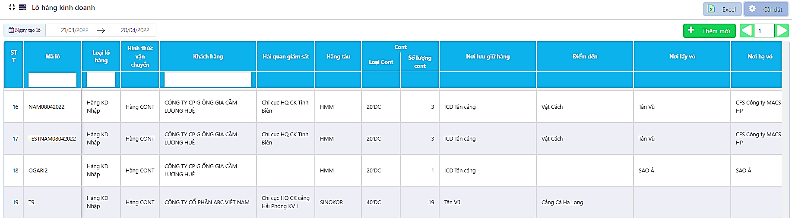

# 5. NGHIỆP VỤ KẾ TOÁN

### **5.1 Quản lý Quyết toán nội bộ (Quản lý QTNB)** 

Để quản lý Tạm ứng, Quyết toán của việc làm hàng, người dùng có thể sử dụng 03 cách:

\- Quản lý tạm ứng theo lô hàng

\- Quản lý tạm ứng theo ngày

\- Kết hợp quản lý theo lô và theo ngày

#### **5.1.1 Quản lý tạm ứng theo lô hàng** 

**5.1.1.1 Tạo tạm ứng nội bộ cho nhân viên**

Bước 1: Tại mục Kế toán, chọn Quyết toán nội bộ

Bước 2: Tìm lô hàng cần làm tạm ứng🡪 Có thể nhấn vào cột Phiếu tạm ứng để xem các khoản đề xuất của CUS🡪 Tại cột chức năng của bảng Quyết toán nội bộ, nhấn nút  để thêm mới.

Bước 3: Điền thông tin vào bảng🡪 nhấn Lưu để lưu lại tạm ứng vừa tạo.

.png>)

.png>)

* Người tạm ứng: Chọn trong bảng thông tin nhân viên tại vị trí Thương Vụ. Nếu chưa có tên người tạm ứng, người dùng cần thêm mới nhân viên ở mục Thông tin chung- bảng Nhân viên

Bước 4: Sau khi đã đối chiếu và quản lý xong các khoản tạm ứng của 1 lô hàng, người dùng thực hiện đóng tạm ứng nội bộ bằng cách nhấn chọn vào trạng thái tạm ứng🡪 chuyển trạng thái Mở thành Đóng🡪 nhấn **Lưu**.

_Lưu ý:_

* _Có thể tạo nhiều tạm ứng cho cùng một lô hàng cho nhiều người khác nhau và ở các thời điểm khác nhau. (Điều kiện: Trạng thái Tạm ứng nội bộ tổng là **Mở**)_
* _Người dùng không thể sửa hoặc xóa khoản tạm ứng nội bộ đã thêm._
* _Khi trạng thái tạm ứng nội bộ cho một cá nhân Đóng, bộ phận kế toán không thể sửa thông tin tạm ứng đó._

<figure><figcaption></figcaption></figure>

* _Trường hợp có phát sinh tạm ứng từ CUS, QTNB sẽ được mở lại để làm tạm ứng nội bộ phát sinh (nếu có). Kế toán thêm mới các khoản tạm ứng cho nhân viên theo các bước phía trên._

Bước 5: Người dùng tiếp tục tạo tạo ứng nội bộ cho các cá nhân (nếu có) và thực hiện làm quyết toán cho đến khi xong hết khoản.

.png>)

.png>)

**5.1.1.2 Quản lý tạm ứng theo lô hàng**

Bước 1: Bộ phận CUS/ Ops vào bảng tạm ứng lô hàng để đối chiếu các khoản thu chi khi đi làm dịch vụ.

* **Cách 1:** Vào Ql lô hàng đủ/ rút gọn 🡪 Nhấn vào số tiền tại cột Tạm ứng
* **Cách 2:** Vào QTNB 🡪 Nhấn vào số tiền tại cột Phiếu tạm ứng

.png>)

Bước 2: Bộ phận phụ trách đối chiếu các hóa đơn chứng từ để sửa đổi/ quản lý các khoản chi phí tạm ứng (Số lượng, Đơn giá, Trạng thái, Thêm mới, Xóa).

Các nội dung chi phí đã đối chiếu xong, người dùng **nhấn tích** vào ô trạng thái để hoàn thiện dòng/mục đó 🡪 Nhấn **Lưu** để lưu lại và đóng tạm ứng.

.png>)

_Lưu ý:_

* _Sau khi lưu**,** người dùng sẽ không thể sửa/ xóa dữ liệu trong tạm ứng vừa thực hiện._
* _Các khoản chi phí đã đóng sẽ được tính gộp để đưa ra tổng tiền đã quyết toán._

**5.1.1.3 Quản lý quyết toán tạm ứng (Quyết toán nội bộ - QTNB)**

Sau khi CUS/ OPS đã xử lý xong các khoản chi phí trên Tạm ứng, Kế toán vào làm quyết toán nội bộ

Bước 1: Vào Ql lô hàng đủ/ rút gọn 🡪 Nhấn vào số tiền tại cột Quyết toán

.png>)

Bước 2: Trong bảng QTNB, nhấn nút .png>)🡪 Đối chiếu chứng từ CUS/ Ops gửi về, thực hiện chỉnh sửa trên bảng nếu có thay đổi (Số lượng, đơn giá, ghi chú, hóa đơn, …)🡪 nhấn Lưu chỉnh sửa.

Nhấn nút .png>) trong trường hợp người dùng muốn thay đổi lại nhóm của chi phí:

* Phí định mức hải quan: Chỉ có trong Tạm ứng và QTNB, không có trong QTKH
* Phí chi trả hộ: lấy từ QTNB sang QTKH

.png>)

Bước 3: Sau khi đã kiểm tra và chỉnh quyết toán theo số liệu doanh nghiệp, người dùng thực hiện đóng QTNB🡪 Vào mục Kế toán, Quyết toán nội bộ 🡪 Tại cột Trạng thái, nhấn nút Mở để chuyển sang Đóng 🡪 Lưu.

.png>)

_Lưu ý:_

* _Quyết toán cho cược vỏ sẽ được quản lý riêng trong mục Quản lý cược vỏ thay vì hiển thị trong QTNB._
* _Trường hợp có Tạm ứng phát sinh, người dùng nhấn_ .png>) _trong bảng QTNB để cập nhật chi phí của các tạm ứng phát sinh vào chung một phiếu QTNB._

#### **5.1.2 Quản lý tạm ứng theo ngày** 

Chức năng quản lý các khoản tạm ứng theo ngày thực hiện và người thưc hiện (người giao – nhận), giúp kế toán kiểm soát và hạch toán các khoản thu chi nhanh chóng, minh bạch.

Phạm vi sử dụng: mục Kế toán🡪 chức năng Quản lý tạm ứng

Kế toán quản lý quỹ chi phí hoạt động tạm ứng, thanh toán, quyết toán, hoàn tạm ứng cho bộ phận CUS/ Ops. Chức năng được thiết kế với 03 bảng:

* Quản lý quỹ: Danh sách các khoản thu chi trong quỹ và tồn của từng các nhân nhận tạm ứng, sử dụng cho Thủ quỹ
* Quản lý tạm ứng: Chi tiết các khoản đã tạm ứng, sử dụng cho Kế toán/ CUS
* Thanh toán: Liệt kê các chi phí lấy trong Tạm ứng lô hàng để khai báo thanh toán, sử dụng cho CUS/ Ops

**5.1.2.1 Quản lý Quỹ**

<figure><figcaption>
<em><strong>Màn hình Quản lý quỹ</strong></em>
</figcaption></figure>

Khi thủ quỹ thực hiện ứng tiền/ hoàn ứng cho phụ trách bộ phận làm hàng, thao tác:

Bước 1: Trong bảng **Quản lý Quỹ**🡪 nhấn nút Thêm mới

Bước 2: Nhập thông tin vào bảng, chọn

\+ Chi tạm ứng: nếu là khoản chi

\+ Hoàn ứng: nếu là khoản tiền hoàn tạm ứng thu về

Bước 3: Theo dõi các dòng tiền mà người nhận tạm ứng phụ trách chi theo ngày.

_Lưu ý: Quản lý Quỹ không quản lý chi tiết từng người thực hiện làm hàng của bộ phận CUS/OPS, chỉ quản lý chung nguồn tiền dưới trách nhiệm của người phụ trách nhận tạm ứng ban đầu._

* _Chữ xanh: Chi phí nhảy tự động từ tích thanh toán_
* _Chữ đen: Chi phí thêm mới trực tiếp trong Quản lý quỹ_

**5.1.2.2 Quản lý tạm ứng**

Bước 1: Trong bảng Quản lý tạm ứng, nhấn nút Thêm mới khi muốn lưu một khoản chi đã tạm ứng cho nhân viên đi làm hàng

* Người giao tiền: Mặc định là người dùng đang đăng nhập vào hệ thống, vị trí Kế toán/ Chung trong bảng Nhân viên (TTC)
* Người nhận: nhân viên nhóm Kế toán/ Thương vụ trong bảng Nhân viên (TTC)

Bước 2: Quản lý các khoản thanh toán từ CUS/ OPS đưa sang, đối chiếu hóa đơn chứng từ.

Bước 3: Để cân bằng lượng tiền, thực hiện hoàn ứng bằng cách chọn Thêm mới🡪 nhập thông tin người giao nhận giống như tạm ứng🡪 Nhập số tiền dưới dạng số âm🡪 Lưu

.png>)

.png>)

_Lưu ý:_

* _Chữ xanh: Chi phí nhảy tự động từ tích thanh toán. Số tiền dư đến ngày báo cáo tính cho người giao._
* _Chữ đen: Chi phí thêm mới trực tiếp trong Quản lý quỹ. Số tiền dư đến ngày báo cáo tính cho người nhận._

**5.1.2.3 Thanh toán**

Thông tin thanh toán lấy từ bảng Tạm ứng CUS đã tạo trong **Ql lô đủ/ rút gọn**.

Thông tin tích chọn thanh toán sau sẽ được đưa sang bảng Quản lý tạm ứng và làm thành Quyết toán nội bộ.

Bước 1: CUS/ Ops khai báo, cập nhật các chi phí, chứng từ đã đi làm hàng:

* Người nhận: Mặc định là người dùng đang đăng nhập vào hệ thống

Người giao: nhân viên nhóm Kế toán/ Thương vụ trong bảng Nhân viên (TTC)

* Cập nhập đơn giá, số lượng hoặc thêm chi phí nếu có phát sinh
* Tích vào ô Lựa chọn với các mục đã thực hiện, chọn Chứng từ nếu có.

Bước 2: CUS/ Ops nhấn Lưu để đưa thông tin sang cho Kế toán và Thủ quỹ

.png>)

_Lưu ý: Các chi phí thêm mới trực tiếp trong bảng Thanh toán sẽ được cập nhật lại tạm ứng và QTNB, QTKH của lô hàng tương ứng_

#### **5.1.3 Quản lý linh hoạt theo lô và theo ngày** 

**5.1.3.1 Quản lý tạm ứng cho Ops**

Bước 1: Sau khi có tạm ứng lô hàng 🡪 Vào mục **Kế toán- Quản lý tạm ứng** 🡪 nhấn nút Thêm mới khi muốn lưu một khoản chi đã tạm ứng cho nhân viên đi làm hàng

Bước 2: Nhập thông tin Tạm ứng vào bảng 🡪 Lưu

* Người giao tiền: Mặc định là người dùng đang đăng nhập vào hệ thống, vị trí Kế toán/ Chung trong bảng Nhân viên (TTC)
* Người nhận: nhân viên nhóm Kế toán/ Thương vụ trong bảng Nhân viên (TTC)

.png>)

**5.1.3.2 Quyết toán chi phí**

Bước 1: Tại bảng Thanh toán, thực hiện điều chỉnh các thông tin theo chứng từ của CUS/ Ops

Bước 2: Tích vào cột Lựa chọn 🡪 Nhấn nút Lưu.

.png>)

Bước 3: Kiểm soát lại dòng tiền lưu động của CUS/ Ops tại bảng **Quản lý tạm ứng**🡪 Thực hiện hoàn ứng nếu cần bằng cách chọn Thêm mới 🡪 Nhập số tiền âm (khoản thu lại từ CUS/Ops)🡪 Lưu

<figure><figcaption></figcaption></figure>

<figure><figcaption></figcaption></figure>

**5.1.3.3 Hoàn tất QTNB**

Bước 1: Tại mục Quản lý lô đủ/rút gọn, nhấn vào cột Quyết toán 🡪 Trong bảng Quyết toán, nhấn chọn .png>)

Nhấn nút .png>) khi có thêm thanh toán chi phí của lô làm quyết toán.

<figure><figcaption></figcaption></figure>

### &#x20;**5.2 Quản lý Quyết toán Khách hàng (Quản lý QTKH)** 

#### **5.2.1 Mở quyết toán Khách hàng** 

Bước 1: Tại mục Kế toán 🡪 Chọn Quyết toán khách hàng

Bước 2: Nhấn vào ô Tổng tiền của lô cần làm thanh toán

<figure><figcaption>
<em><strong>Màn hình Quyết toán khách hàng</strong></em>
</figcaption></figure>

Bước 3: Nhấn nút 🡪 .png>) Phần mền hiện thị ra danh sách các khoản cần quyết toán với khách hàng

Thông tin trong quyết toán khách hàng bao gồm bảng Tổng hợp phí và bảng Chi tiết. Bảng Tổng hợp phí bao gồm:

* Chi phí dịch vụ: dịch vụ thông quan, cước vận chuyển, lưu ca, bù cước,…
* Chi phí chi trả hộ: Các khoản chi phí có trong QTNB
* Chứng từ trả khách: nếu có, thêm mới trực tiếp
* Cập nhật các khoản bù trừ vận chuyển: Lượng hao hụt cho phép theo chuyến/ theo lô, Tỉ lệ hao hụt, Đơn giá đền bù, Lượng giảm trừ cho phép, VAT

Đơn giá trong bảng QTKH được lấy theo đơn giá hợp đồng mà người dùng đã khai báo trong thông tin chung, trường hợp chưa có đơn giá hợp đồng, phần mềm lấy dữ liệu từ QTNB.

Bước 4: Trong bảng chi tiết Quyết toán khách hàng của từng lô, thực hiện thay đổi nếu cần:

* Đơn giá, số lượng của các chi phí
* Thêm mới chi phí trên QTKH: nút .png>)
* Cập nhật QTKH khi có phát sinh tạm ứng và QTNB: nút .png>)

<figure><figcaption></figcaption></figure>

Bước 5: Thêm các thông tin liên quan đến VAT và đền bù hao hụt 🡪 Nhấn vào dong Cập nhật thông tin lô hàng ở cuối bảng QTKH🡪 Nhập thông tin 🡪 Lưu

<figure><figcaption>
<em><strong>Màn hình tổng hợp Quyết toán khách hàng</strong></em>
</figcaption></figure>

_Lưu ý:_

* Trường hợp người dùng muốn in QTKH không bao gồm cước vận chuyển và lưu ca, chọn loại in – In không cước.
* Các khoản có chi phí bằng 0 trong QTNB sẽ không được đưa sang QTKH
* Các khoản chi phí bằng 0 trong QTKH khi in sẽ tự động được loại bỏ

#### **5.2.2 Cập nhật Quyết toán KH** 

Bước 1: Tại mục **Kế toán**, chọn **Quyết toán khách hàng**

Bước 2: Nhấn vào số tiền cột Đã thanh toán

Bước 3: Nhập số tiền khách hàng đã thanh toán vào ô Tiền thanh toán thêm. Nhấn Lưu để lưu lại và kết thúc quyết toán khách hàng.

<figure><figcaption>
<em><strong>Màn hình nhập thanh toán khách hàng</strong></em>
</figcaption></figure>

* Quyết toán khách hàng quản lý theo từng lô. Ngày tìm kiếm là ngày tạo hoặc chỉnh sửa lô hàng.
* Ngày hợp đồng: là ngày tạo lô
* Tỷ lệ doanh thu cước = (Vận chuyển + Phát sinh)/ (Tổng vận chuyển+ phát sinh) của các lô hiển thị
* Tỷ lệ doanh thu dịch vụ = Chi HQ của 1 lô/ Tổng chi HQ của các lô hiển thị
* Chi phí HQ: tổng các chi phí hải quan trong Ql lô hàng 🡪 QTKH
* Chi trả hộ theo lô: tổng chi phí chi trả hộ trong Ql lô hàng 🡪 QTKH
* Chi hộ theo chuyến: tổng chi phí chi trả hộ theo chuyến trong Ql cước vc
* Vận chuyển = Cước vận chuyển trong QTKH
* Phát sinh = Phát sinh chuyển điểm + lưu ca
* VAT: theo khai báo lô hàng, tab thông tin mở rộng hoặc trong QTKT, thông tin cập nhật lô hàng.
* Còn lại = Tổng tiền – Tổng tiền – Đã thanh toán
* Số lượng cont/ Khối lượng: Theo khai báo lô hàng.
* Đơn giá: nhập tay trực tiếp
* **Điều kiện Mở/Đóng trạng thái thanh toán QTKH:**
* Người dùng có thể đóng QTKH từ mục Ql lô hàng 🡪 QTKH .png>)
* Với màn hình Kế toán 🡪 Quyết toán khách hàng: Để chuyển trạng thái lô hàng thì tiền Đã thanh toán >= cột Tổng tiền. 🡪 Chuyển trạng thái sang Đóng.

<figure><figcaption>
<em><strong>Màn hình Quản lý QTKH</strong></em>
</figcaption></figure>

### **5.3 Quản lý Cược vỏ** 

#### **5.3.1 Tạo thông tin cược vỏ** 

Bước 1: Tại mục Quản lý lô đủ/ rút gọn 🡪 Vào tạm ứng lô hàng 🡪 nhấn nút .png>)

Bước 2: Chọn loại Phí cược vỏ 🡪 Nhập thông tin cược 🡪 Lưu.

<figure><figcaption></figcaption></figure>

Thông tin cược sau đó sẽ được quản lý riêng tại mục **Kế toán🡪 Quản lý cược vỏ.**

<figure><figcaption>
<em><strong>Màn hình Quản lý cược vỏ</strong></em>
</figcaption></figure>

* Định mức: Tiền cược vỏ dự toán trong màn hình Tạm ứng- mục Ql lô đủ/ rút gọn

Thực chi: Tiền cược vỏ làm thanh toán trong màn hình Qly tạm ứng – mục Kế toán

#### **5.3.2 Cập nhật thông tin cược vỏ** 

Bước 1: Trong mục Kế toán, chọn QL cược vỏ. Nhấn nút  tại lô hàng muốn cập nhật thông.

Bước 2: Điền thông tin vào bảng cập nhật. Sau đó nhấn Lưu để lưu lại thông tin

* Khi chọn hình thức thanh toàn là Tiền mặt, phần mềm tự động tạo một dòng chi phí hoàn tiền cho người nhận cược trong Quản lý tạm ứng 🡪 Quản lý quỹ.
* Khi chọn hình thức thanh toán là Chuyển khoản, không có thay đổi trong Quản lý quỹ.

<figure><figcaption>
<em><strong>Màn hình cập nhật Quản lý cược vỏ</strong></em>
</figcaption></figure>

### **5.4 Quản lý Sửa chữa** 

Quản lý sửa chữa là các khoản tạm ứng và quyết toán cho việc sửa chữa xe.

#### **5.4.1 Thêm mới tạm ứng sửa chữa** 

Bước 1: Tại mục Kế toán, chọn chức năng QL sửa chữa. Nhấn nút   để thêm thông tin sửa chữa.

<figure><figcaption>
<em><strong>Màn hình Quản lý sửa chữa</strong></em>
</figcaption></figure>

Bước 2: Nhập thông tin vào bảng và nhấn Lưu để lưu lại thông tin

<figure><figcaption></figcaption></figure>

Sau khi tạo xong tạm ứng, nhân viên bộ phận sửa chữa có thể thực hiện tạo và khai báo các thông tin về sửa chữa, sử dụng các mã tạm ứng đã được tạo.

_Lưu ý: Mục người tạm ứng là nhân viên ở bộ sửa chữa. Nếu nhân viên đó chưa có tên thì người dùng có thể thêm mới nhân viên tại mục Nhân viên trong phần Thông tin chung_

#### **5.4.2 Quản lý chi phí và trạng thái hóa đơn sửa chữa** 

Sau khi tiền sử dụng tạm ứng để thực hiện sửa chữa cho xe xong, nhân viên bộ phận SỬA CHỮA lên chi tiết nội dung sửa chữa tại mục sửa chữa / thay thế sửa chữa. Kế toán căn cứ vào nội dung sửa chữa dể cập nhật trạng thái và làm quyết toán khoản tạm ứng sửa chữa.

* _**Cập nhật trạng thái quyết toán sửa chữa của xe**_

Bước 1: Trong bảng Quản lý sửa chữa, nhấn vào nút **Mở** tại cột Trạng thái quyết toán.

<figure><figcaption></figcaption></figure>

Bước 2: Chuyển trạng thái từ Mở 🡪 Đóng, rồi nhấn **Lưu.**

<figure><figcaption></figcaption></figure>

* _**Cập nhật trạng thái tạm ứng**_

Bước 1: Trong bảng Quản lý sửa chữa, nhấn vào nút **Mở** tại cột Tạm ứng.

<figure><figcaption></figcaption></figure>

Bước 2: Chuyển trạng thái từ **Mở** 🡪 Đóng, rồi nhấn **Lưu.**

_Lưu ý:_

* _Trong thời gian cho phép, phần mềm vẫn cho phép người dùng mở lại hóa đơn đã đóng để chỉnh sửa thông tin nếu có sai sót 🡪 Nhấn nút_  _🡪 chuyển trạng thái sang Mở🡪 Lưu. (Phân quyền chặt chẽ cho người có quyền mở lại hóa đơn)._
* _Sau khi đóng Tạm ứng, mã Tạm ứng đó sẽ không còn hiển thị tại bảng khai báo sửa chữa._
* _Ngoài ra, người dùng có thể tìm kiếm, cập nhật thông tin, hay in phiếu đề nghị tạm ứng._

### **5.5 Quản lý khấu hao chung** 

Quản lý các chi phí khấu hao bao gồm:

* Phí thường niên theo xe như: Phí đăng kiểm, Phí lưu thông đường bộ, … 🡪 Tính riêng chi phí cho từng xe
* Phí khấu hao chung: Chi phí vật tư phân bổ chung, …🡪 Chia đều cho số dầu xe công ty

<figure><figcaption>
<em><strong>Màn hình quản lý phí khấu hao</strong></em>
</figcaption></figure>

#### **5.5.1 Thêm mới và quản lý chi phí** 

Bước 1: Đăng nhập vào phần mềm, tại mục Kế toán🡪 Chọn Quản lý phí thường niên

Bước 2: Nhấn nút Thêm mới 🡪 Nhập thông tin vào bảng🡪 Nhấn Lưu.

_Lưu ý:_

<figure><figcaption></figcaption></figure>

* _Thông tin Quản lý phí thường niên được tự động cập nhập vào bảng Quản lý quá hạn, Báo cáo doanh thu chi phí theo xe._
* _Các chi phí khi sắp/ đã quá hạn sẽ được đưa thành cảnh báo trong màn hình Dashboard._

#### **5.5.2 Tiện ích bổ sung** 

**5.5.2.1 Tìm kiếm theo trạng thái**&#x20;

Có 3 trạng thái tìm kiếm trên màn hình Quản lí phí khấu hao, bao gồm:

* Tháng áp dụng: Chi phí trong còn hạn Áp dụng trong tháng đang tìm kiếm
* Tháng hết hạn: Chi phí có Ngày hết hạn trong tháng đang tìm kiếm
* Tháng thanh toán: Chi phí có Ngày mua trong tháng đang

.png>)

**5.5.2.2 In đề xuất thanh toán**

Bước 1: Tại chi phí muốn tạo đề xuất, nhấn nút  trong cột chức năng.

Bước 2: Lựa chọn người thanh toán, nhấn nút .png>).

<figure><figcaption>
<em><strong>Mẫu phiếu in đề xuất thanh toán phí khấu hao</strong></em>
</figcaption></figure>

### **5.6 Quản lý thu chi** 

Chức năng được thiết kế như một cuốn sổ kế toán, tổng hợp toàn bộ các khoản thu – chi từ những nghiệp vụ của các bộ phận khác nhau trên phần mềm. Từ đó, giúp kế toán kiểm soát chặt chẽ các chi phí, dòng tiền lưu động của doanh nghiệp.

Chức năng bao gồm 01 bảng chi tiết các chi phí và 01biểu đồ thể hiện biến động của các khoản thu – chi.

<figure><figcaption>
<em><strong>Màn hình quản lý sổ thu chi</strong></em>
</figcaption></figure>

#### **5.6.1 Theo dõi sổ thu chi** 

Các chi phí trong sổ thu chi bao gồm:

<table data-header-hidden><thead><tr><th width="168.33333333333331"></th><th></th><th></th></tr></thead><tbody><tr><td><strong>Nhóm/ Tên chi phí</strong></td><td><strong>Điều kiện hiển thị</strong></td><td><strong>Nội dung</strong></td></tr><tr><td><strong>Phí Chi</strong></td><td></td><td></td></tr><tr><td>Phí dịch vụ &#x26; Phí chi trả hộ</td><td>Có ngày thanh toán trong bảng Kế toán – Quản lý tạm ứng- tab Quản lý tạm ứng</td><td>
Các chi phí làm dịch vụ hải quan và chi trả hộ từ CUS/Ops

Người dùng thực hiện tích chi phí từ bảng Thanh toán 🡪 Lưu
</td></tr><tr><td>Cược vỏ</td><td>Có Ngày thanh toán trong bảng Kế toán – Quản lý tạm ứng- tab Quản lý tạm ứng</td><td>Chi phí cược vỏ được tạo từ tạm ứng, người dùng thực hiện thanh toán bằng cách tích 🡪 lưu Phí cược vỏ trong bảng Thanh toán.</td></tr><tr><td>Cước thuê ngoài</td><td>Có ngày trả tiền cho vendor tại bảng Báo cáo tổng hợp – Báo cáo cước xe ngoài</td><td>Chi phí tại cột Số tiền trả cho vendor trong báo cáo cước xe ngoài</td></tr><tr><td>Tiền đường</td><td>Lái xe tích nhận tiền đường từ mobile app – có thể kiểm tra trên phần mềm tại bảng Lái xe - Quản lý phơi phiếu</td><td>Chi phí tiền đường điều chỉnh trong bảng Ql chi phí vận chuyển</td></tr><tr><td>Lương</td><td>Lái xe tích nhận lương từ mobile app – có thể kiêm tra trên phần mềm tại bảng Lái xe - Lương lái xe</td><td>Chi phí lương tại cột Còn nhận của bảng Lương lái xe</td></tr><tr><td>Nhiên liệu</td><td>Người dùng thêm mới tại bảng Nhiên liệu – Ql cấp dầu cho xe</td><td>Chi phí cho 01 lần cấp dầu cho xe tại cột Thành tiền của bảng Ql cấp dầu cho xe</td></tr><tr><td>Nhập phụ tùng</td><td>Người dùng thêm mới tại bảng Sửa chữa – Nhập phụ tùng</td><td>Chi phí cho 01 lần nhập vật tư tại cột Số tiền thanh toán của bảng Nhập phụ tùng</td></tr><tr><td>Sửa chữa</td><td>Người dùng nhập Ngày thanh toán trong hóa đơn sửa chữa của bảng Sửa chữa – Thay thế, sửa chữa</td><td>Tổng chi phí của 01 hóa đơn sửa chữa tại cột Quyết toán, bảng Thay thế, sửa chữa</td></tr><tr><td>Phí thường niên</td><td>Người dùng thêm mới tại bảng Quản lý khấu hao</td><td>Chi phí cho 01 loại phí khấu hao tại cột Thành tiền, bảng Quản lý khấu hao</td></tr><tr><td><strong>Phí thu</strong></td><td></td><td></td></tr><tr><td>Cước vận chuyển</td><td>Có Ngày thanh toán trong bảng Kế toán- Quyết toán Khách hàng</td><td>Cước vận chuyển thu theo QTKH, điều chỉnh dựa theo Thành tiền cước hợp đồng tại bảng Điều hành - Ql cước vc.</td></tr><tr><td>
Phí dịch vụ thông quan

&#x26; Phí chi trả hộ
</td><td>Có Ngày thanh toán trong bảng Kế toán- Quyết toán Khách hàng</td><td>
Phí dịch vụ hải quan thu độc lập trên bảng QTKH

Phí chi trả hộ từ QTNB đưa sang, có thể chỉnh sửa và tính theo chi phí thực tế trên QTKH.
</td></tr></tbody></table>

#### **5.6.2 Cập nhật sổ thu chi** 

Các chi phí trong sổ thu chi được cập nhật trực tiếp tại từng bảng tương ứng như mô tả trong mục 5.6.1.

Khi có thay đổi, chi phí trên bảng thu chi lấy theo dữ liệu nhập lần đầu. Số liệu thay đổi được thể hiện tại cột Chênh lệch = Giá cập nhật – Giá thanh toán lần đầu.

Tại dòng có chi phí được thay đổi, phần mềm sẽ đánh dấu bằng màu riêng để cảnh báo với người quản lý.

**5.6.2.1 Thêm mới chi phí vào sổ**

Ngoài việc kiểm soát các chi phí tự động cập nhật từ hoạt động của các bộ phận khác, người dùng cũng có thể thêm mới trực tiếp chi phí cần quản lý vào bảng.

Bước 1: Tại bảng Quản lý thu chi, nhấn nút 

Bước 2: Nhập thông tin vào bảng 🡪 Nhấn Lưu

<figure><figcaption></figcaption></figure>

**5.6.2.2 Cập nhật tình trạng cảnh báo**

Sau khi kiểm tra lại thông tin cập nhật chi phí, người dùng có thể bỏ đánh dấu thay đổi bằng cách:

Bước 1: Tích chọn vào ô đầu dòng các chi phí muốn bỏ đánh dấu

Bước 2: Nhấn nút  để bỏ cảnh báo

<figure><figcaption></figcaption></figure>

#### **5.6.3 Biểu đồ thống kê thu chi** 

Phần mềm cung cấp biểu đồ thu chi theo ngày/ tháng/ năm tùy vào mục đích mà người dùng mong muốn sử dụng.

<figure><figcaption>
<em><strong>Màn hình biểu đồ thống kê thu chi</strong></em>
</figcaption></figure>

