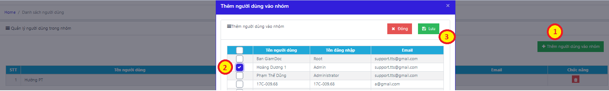

# 6. BỘ PHẬN KHO - SỬA CHỮA

### 6.1 **Quản lý kho thiết bị, phụ tùng** 

Bảng Quản lý phụ tùng có thể coi như các phân xưởng kho vật tư thiết bị của doanh nghiệp. Các vật tư có tên gọi được đồng bộ giữa các kho nhưng quản lý riêng về số lượng tồn của từng kho.

.png>)

_Màn hình Quản lý kho phụ tùng_

**Các bước thêm mới thông tin thiết bị, phụ tùng**

Bước 1: Trong mục Sửa chữa, chọn Thiết bị, phụ tùng

Bước 2: Nhấn nút .png>)🡪 Nhập thông tin vào bảng 🡪 Lưu

.png>)

* Sau khi lưu, thông tin thiết bị sẽ được cập nhật cho tất cả các kho mà doanh nghiệp quản lý
* Nhập tồn cho phép: mặc định theo thông tin tạo mới ban đầu, có thể chỉnh sửa riêng cho từng kho. Thông tin định mức được dùng để đưa ra cảnh báo khi số lượng tồn trong các kho dưới mức cho phép.
* Quản lý chi tiết vật tư: Cho phép quản lý chi tiết số serial của vật tư khi thực hiện nhập kho thiết bị.

### **6.2 Quản lý nhập phụ tùng** 

Quản lý thông tin về nhập kho và cảnh báo chuyển kho chưa đồng bộ.

Nhập kho: bao gồm thông tin phiếu nhập và chi tiết vật tư nhập kho

Chuyển kho: bao gồm các vật tư đã có phiếu xuất từ kho khác nhưng làm nhập kho quản lý.

.png>)

_Màn hình Quản lý nhập phụ tùng_

#### **6.2.1 Thêm mới thông tin nhập** 

Bước 1: Tại mục Sửa chữa, chọn Nhập kho

Bước 2: Tạo thông tin phiếu nhập kho, nhấn .png>), và nhập thông tin vào bảng 🡪 Lưu

* Kho nhập: là kho nhận vật tư vào để quản lý
* Kho xuất: là nơi xuất vật tư đi.

.png>)

_Màn hình Thêm mới nhập phụ tùng_

_Lưu ý: Thông tin có chi tiết vật tư được phần mềm tự động cập nhật theo khai báo đã nhập bên Thiết bị, phụ tùng._

Bước 3: Tạo chi tiết phiếu nhập kho, nhấn vào số tiền tại cột Số hóa đơn 🡪 Thêm mới thông tin các phụ tùng nhập vào phiếu 🡪 Lưu

.png>)

_Thao tác thêm mới chi tiết phiếu nhập phụ tùng_

#### **6.2.2 Cập nhật chi tiết vật tư nhập** 

Trường hợp vật tư có quản lý chi tiết số serial (tích chọn có chi tiết khi thêm mới Thiết bị, phụ tùng), người dùng nhập thêm chi tiết vật tư vào phiếu nhập:

Bước 1: Tại màn hình chi tiết phiếu nhập phụ tùng, nhấn nút .png>) ở vật tư quản lý chi tiết

Bước 2: Nhấn nút Thêm mới 🡪 Nhập thông tin vào bảng 🡪 Lưu

.png>)

_Lưu ý:_

* _Trạng thái vật tư gồm: Mới_ và _Đã qua sử dụng_
* _Thông tin chi tiết phụ tùng sau đó được quản lý cả trong chi tiết Thiết bị, phụ tùng và chi tiết Nhập kho._

### **6.3 Quản lý xuất kho** 

Quản lý các thông tin liên quan đến xuất phụ tùng: xuất sửa chữa, xuất bán, xuất chuyển kho. Giúp bộ phận Sửa chữa quản lý, theo dõi lịch sử xuất phụ tùng đã nhập vào kho, đối chiếu báo cáo xuất-nhập-tồn kho sửa chữa.

.png>)

_Màn hình quản lý xuất kho_

#### **6.3.1 Thêm mới thông tin xuất** 

Bước 1: Tại mục Sửa chữa, chọn Nhập kho

Bước 2: Sau đó nhấn .png>), và nhập thông tin vào bảng 🡪 nhấn Lưu

* Kho xuất: là nơi xuất vật tư đi.
* Kho nhập: là kho nhận vật tư vào để quản lý

.png>)

_Màn hình thêm mới phiếu xuất kho vật tư_

Bước 3: Thêm mới chi tiết phiếu xuất, nhấn vào con số tại cột Số hóa đơn 🡪 nhập chi tiết phiếu xuất 🡪 Lưu

.png>)

_Thao tác thêm chi tiết phiếu xuất_

### **6.4 Quản lý chuyển kho** 

Thông tin trong quản lý nhập kho và xuất kho được quản lý độc lập trên 2 danh mục. Vì vậy, trong trường hợp luân chuyển vật tư giữa các kho, dữ liệu có thể chưa thống nhất giữa các bên nhập và xuất.

Để tránh tình trạng mất cân bằng trong quản lý số liệu của các kho, phần mềm hỗ trợ cảnh báo người dùng các vật tư chưa hoàn thành khai báo và đồng bộ lại dữ liệu.

.png>)

Cụ thể, các vật tư có thông tin nhập kho mà chưa làm xuất kho sẽ hiển thị tại tab Chuyển kho của danh mục Nhập kho.

**Để đồng bộ lại dữ liệu người dùng thực hiện:**

Bước 1: Trong mục Nhập kho, chọn tab Chuyển kho 🡪 Lựa chọn kho thao tác 🡪 nhấn Tìm kiếm

Bước 2: Nhấn vào số hóa đơn xuất để kiểm tra chi tiết vật tư chuyển kho.

Tại màn hình Chuyển kho, nhập trực tiếp Số hóa đơn nhập tại dòng cần đồng bộ, nhập thêm các thông tin khác (phương thức thanh toán, ngày nhập, số đề xuất)

Bước 3: Tích chọn tại đầu dòng 🡪 Nhấn nút .png>), thông tin các vật tư sẽ được đưa sang quản lý bên tab Phiếu nhập và Chi tiết của kho chuyển, không còn trong cảnh báo.

.png>)

_Thao tác đồng bộ dữ liệu chuyển kho_

### **6.5 Quản lý thu mua và báo giá** 

#### **6.5.1 Phân quyền vai trò người dùng** 

Phân quyền truy cập và thao tác các chức năng của Quản lý thu mua và báo giá trong mục **Hành chính** 🡪 **Cài đặt công việc**.

.png>)

_Màn hình quản lý nhóm công việc_

\- Người làm đề nghị mua hàng: toàn bộ người dùng có quyền truy cập vào màn hình Quản lý thu mua và báo giá

\- Người duyệt đề nghị mua hàng và báo giá: nhóm Giám đốc và Phê duyệt báo giá

\- Người làm báo giá: nhóm Báo giá

\- Người làm thu mua (nhập kho hàng): nhóm Thu mua

**Để phân quyền người dùng, thao tác:**

Bước 1: Tại màn hình Cài đặt công việc, nhấn chọn vào dòng Người dùng của cột Số lượng người dùng 🡪 nhấn Thêm người dùng vào nhóm

Bước 2: Tích chọn người dùng muốn đưa vào nhóm. Danh sách người dùng lấy từ Quản trị hệ thống 🡪 bảng Quản lý người dùng.

Bước 3: Nhấn Lưu.

_Thao tác thêm nhân viên vào nhóm theo vai trò_

#### **6.5.2 Lên đề xuất thu mua- Duyệt đề xuất** 

Quản lý các đề xuất mua thêm thiết bị vật tư.

Bước 1: Trong **Quản lý thu mua và báo giá**, chọn tab **Đề xuất và báo giá**

Bước 2: Nhấn **Thêm mới** 🡪 nhập đề nghị mua hàng.

* Hình ảnh trong kho: Cho phép chọn theo danh sách phụ tùng đã khai báo trong Thiết bị, phụ tùng. Nhấn .png>) để chọn ảnh đã lưu trữ trên phần mềm cho phụ tùng đó.
* Trường hợp phụ tùng chưa khai báo/ chưa có ảnh trong kho, người dùng có thể upload trực tiếp từ máy tính vào đề nghị.
* Mô tả: Lấy theo tên vật tư, có thể nhập thêm thông tin.
* Mục đích: đưa vào phiếu in đề nghị mua hàng.

.png>)

_Màn hình nhập và quản lý đề nghị mua hàng_

Bước 3: Phê duyệt đề nghị mua hàng. Người thuộc nhóm Giám đốc/ Phê duyệt báo giá vào màn hình Đề xuất và báo giá🡪 nhấn .png>)

Bước 4: Kiểm tra đề nghị và chuyển trạng thái sang Duyệt mua hàng/ Từ chối mua. Trường hợp Duyệt mua hàng 🡪 chuyển sang quá trình báo giá. Trường hợp từ chối mua, không có các chức năng tiếp theo.

#### **6.5.3 Lên báo giá – duyệt thu mua** 

Tại đề nghị mua hàng đã được duyệt, có thêm chức năng làm báo giá.

Bước 1: Tại màn hình Đề xuất và báo giá, người được phân quyền làm báo giá bấm nút  để vào màn hình báo giá

Bước 2: Tại màn hình báo giá, chọn nút  🡪 Nhập thông tin báo giá🡪 Nhấn Lưu.

Trường hợp làm báo giá cho nhiều hơn một nhà cung cấp🡪 nhấn  để thêm trường nhập dữ liệu.

Trường hợp muốn thêm thông tin thiết bị khác vào báo giá, nhấn nút  🡪 Nhập dữ liệu

_Thao tác tạo báo giá_

Sau khi nhân viên tạo xong báo giá, trạng thái của đề xuất là Chờ duyệt báo giá.

**Để duyệt báo giá, người dùng thực hiện:**

Bước 1: Nhấn vào nút chức năng phê duyệt trong chi tiết báo giá

Bước 2: Chuyển trạng thái báo giá, nhập số lượng phê duyệt 🡪 Lưu

_Thao tác duyệt thu mua_

#### **6.5.4 Theo dõi thu mua** 

Sau khi báo giá được duyệt, thông tin đề xuất được đưa sang bảng Thu mua.

Bước 1: Người được phân quyền (nhóm Thu mua trong Cài đặt công việc) vào màn hình Thu mua, nhấn nút&#x20;

Bước 2: Nhập các thông tin liên quan đến nhập kho 🡪 Nhấn **Lưu.**

_Lưu ý:_

* _Các đề nghị quá thời gian xử lý – Hạn ngày có- mà chưa được nhập kho sẽ được đổi màu để cảnh báo._

_Màn hình cập nhật thông tin thu mua_

### **Thay thế, sửa chữa** 

Quản lý thay thế, sửa chữa giúp bộ phận Sửa chữa cập nhật, quản lý các sửa chữa, thay thế thiết bị theo xe: Mã hóa đơn, Số xe, Người phụ trách, Ngày lập hóa đơn, Tình trạng, Quyết toán, …

_Màn hình Danh sách sửa chữa_

#### **Lên đề xuất sửa chữa** 

Bước 1: Tại mục Sửa chữa, chọn tiếp Thay thế, sửa chữa. Nhấn để khai báo 1 hóa đơn thay thế, sửa chữa.

Bước 2: Nhập thông tin vào bảng theo hướng dẫn

* Mã hóa đơn: được tạo ngẫu nhiên bởi hệ thống
* Phòng ban, Số xe: Lấy thông tin đã được khai báo trong bảng Danh sách xe
* Người phụ trách: bộ phận Sửa chữa, lấy trong Thông tin chung – bảng Nhân viên
* Mã hóa đơn tạm ứng: Danh sách mã hóa đơn tạm ứng trong bảng Quản lý sửa chữa, mục Kế toán

Bước 3: Nhấn Lưu để lưu lại thông tin vừa khai báo.

_Màn hình thêm mới Hóa đơn sửa chữa_

#### **Lên dự tính sửa chữa chi tiết** 

Bước 1: Trong mục **Sửa chữa**, chọn **Thay thế, sửa chữa**

Bước 2: Trong màn hình Danh sách thay thế, sửa chữa, Nhấn vào số tiền tại cột quyết toán, để thực hiện quyết toán sửa chữa

Bước 3: Chọn **Thêm mới** để tạo thông tin làm quyết toán sửa chữa và nhập thông tin sửa chữa vào bảng. Ấn **Lưu** để kết thúc

* Lựa chọn phụ tùng trong kho sẽ tính vào chi phí, vật tư tại kho trong của doanh nghiệp.
* Loại vật tư, tên phụ tùng: Lấy theo bảng Thiết bị, phụ tùng
* Chọn nhà cung cấp để lọc số serial của phụ tùng có chi tiết tương ứng.
* Vị trí lắp đặt được nhập khi phụ tùng thay là lốp
* Thông tin giá tiền và thời gian bảo hành lấy theo thông tin khi nhập phụ tùng.
* Chỉ số km: Là chỉ số đồng hồ của xe trước khi thay mới một phụ tùng.

_Màn hình thêm mới chi tiết hóa đơn sửa chữa_

_Lưu ý:_

### **Quản lý quá hạn** 

Quản lý quá hạn được hiển thị ngay trên màn hình giao diện chính (dashboard) giúp người dùng dễ dàng nắm bắt được những thông tin quá hạn cần xử lý ngay khi đăng nhập vào phần mềm.

_Màn hình Dashboard hiển thị cảnh báo_

Thông tin trong bảng quản lý quá hạn bao gồm: thông tin thêm mới trực tiếp và thông tin từ bảng Quản lý khấu hao liên kết sang.

_Màn hình Quản lý quá hạn_

#### **Theo dõi cảnh báo quá hạn** 

Có 2 cách tạo mới quản lý quá hạn:

* _**Cách 1:**_

Bước 1: Trong mục Sửa chữa, chọn Quản lý quá hạn, nhấn nút Thêm mới

Bước 2: Điền thông tin vào bảng 🡪 Lưu

* Phòng ban, số xe: chọn trong Danh sách xe đã nhập ơ Thông tin Chung
* Phụ tùng: chọn trong danh sách Thông tin phụ tùng
* Serial: Nhập số serial của loại phụ tùng thay thế
* Serial cũ: chọn trong danh sách các số serial của phụ tùng cũ đã khai báo trước đó
* Ngày sửa chữa: Ngày sửa/ thay mới phụ tùng
* Ngày quá hạn: chính là ngày hết hạn sử dụng của phụ tùng vùa thay/ sửa chữa
* _**Cách 2:**_

Tạo Quyết toán sửa chữa trong chức năng Sửa chữa, thay thế🡪 Khai báo phụ tùng, số serial, serial cũ, và ngày quá hạn. (xem chi tiết tại mục Thay thế, sửa chữa)

_Bảng thêm mới thông tin sửa chữa_

#### **Hướng dẫn xử lý thông tin cảnh báo quá hạn** 

Việc đặt hạn sử dụng cho phụ tùng giúp chủ xe chủ động trong việc bảo dưỡng, thay thế các phụ tùng đã xuống cấp hoặc đến hạn cần thay thế nhằm kéo dài tuổi thọ cho xe và đảm bảo an toàn khi xe lưu thông trên đường.

Phụ tùng theo xe được quản lý quá hạn với 02 trạng thái: Đang sử dụng và Hoàn thành

* Đang sử dụng: Khi phụ tùng theo xe chưa đến ngày quá hạn
* Hoàn thành: sau khi thay thế/ sửa chữa phụ tùng quá hạn bằng phụ tùng mới (có thể hiểu là việc chuyển số serial cũ 🡪 số serial mới của phụ tùng tương ứng).

**Cách thực hiện:** Xử lý quá hạn bằng cách thay mới phụ tùng. Thực hiện theo 2 cách như Tạo mới quá hạn (mục 6.7.1)

* Chọn đúng số xe có phụ tùng quá hạn
* Chọn phụ tùng quá hạn để khai báo sửa/thay mới
* Chọn số serial cũ- số serial của phụ tùng quá hạn, thêm số serial mới và ngày quá hạn để tiếp tục quản lý.
  1. **Điều xe sửa chữa**

Điều xe sửa chữa có chức năng tương tự như Thay thế, sửa chữa. Trong khi Thay thế, sửa chữa được thực hiện tại Nơi sửa chữa; Điều xe sửa chữa thay thế, sửa chữa các thiết bị theo xe trong quá trình vận chuyển ( do sự cố).

_Màn hình Điều xe sửa chữa_

#### **Lên đề xuất sửa chữa** 

Bước 1: Tại mục Sửa chữa, chọn tiếp Điều xe sửa chữa. Nhấn để khai báo 1 hóa đơn điều xe sửa chữa.

Bước 2: Nhập thông tin vào bảng theo hướng dẫn

* Số xe, Lái xe: Lấy thông tin đã được khai báo trong bảng Danh sách xe
* Tuyến đường, Ngày sửa, Giờ vào, Giờ ra: người dùng tự thiết lập theo thực tế

Bước 3: Nhấn Lưu để lưu lại thông tin vừa khai báo.

_Màn hình thêm mới Hóa đơn điều xe sửa chữa_

#### **Lên dự tính sửa chữa chi tiết** 

Bước 1: Trong mục **Sửa chữa**, chọn **Điều xe sửa chữa**

Bước 2: Trong màn hình Điều xe sửa chữa, Nhấn vào nút  để bắt đầu thực hiện quyết toán sửa chữa

Bước 3: Chọn **Thêm mới** để tạo thông tin làm quyết toán sửa chữa và nhập thông tin sửa chữa vào bảng. Ấn **Lưu** để kết thúc

* Lựa chọn phụ tùng trong kho sẽ tính vào chi phí, vật tư tại kho trong của doanh nghiệp.
* Loại vật tư, tên phụ tùng: Lấy theo bảng Thiết bị, phụ tùng
* Chọn nhà cung cấp để lọc số serial của phụ tùng có chi tiết tương ứng.
* Vị trí lắp đặt được nhập khi phụ tùng thay là lốp
* Thông tin giá tiền và thời gian bảo hành lấy theo thông tin khi nhập phụ tùng.
* Chỉ số km: Là chỉ số đồng hồ của xe trước khi thay mới một phụ tùng.

<figure><figcaption>
<em>Màn hình thêm mới chi tiết hóa đơn sửa chữa</em>
</figcaption></figure>

