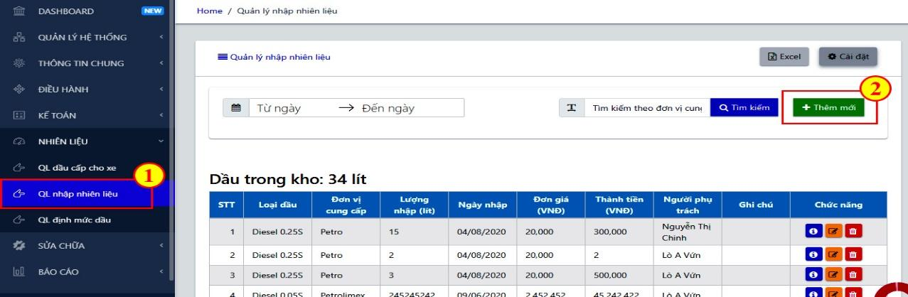
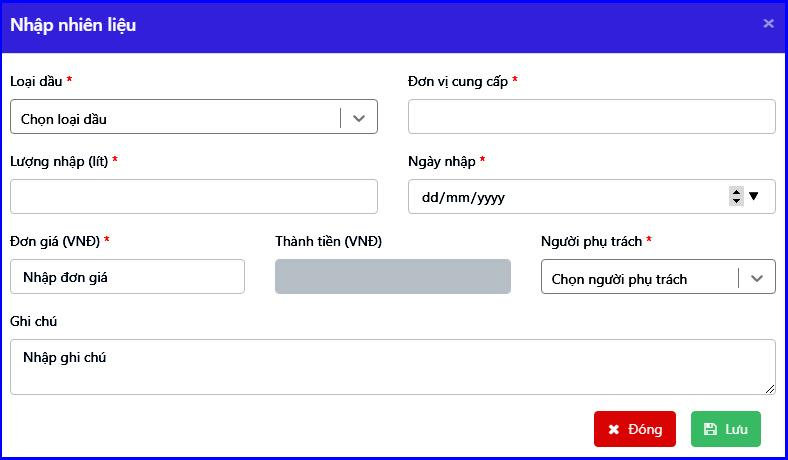

# 7. BỘ PHẬN QUẢN LÝ NHIÊN LIỆU

### 7.1 **Quản lý nhập nhiên liệu** 

Bước 1: Tại mục **Nhiên liệu**, lựa chọn chức năng **Quản lý nhập nhiên liệu**.

Bước 2: Nhấn nút 🡪 Điền các thông tin vào bảng.

Bước 3: Nhấn Lưu để lưu lại thông tin thêm mới nhiên liệu

_Lưu ý:_

* _Mục người phụ trách là <mark style="background-color:orange;">vị trí Chung</mark> được nhập trong mục nhân viên trong phần nhập Thông tin chung._
* _Tỷ lệ hao hụt dùng để tính lượng hao hụt trong báo cáo tồn dầu._

### **7.2 Quản lý định mức dầu chuyến xe** 

Trong mục quản lý định mức dầu của mục nhiên liệu, người dùng có thể quản lý định mức dầu theo từng xe trong từng chuyến hàng và lô hàng

**Cập nhật đinh mức dầu:**

Bước 1: Tại mục Nhiên liệu, lựa chọn chức năng Quản lý định mức dầu

Bước 2: Nhập định mức dầu tại cột Định mức dầu. Phần mềm tự động tính ra tổng định mức dầu trên cả chuyến hàng.

_Lưu ý: Định mức thay đổi trong màn hình này được đồng thời cập nhật vào Quản lý cước vận chuyển để tính toán chi phí cho xe và đưa dữ liệu vào các báo cáo._

Bước 3: Tại cột chức năng, có chức năng in phiếu cấp dầu. Sau khi vào chức năng này, sẽ có cột hành động -> In phiếu -> tại đây sẽ xuất hiện Phiếu cấp xăng dầu. Mã phiếu sẽ tăng tự động, Mỗi phiếu dầu sẽ phải có mã số khác nhau, phần mềm sẽ tự động nhảy mã phiếu theo thứ tự tặng dần. Trong danh sách xe đã thêm thuộc tính xe cấp dầu bằng thẻ, chính vì vậy, những xe đổ cây dầu trong bằng thẻ dầu phần mềm sẽ khoá chức năng in phiếu dầu đối với những xe này, nhưng vẫn cho phép chức năng cấp dầu thực tế để link được vào Báo cáo vận chuyển.

Ngoài ra, Tại quản lý định mức dầu, ở cột chức năng in, ngoài tích In phiếu, còn một chức năng khác nữa, đó là tích Cấp dầu. Sau khi tích sẽ hiện bảng điền thông tin lượng dầu cấp thực tế cho xe, khi đó, thông tin này sẽ tự động link sang Quản lý dầu cấp cho xe và Báo cáo vận chuyển.

### **7.3 Quản lý cấp dầu cho xe** 

Chức năng quản lý thông tin các lượt đổ dầu cho xe. Hỗ trợ kiểm tra, kiểm soát hoạt động xuất bán dầu cho các xe ngoài công ty.

#### **7.3.1 Thêm mới dầu cấp từng xe** 

Có 2 cách để thêm mới cấp dầu:

* _**Cách 1: Thêm mới từng lần cấp**_

Bước 1: Tại mục Nhiên liệu, chọn QL dầu cấp cho xe

Bước 2: Nhấn nút  🡪 nhập thông tin vào bảng 🡪 Lưu.

.png>)

<figure><figcaption>
<em><strong>Màn hình nhập dữ liệu</strong></em>
</figcaption></figure>

* Biển số xe: Chọn từ danh sách xe đã nhập trong mục Thông tin chung
* Nơi cung cấp: Chọn theo danh sách NCC Nhiên liệu đã nhập trong Thông tin chung, bảng Đối tác. Phần mềm lấy theo khai báo để xác định việc đổ dầu lấy từ cây dầu trong công ty hay đổ ngoài.
* Chỉ số cây dầu: Nhập chỉ số để quản lý cây dầu trong kho (nếu cần)
* Số dầu cấp: Nhập lượng dầu cấp thực tế cho xe
* Số phiếu xuất: Nhập số phiếu xuất thay cho hóa đơn bán dầu

#### **7.3.2 Tải file excel dầu cấp nhiều xe** 

Bước 1: Tại màn hình Ql cấp dầu cho xe, nhấn nút 

* Mẫu file excel tải lên: [https://bitly.com.vn/0e9aeq](https://bitly.com.vn/0e9aeq)

Bước 2: Chọn file excel từ máy tính 🡪 nhấn Mở để đưa file lên phần mềm.

* Mã vòi: NCC Nhiên liệu đã khai báo trong TTC (tên đầy đủ)
* Biển xe: cần lấy theo danh sách xe đã khai báo trong TTC
* Nhóm khách hàng: chủ xe

_Lưu ý: trong trường hợp người dùng khai báo cấp dầu từ cây dầu của công ty, số liệu sẽ được sử dụng vào báo cáo tồn dầu._

.png>)
