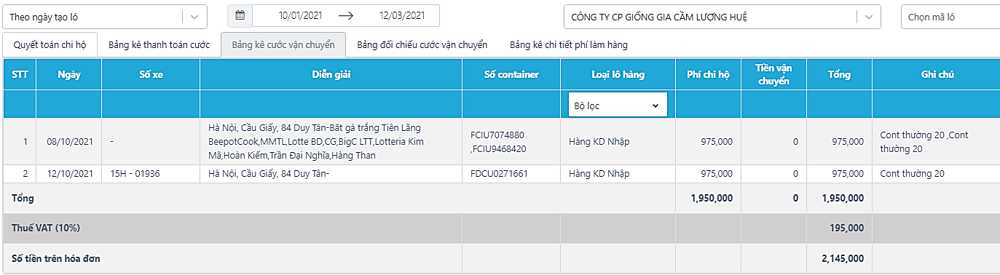
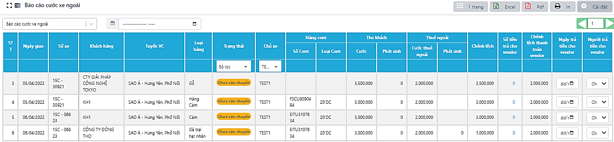
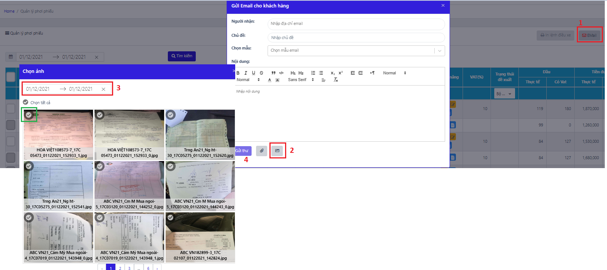

# 8. BÁO CÁO

Báo cáo được cài đặt tùy chỉnh theo từng yêu cầu riêng của công ty vận tải. Báo cáo được phân loại theo:

* Báo cáo tổng hợp
* Báo cáo Trucking
* Báo cáo kho- sửa chữa
* Báo cáo dầu

### **8.1 Báo cáo tổng hợp** 

#### **8.1.1 Báo cáo Doanh thu chi phí theo xe (DTCP)** 

Báo cáo Doanh thu chi phí theo xe là bảng tổng hợp thông tin lấy dữ liệu trong các bảng của mục: Điều hành, Kế toán, Sửa chữa, Nhiên liệu để tổng hợp chi phí theo từng xe. Gồm có:

* Báo cáo chi tiết: Chi tiết từng chuyến hàng theo xe, chi phí trên từng chuyến
* Báo cáo tổng hợp: Tổng hợp chi phí của xe trên tất cả các chuyến vận chuyển

**8.1.1.1 Mẫu 1- mẫu chung**

.png>)

.png>)

<table data-header-hidden><thead><tr><th width="191"></th><th></th></tr></thead><tbody><tr><td>Lượng giao/ Lượng nhận</td><td>Lượng lái xe giao / Lượng lái xe nhận </td></tr><tr><td>Lượng hao hụt</td><td>Lượng Giao - Nhận</td></tr><tr><td>DT vận tải bộ</td><td>Cước thực thu trong Ql cước vc (= Định mức cước – Chiết khấu)</td></tr><tr><td>Lưu ca</td><td>Tổng tiền lưu ca trong Ql cước vc</td></tr><tr><td>Nhiên liệu </td><td>Tổng tiền nhiên liệu trong Ql chi phí vc (mặc định= (lượng dầu ĐM + Bổ sung) x Đơn giá định mức -lấy từ TTC) </td></tr><tr><td>Chi phí đi đường </td><td>Tổng tiền đường trong Ql chi phí vc</td></tr><tr><td>Lương LX</td><td>Lương khai báo trong bảng Nhân viên (k bao gồm phụ cấp, ...)</td></tr><tr><td>Sửa chữa </td><td>Tổng chi phí các hóa đơn sửa chữa của xe trong tháng </td></tr><tr><td>Đăng kiểm &#x26; lưu thông </td><td>(Phí đăng kiểm + dịch vụ) + Phí lưu thông đường bộ cho xe và mooc được gán cho xe</td></tr><tr><td>Bảo hiểm</td><td>Bảo hiểm Trách nhiệm dân sự + Bảo hiểm vật chất</td></tr><tr><td>Ngân hàng </td><td>Vay ngân hàng + Lãi ngân hàng </td></tr><tr><td>Định vị </td><td>Phí định vị + Phí camera</td></tr><tr><td>Chi phí khác</td><td>Các khoản phí thường niên còn lại </td></tr><tr><td>Lợi nhuận </td><td>(DTVT bộ + Lưu ca) - Chi phí xe</td></tr></tbody></table>

**8.1.1.2 Mẫu 2 – Dùng cho điều xe ghép**

.png>)

.png>)

<table data-header-hidden><thead><tr><th width="215"></th><th></th></tr></thead><tbody><tr><td>Ngày đi</td><td>Ngày xe đi</td></tr><tr><td>Tuyến đường</td><td>Điểm đến trong KHĐX</td></tr><tr><td>
Vé/ Sửa rửa/ Dầu

Ăn/ Công an
</td><td>Thông tin tiền đường trong Điều xe ghép</td></tr><tr><td>Bốc vác</td><td>Tiền phát sinh, nhập trong Đx ghép- phần thông tin tiền đường </td></tr><tr><td>Bồi dưỡng</td><td>Chi phí khác, nhập trong Đx ghép- phần thông tin tiền đường </td></tr><tr><td>Tổng DT </td><td>= Cước thực thu + phát sinh (ô nhập bên cạnh Cách tính cước)</td></tr><tr><td>Tổng Chi phí</td><td>= Tổng CP </td></tr><tr><td>Đền Hao hụt </td><td>= [(lượng nhận - lượng giao)- (lượng nhận x %hao hụt)] x Giá đền bù</td></tr><tr><td>Đền tiền hàng </td><td>
= Tiền hàng trong bảng lương lái xe (Chính là tiền đền bù gà yếu, chết)

= Đơn giá bù * Lái xe chịu (Nhập chi tiết trong Tiền hàng)
</td></tr><tr><td>Lợi nhuận _ Dầu không theo chuyến</td><td>Tổng lượng Dầu cấp theo xe trong tháng</td></tr><tr><td>Lợi nhuận _ Sửa xe k theo chuyến</td><td>Tổng tiền các hóa đơn sửa chữa của xe trong tháng (theo ngày sửa)</td></tr><tr><td>Phí khác</td><td>Phí thường niên hàng tháng của xe</td></tr><tr><td>Lợi nhuận xe</td><td>= Tổng DT - (Tổng chi phí + Đền hao hụt + Đề tiền hàng + Dầu k theo chuyến + Sửa xe k theo chuyến + Phí khác)</td></tr><tr><td>% lái xe hưởng</td><td>Theo khai báo Lợi nhuận trong Đx ghép</td></tr><tr><td>Vận chuyển </td><td>= (Cước + Phát sinh- Đền hao hụt - Đền tiền hàng) x % lx hưởng </td></tr><tr><td>Hao hụt</td><td>= Đền hao hụt lô hàng</td></tr><tr><td>Dầu k theo chuyến </td><td>= Lợi nhuận _ Dầu không theo chuyến</td></tr><tr><td>Sửa k theo chuyến</td><td>
Tổng các hóa đơn sửa xe trong tháng tính theo CT sau

HĐ &#x3C;1 triệu: Tính toán bộ cho lái xe

HĐ > 1 triệu: Lái xe chịu = 1 triệu + (Hóa đơn - 1 triệu)/ 2
</td></tr><tr><td>VETC</td><td>= Tổng VETC trong tháng (nhập tại Quản lý phí thường niên)</td></tr><tr><td>Lái xe _ Lợi nhuận</td><td>= Tổng thu - (Tổng CP + VETC + Dầu k theo chuyến + Sửa xe k theo chuyến)</td></tr><tr><td>Phí thường niên </td><td>= Tổng các phí thường niên của xe trong tháng (trừ VETC đã tính cho Lxe)</td></tr><tr><td>Cước thu</td><td>= (Cước + Phát sinh - Đền hao hụt - Đền tiền hàng)* (100%- % lái xe hưởng) </td></tr><tr><td>Hỗ trợ sửa xe</td><td>
HĐ > 1 triệu 

= (Hóa đơn - 1 triệu)/ 2

= Sửa chữa k theo chuyến (Lợi nhuận) - Sửa chữa k theo chuyến (Lái xe) 
</td></tr><tr><td>Lợi nhuận</td><td>= Cước thu - (Phí thường niên + Hỗ trợ sửa xe)</td></tr></tbody></table>

#### **8.1.13 Báo cáo bộ phận thống kê**

.png>)

.png>)

<figure><figcaption>
<em><strong>Màn hình Báo cáo bộ phận thống kê</strong></em>
</figcaption></figure>

<table data-header-hidden><thead><tr><th width="268"></th><th></th></tr></thead><tbody><tr><td>Mã KH</td><td>Lấy từ cột Mã đối tác trong Quản lý đối tác - TTC</td></tr><tr><td>Khách hàng</td><td>Tên đầy đủ của khách hàng, link từ bảng Quản lý đối tác - TTC</td></tr><tr><td>Mã chuyến ghép</td><td>Link từ cột Mã chuyến ghéo trong Điều xe</td></tr><tr><td>Tên hàng</td><td>Lấy từ Quản lý hàng hóa – TTC, link từ Qly lô hàng</td></tr><tr><td>Số book/bill</td><td>Lấy theo số vận đơn/ booking trong Quản lý lô hàng</td></tr><tr><td>Loại cont</td><td>Loại cont của chuyến</td></tr><tr><td>Hàng nhập/xuất</td><td>Loại hàng xuất/ nhập/ nội địa trong Quản lý lô hàng</td></tr><tr><td>Điểm lấy hàng/đóng hàng</td><td>Link từ Kế hoạch vận chuyển</td></tr><tr><td>Điểm giao hàng/nhận hàng</td><td>Link từ Kế hoạch vận chuyển</td></tr><tr><td>Điểm hạ vỏ/lấy vỏ</td><td>Link từ Kế hoạch vận chuyển</td></tr><tr><td>Cảng xuất</td><td>Link từ Quản lý lô hàng</td></tr><tr><td>Số cont</td><td>Số cont của chuyến xe</td></tr><tr><td>Số seal</td><td></td></tr><tr><td>Số tờ khai</td><td>Link từ Quản lý lô hàng</td></tr><tr><td>Ngày xe chạy</td><td>Ngày vận chuyển trong Kế hoạch điều xe</td></tr><tr><td>Thời gian nhận hàng</td><td>Link từ app mobile, sau khi lái xe tích nhận hàng</td></tr><tr><td>Thời gian giao hàng</td><td>Link từ app mobile, sau khi lái xe tích giao hàng</td></tr><tr><td>Tổng thời gian giao nhận hàng</td><td>= Thời gian giao hàng – Thời gian nhận hàng</td></tr><tr><td>Số xe</td><td>Link từ Điều xe</td></tr><tr><td>Tuyến đường</td><td></td></tr><tr><td>Số phiếu dầu</td><td></td></tr><tr><td>Dầu ĐM</td><td>Link từ cột ĐM dầu trong Quản lý chi phí vận chuyển</td></tr><tr><td>Bù trừ dầu</td><td></td></tr><tr><td>Dầu thực tế</td><td>Link từ Quản lý dầu cấp cho xe</td></tr><tr><td>Vé chuyến</td><td>Tiền vé trong Quản lý chi phí vận chuyển</td></tr><tr><td>Lương chuyến</td><td>Ca xe trong Quản lý chi phí vận chuyển</td></tr><tr><td>Đi đường</td><td></td></tr><tr><td>Vé cao tốc</td><td>Vé cao tốc PS trong Quản lý chi phí vận chuyển</td></tr><tr><td>CP phát sinh</td><td></td></tr><tr><td>Tổng chi phí</td><td>Tiền đường trong Quản lý chi phí vận chuyển</td></tr><tr><td>Lưu ca</td><td>Tổng tiền lưu ca trong Ql cước vc</td></tr><tr><td>Ghi chú</td><td></td></tr></tbody></table>

#### **8.1.2 Báo cáo lô hàng** 

Tổng hợp các chi phí làm hàng theo lô, bao gồm: chi phí hải quan, chi trả hộ, thu chi từ lái xe, cước vận chuyển, cược vỏ, lưu ca, …; Tính toán chênh lệch trong QTNB và QTKH.

Báo cáo lô hàng được tự động cập nhật khi người dùng có các thay đổi số liệu chi phí chuyến hàng ở các tác vụ khác: Cập nhật chi phí chi, trả hộ; Cập nhật thông tin lưu ca; Cập nhật thông tin cược vỏ, Cập nhật thu chi lái xe.

.png>)

<table data-header-hidden><thead><tr><th width="218"></th><th></th></tr></thead><tbody><tr><td>Điều kiện hiển thị </td><td>Tạo tạm ứng lô hàng từ Quản lý lô hàng đủ/ rút gọn</td></tr><tr><td>Nội dung chi phí</td><td>
- Các chi phí trong tạm ứng lô hàng 

- Cước các chuyến vận chuyển của lô (Thực tế theo cước thực thu, KH theo cước HĐ), Lưu ca của lô – Theo Ql cước vc và QTKH.

- Chi phí trong Quản lý thu chi lái xe
</td></tr><tr><td>Ngày thực hiện</td><td>
- Chi phí tạm ứng - Ngày tạo tạm ứng 

- Cước + lưu ca: Ngày điều xe

- Chi phí thu chi lái xe: Ngày nhập phí
</td></tr><tr><td>Ghi chú</td><td>Ghi chú của Điều xe và tạm ứng lô hàng.</td></tr></tbody></table>

#### **8.1.3 Thanh toán khách hàng** 

**8.1.3.1 Quyết toán chi hộ**

.png>)

<table data-header-hidden><thead><tr><th width="250"></th><th></th></tr></thead><tbody><tr><td>Điều kiện hiển thị</td><td>Tìm kiếm theo ngày tạo lô/ ngày thanh toán, có tạm ứng</td></tr><tr><td>Ghi chú</td><td>Ghi chú QTKH (hoặc từ tạm ứng/ QTNB)</td></tr><tr><td>Ngày TK</td><td></td></tr><tr><td>Bill/ Booking</td><td>Lấy theo số vận đơn/ booking trong Quản lý lô hàng</td></tr><tr><td>Ngày tạo lô</td><td>Ngày tạo lô hàng</td></tr><tr><td>Tờ khai hải quan/ số cont</td><td>Số tờ khai/ số cont được khai báo ở Qly lô hàng</td></tr><tr><td>Hàng, Loại cont </td><td>Loại hàng xuất/ nhập/ nội địa; loại hàng cont 20, 40,... trong Ql lô hàng</td></tr><tr><td>Trị giá hóa đơn </td><td>theo Thành tiền trong QTKH</td></tr><tr><td>Mã lô</td><td>Mã lô được tạo tạI Qly lô hàng</td></tr><tr><td>Nội dung</td><td>Các chi phí Chi trả hộ trong QTKH</td></tr><tr><td>Ngày thanh toán</td><td>Ngày tích thanh toán trong Tạm ứng lô hàng/ Quản lý tạm ứng- tab Thanh toán</td></tr><tr><td>Ngày hóa đơn</td><td>Ngày hóa đơn trong Tạm ứng lô hàng/ Quản lý tạm ứng- tab Thanh toán</td></tr><tr><td>Số hóa đơn</td><td>Nhập tại cột hóa đơn ở Quyết toán theo KH</td></tr><tr><td>Trị giá hóa đơn</td><td>Là số thành tiền của các phí trong bảng</td></tr></tbody></table>

**8.1.3.2 Bảng kê thanh toán cước**

.png>)

| Ngày                   | Ngày điều xe, tìm kiếm phụ thuộc vào ngày điều xe, dữ liệu chạy theo Ql cước vc                                                                                                                        |
| ---------------------- | ------------------------------------------------------------------------------------------------------------------------------------------------------------------------------------------------------ |
| Diễn giải              | 
Tuyến đường lấy theo điểm Mở rộng - Chi tiết 

TH phát sinh chuyển điểm: thêm 1 dòng ghi điểm phát sinh 
                                                                                   |
| Lượng giao, Lượng nhận | Lấy theo Ql cước vc. Lượng giao= Lượng lx giao, Lượng nhận= Lượng lx nhận                                                                                                                              |
| Chênh lệch             | = Lượng nhận - Lượng giao                                                                                                                                                                              |
| Đơn giá                | Đơn giá HĐ, theo Ql cước vc                                                                                                                                                                            |
| Tiền cước              | Cước HĐ                                                                                                                                                                                                |
| Phát sinh cước         | phát sinh cước HĐ khi chuyển điểm+ Lưu ca                                                                                                                                                              |
| Phí dịch vụ            | 
Chạy từ phí dịch vụ thông quan trên QTKH: 

Hàng cont: lấy đơn giá * Số lượng cont của chuyến (Đơn vị Cont 20, cont 40)

Hàng rời: Đơn giá * Trọng lượng nhận của chuyến (đơn vị tấn)
 |
| Cộng                   | = Tiền cước + Phát sinh cước + Phí dịch vụ                                                                                                                                                             |
| Ghi chú                | Số cont từ điều xe                                                                                                                                                                                     |

**8.1.3.3 Bảng kê cước vận chuyển**

<table data-header-hidden><thead><tr><th width="218"></th><th></th></tr></thead><tbody><tr><td>Ngày</td><td>Ngày tạo lô</td></tr><tr><td>Tìm kiếm</td><td>Ngày điều xe</td></tr><tr><td>Số xe</td><td>theo Điều xe</td></tr><tr><td>Diễn giải </td><td>Tuyến đường lấy theo điểm Mở rộng - Chi tiết </td></tr><tr><td>Số container </td><td>Số cont từ điều xe</td></tr><tr><td>Loại lô hàng </td><td>Loại hàng xuất/ nhập/ nội địa trong Ql lô hàng</td></tr><tr><td>Phí chi hộ</td><td>=Tổng chị trả hộ (QTKH)/ số chuyến của lô (làm tròn đến hàng nghìn VNĐ)</td></tr><tr><td>Tiền VC</td><td>= Thành tiền cước HĐ + Phát sinh cước HĐ (chưa bao gồm Lưu ca 9/11)</td></tr><tr><td>Tổng</td><td>= Phí chi hộ + Tiền vận chuyển</td></tr><tr><td>Ghi chú</td><td>Loại cont (20’, 40’...)</td></tr></tbody></table>

**8.1.3.4 Bảng đối chiếu cước vận chuyển**

.png>)

<table data-header-hidden><thead><tr><th width="236"></th><th></th></tr></thead><tbody><tr><td>Ngày</td><td>Ngày tạo/ sửa lô</td></tr><tr><td>Số xe</td><td>Số xe đã chọn khi tạo điều xe</td></tr><tr><td>Diễn giải</td><td>Tuyến đường trong điều xe (tuyến đầu tiên, không tính chuyển điểm)</td></tr><tr><td>Mã lô</td><td>Mã lô đã tạo trong Qly lô hàng</td></tr><tr><td>Bill</td><td>Lấy theo số vận đơn/ booking trong Quản lý lô hàng</td></tr><tr><td>Lượng giao</td><td>Lượng giao khi khai báo ở Điều xe</td></tr><tr><td>Làm luật</td><td>Phí kẹp quá tải của Phí chi trả hộ theo thuyến - Qly chi phí vận chuyển</td></tr><tr><td>Chi phí phát sinh theo chuyến</td><td>bỏ</td></tr><tr><td>Chi phí khác</td><td>bỏ</td></tr><tr><td>Chi phí phát sinh tiền đường</td><td>bỏ</td></tr><tr><td>Tổng cước VC (chưa VAT)</td><td>Cước TT - Qly cước VC</td></tr><tr><td>VAT</td><td></td></tr><tr><td>Tổng</td><td>bỏ</td></tr><tr><td>Lượng nhận</td><td>Lượng nhận được khai báo khi điều xe</td></tr><tr><td>Số cont</td><td>Số cont của chuyến xe</td></tr><tr><td>Cont/ Chuyến</td><td>(Các) loại cont của chuyến</td></tr><tr><td>Tiền cước</td><td>Tiền cước HĐ</td></tr><tr><td>Phí nâng hàng</td><td></td></tr><tr><td>Phí hạ hàng</td><td></td></tr><tr><td>Phát sinh khác</td><td>Phát sinh cước chuyển điểm + Lưu ca</td></tr><tr><td>Cộng</td><td></td></tr><tr><td>Lưu ca</td><td></td></tr><tr><td>Phát sinh chuyển điểm</td><td></td></tr><tr><td>Ghi chú</td><td>theo ghi chú của Điều xe</td></tr></tbody></table>

**8.1.3.5 Bảng kê chi tiết phí làm hàng**

.png>)

<table data-header-hidden><thead><tr><th width="234"></th><th></th></tr></thead><tbody><tr><td>Ngày thực hiện</td><td>Ngày tạo/ sửa lô</td></tr><tr><td>Bill</td><td>Số vận đơn/ booking khai báo khi tạo lô</td></tr><tr><td>Mã lô</td><td>Được tạo ra từ Qly lô hàng</td></tr><tr><td>Loại lô hàng</td><td>Nhập/xuất/Nội địa</td></tr><tr><td>Phí dịch vụ giao nhận hàng nhập khẩu</td><td>= Tổng phí dịch vụ trong qtkh - (lưu ca + cước vận chuyển + phát sinh chuyển điểm + phát sinh lạch huyện)</td></tr><tr><td>Chi phí hải quan giám sát</td><td>=Phí HQ giám sát ở Qly tạm ứng lô hàng</td></tr><tr><td>Phát sinh vận chuyển</td><td>Tổng cước VC trong QTKH</td></tr><tr><td>Thuế GTGT dịch vụ</td><td>Tổng phí dịch vụ trong QTKH * VAT (được khai báo khi tạo lô hàng)</td></tr><tr><td>Thuế GTGT vận chuyển</td><td>Tổng Cước VC trong QTKH * VAT</td></tr><tr><td>VAT</td><td>Phí VAT được khai báo khi tạo lô hàng</td></tr><tr><td>Khách tạm ứng</td><td>Được khai báo cột Khách tạm ứng - Qly cước VC</td></tr><tr><td>Danh sách phí</td><td>Các phí thuộc mục Chi trả hộ của QTKH (số HĐ, ngày HĐ lấy từ QTNB sang)</td></tr><tr><td>Tổng</td><td>Tổng chi phí chi trả hộ</td></tr><tr><td>Lưu ca</td><td>tiền lưu ca được khai báo khi tạo Điều xe</td></tr><tr><td>Phí phát sinh chuyển điểm</td><td>Phí phát sinh khi có tuyến chuyển điểm được link từ cột Phát sinh chuyển điểm - Qly cước VC</td></tr><tr><td>Tổng cộng</td><td>Tổng các phí trên bảng</td></tr><tr><td>Số cont</td><td>Số cont đã vận chuyển của lô</td></tr><tr><td>Ghi chú</td><td>theo ghi chú của Điều xe</td></tr></tbody></table>

#### **8.1.4 Báo cáo cước xe ngoài** 

**8.1.4.1 Báo cáo cước xe ngoài**

Hiển thị thông tin chuyến hàng và cước phí tương ứng với những chuyến xe thuê ngoài.

<table data-header-hidden><thead><tr><th width="154"></th><th></th></tr></thead><tbody><tr><td>Báo cáo cước xe ngoài </td><td>
Báo cáo của các xe thuần xe ngoài (chỉ nằm trong nhóm Đơn vị vận tải - bảng 

Đối tác)
</td></tr><tr><td>Thu khách</td><td>
Cước: Cước HĐ được tính trong Ql cước vc

Phát sinh: Lưu ca + Chi trả hộ theo chuyến, được tính trong Ql cước vc
</td></tr><tr><td>Thuê ngoài</td><td>
Cước: Cước thuê ngoài, được tính trong Ql cước vc

Phát sinh: cột Phát sinh cước thuê ngoài, được tính trong Ql cước vc 
</td></tr><tr><td>Chênh lệch</td><td>= Thu khách - Thuê ngoài</td></tr><tr><td>Trạng thái</td><td>
Theo trạng thái trong Điều xe

Vận chuyển= chưa vc, đã nhận hàng, đã giao hàng, về bãi 

Hủy. trễ= hủy chuyến, bị trễ
</td></tr><tr><td>Ghi chú</td><td>Theo ghi chú điều xe</td></tr></tbody></table>

**8.1.4.2 Báo cáo đối soát**

Báo cáo đối soát: Hiển thị thông tin chuyến hàng và cước phí tương ứng với những chuyến xe thuê ngoài của đơn vị vận tải vừa là nhà xe vừa là khách hàng. Sử dụng để đối soát cước giữa 2 đơn vị và hạch toán hàng tháng.

Báo cáo theo các xe là chủ xe ngoài (nằm trong nhóm Đơn vị vận tải và có thể cả nhóm KH,...). Đơn vị vận tải được chọn tìm kiếm đóng vai trò là cả Chủ xe và Khách hàng.

Mẫu hiển thị: Giống với Báo cáo cước xe ngoài.

#### **8.1.5 Báo cáo tổng hợp theo dõi bảo hiểm**

Báo cáo tổng hợp theo dõi bảo hiểm tổng hợp thông tin lấy dữ liệu từ Danh sách xe và mục Quản lý phí thường niên – Kế toán

.png>)

<table data-header-hidden><thead><tr><th width="397"></th><th></th></tr></thead><tbody><tr><td>Nhãn hiệu, Năm sản xuất, Tải trọng</td><td>Lấy trong Danh sách xe </td></tr><tr><td>Tên đăng ký, Hạn ngân hàng, Ngày mua bảo hiểm</td><td>Vay ngân hàng/Lãi ngân hàng</td></tr><tr><td>BHTNDS</td><td>Lấy trong Kế toán – Quản lý phí thường niên</td></tr><tr><td>BHVC</td><td>Lấy trong Kế toán – Quản lý phí thường niên</td></tr></tbody></table>

#### **8.1.6 Bảng kê chi tiết vận tải**

.png>)

| Thời gian tìm kiếm                     | Ngày vận chuyển                                               |
| -------------------------------------- | ------------------------------------------------------------- |
| Khách hàng                             | Lấy từ cột Mã đối tác trong Quản lý đối tác - TTC             |
| Hãng tàu                               | Lấy từ Quản lý hãng tàu trong TTC và link từ Qly lô hàng      |
| Ngày chạy                              | Ngày vận chuyển                                               |
| Xe chạy                                | Link từ Điều xe                                               |
| Tuyến đường                            |                                                               |
| Tên hàng                               | Lấy từ Quản lý hàng hóa – TTC, link từ Qly lô hàng            |
| BL - INVOICE NO                        | Số vận đơn/số booking trong Qly lô hàng                       |
| Tờ khai                                | Số tờ khai trong Qly lô hàng                                  |
| Ngày TK                                | Ngày làm tờ khai trong Qly lô hàng                            |
| Luồng TK                               |                                                               |
| Số cont                                | Số cont của chuyến xe                                         |
| Loại cont                              | (Các) loại cont của chuyến                                    |
| SL                                     | Số lượng cont của chuyến                                      |
| X/N                                    | Loại lô hàng trong Qly lô hàng                                |
| 
Cước vận chuyển

Tổng cộng
 | 
Link từ chi phí trong QTKH

= cột Phát sinh + VAT
 |
| 
Chi trả hộ

Tổng tiền
      | Link từ chi phí trong QTNB                                    |
| Hóa đơn                                |                                                               |

### **8.2 Báo cáo trucking** 

#### **8.2.1 Báo cáo cước phí** 

**8.2.1.1 Báo cáo cước phí theo khách hàng**

Báo cáo theo Khách hàng: Tổng hợp các nội dung liên quan đến thu chi cho khách có phát sinh vận chuyển trong tháng. Cho phép lọc theo khách hàng và theo tháng.

.png>)

<table data-header-hidden><thead><tr><th width="234"></th><th></th></tr></thead><tbody><tr><td>Chủ xe</td><td>Lấy theo tên viết tắt, riêng xe trong thì chia theo phòng ban </td></tr><tr><td>Điểm bắt đầu - Địa điểm giao hàng</td><td>Lấy theo Điểm đi - Điểm đến trong Điều xe, chiều xe đi đầu tiên</td></tr><tr><td>Ngày giao, số cont, loại cont, số vỏ rỗng, số kiện </td><td>Lấy theo dữ liệu trong điều xe</td></tr><tr><td>Lượng giao - nhận</td><td>Có thể lấy trong khai báo khi điều xe hoặc trong Ql cước vc </td></tr><tr><td>Khoảng cách</td><td>Tổng các chiều đi (không lấy chiều về cuối cùng)</td></tr><tr><td>Cước nội bộ</td><td>Ql cước vc, Chênh lệch = Thực thu - Thuê ngoài</td></tr><tr><td>Cước HĐ</td><td>Ql cước vc, Chênh lệch cước= Cước HĐ - Cước thực thu</td></tr><tr><td>Phát sinh chuyển điểm </td><td>Cước HĐ nhập trong ô chuyển điểm của Ql cước vc </td></tr><tr><td>Tiền dầu</td><td>= số lít dầu định mức x Đơn giá, trong Ql cước vc</td></tr><tr><td>Tiền đường, Chi trả hộ theo chuyến </td><td>Ql cước vc</td></tr><tr><td>Tổng chi hộ</td><td>= Tổng chi trả hộ theo chuyến </td></tr><tr><td>Tổng thu</td><td>= Cước thực thu + Lưu ca</td></tr><tr><td>Tổng chi</td><td>= Cước thuê ngoài + Tiền dầu + Tiền đường</td></tr><tr><td>Lợi nhuận</td><td>
= Tổng thu - Tổng chi

(Note: Chi phí phát sinh chuyển điểm đc tách riêng, k tính lẫn vào các chi phí) 
</td></tr></tbody></table>

**8.2.1.2 Báo cáo cước phí theo chủ xe**

.png>)

<table data-header-hidden><thead><tr><th width="236"></th><th></th></tr></thead><tbody><tr><td>Ngày tìm kiếm</td><td>Theo ngày giao hàng</td></tr><tr><td>Cước Thực thu</td><td>Cước thực thu + Phát sinh chuyển điểm thực thu</td></tr><tr><td>Cước thuê ngoài</td><td>Cước thuê ngoài + Phát sinh + phát sinh chuyển điểm (Tổng thành tiền cước TN)</td></tr><tr><td>Cước HĐ</td><td>Cước HĐ (không cộng phát sinh chuyển điểm)</td></tr><tr><td>Môi giới</td><td>= Cước hợp đồng - Cước thực thu</td></tr><tr><td>Tổng cước vận tải theo lô</td><td>= Tổng cước thực thu của cả lô (tổng các chuyển)</td></tr></tbody></table>

**8.2.1.3 Bảng kê cước vận chuyển**

Liệt kê chi phí vận chuyển trong tháng theo từng xe.

.png>)

<table data-header-hidden><thead><tr><th width="256"></th><th></th></tr></thead><tbody><tr><td>Ngày tờ khai</td><td>Ngày làm tờ khai, nhập khi tạo lô hàng</td></tr><tr><td>Tuyến vận chuyển</td><td>Chiều đầu tiên của chuyến vận chuyển trong Ql cước vc</td></tr><tr><td>Chi trả hộ</td><td>Tổng tiền chi trả hộ theo QTNB</td></tr><tr><td>Cước</td><td>Tổng tiền cước thực thu theo QTNB</td></tr><tr><td>Phát sinh</td><td>Phát sinh cước chuyển điểm + Lưu ca</td></tr><tr><td>Tổng cộng</td><td>= Chi trả hộ + Cước + Phát sinh</td></tr><tr><td>Số tiền nhận của KH</td><td>Người dùng nhập tay trực tiếp</td></tr><tr><td>Người nhận tiền của KH</td><td>Lựa chọn trong danh sách nhân viên (đã khai báo trong TTC – Nhân viên)</td></tr><tr><td>Chênh lệch thanh toán</td><td>= Tổng cộng – Số tiền nhận của KH</td></tr></tbody></table>

#### **8.2.2 Báo cáo vận chuyển** 

Tổng hợp các thông tin liên quan đến chuyến hàng và xe điều cho chuyến. Lưu trữ các chứng từ hóa đơn do Lái xe gửi lên từ điện thoại. Cho phép người dùng tìm kiếm theo tháng và theo các thông số: mã lô, số cont, số xe hoặc khách hàng.

**Báo cáo vận chuyển**

.png>)

<table data-header-hidden><thead><tr><th width="255"></th><th></th></tr></thead><tbody><tr><td>Số vận đơn</td><td>Số vận đơn/ số booking khai báo từ lô hàng </td></tr><tr><td>Thực giao </td><td>Lượng KH giao (lái xe nhận) </td></tr><tr><td>Thực nhận</td><td>Lượng KH nhận (lái xe giao)</td></tr><tr><td>Chênh lệch</td><td>= Thực nhận – Thực giao </td></tr><tr><td>Chi phí phát sinh</td><td>Phát sinh chi lái xe (nhập từ app hoặc trong Quản lý thu chi lái xe-phí chi)</td></tr><tr><td>Thu phát sinh</td><td>Phát sinh lái xe thu (nhập từ app hoặc trong Quản lý thu chi lái xe-phí thu)</td></tr><tr><td>Thuê ngoài</td><td>Cước thuê ngoài trong Ql cước vc</td></tr><tr><td>Thực thu</td><td>Cước thực thu trong Ql cước vc</td></tr><tr><td>Hợp đồng</td><td>Cước HĐ trong Ql cước vc</td></tr><tr><td>Ảnh chứng từ </td><td>Ảnh từ mobile gửi lên</td></tr><tr><td>Ghi chú</td><td>Ghi chú của điều xe/ đx gộp cước</td></tr></tbody></table>

**8.2.2.2 Báo cáo Vendor**

<table data-header-hidden><thead><tr><th width="218"></th><th></th></tr></thead><tbody><tr><td>Ngày </td><td>Ngày giao hàng</td></tr><tr><td>Địa điểm</td><td>Điểm địa</td></tr><tr><td>Lượng nhận</td><td>Lượng LX nhận (theo Ql cước vc)</td></tr><tr><td>Lượng giao</td><td>Lượng LX giao (theo Ql cước vc)</td></tr><tr><td>Hao hụt</td><td>Lượng giao - nhận </td></tr><tr><td>Hao hụt cho phép</td><td>từ Quản lý lô hàng → form thêm mới lô→ tab mở rộng</td></tr><tr><td>Đền HH</td><td>= hao hụt- HH cho phép (HH cho phép = % HH cho phép * lượng LX nhận)</td></tr><tr><td>Đơn giá</td><td>từ Quản lý lô hàng → form thêm mới lô→ tab mở rộng</td></tr><tr><td>Thành tiền</td><td>= Đền HH x đơn giá</td></tr><tr><td>Đơn giá</td><td>Đơn giá thực thu (trong Ql cước vc)</td></tr><tr><td>Thành tiền</td><td>Lượng giao/ nhận (khai báo từ điều xe xem tính theo lượng nào) x Đơn giá TT</td></tr><tr><td>Thực lĩnh</td><td>= Thành tiền - Thành tiền (đền hao hụt)</td></tr><tr><td>Ghi chú</td><td>Ghi chú của lô hàng</td></tr><tr><td>Tổng</td><td>Tổng tiền (có làm tròn đến hàng nghìn đồng)</td></tr><tr><td>VAT</td><td>mặc định VAT 10% </td></tr><tr><td>Tổng cộng</td><td>= Thành tiền/ thực lĩnh + 10% Thành tiền/ thực lĩnh (có làm tròn đến hàng nghìn đồng) </td></tr></tbody></table>

#### **8.2.3 Báo cáo vận chuyển**

<figure><figcaption></figcaption></figure>

<table data-header-hidden><thead><tr><th width="217"></th><th></th></tr></thead><tbody><tr><td>Số thứ tự</td><td>Sắp xếp đúng theo thứ tự danh sách xe lấy từ Thông tin chung -> Danh sách xe</td></tr><tr><td>Số xe</td><td>Lấy theo Thông tin chung -> Danh sách xe</td></tr><tr><td>Chuyến Hà Nội</td><td>Số lượng chuyến có điểm đi/ đến = địa chỉ mở rộng – Hà Nội (địa chỉ default, không có xóa)</td></tr><tr><td>Chuyến Yên Bái</td><td>Số lượng chuyến có điểm đi/ đến = địa chỉ mở rộng – Yên Bái (địa chỉ default, không có xóa)</td></tr><tr><td>Chuyến ngắn</td><td>Đếm số lượng chuyến ngắn từ app mobile gửi lên</td></tr><tr><td>Kẹp</td><td>= Số chuyến – (Chuyến Yên Bái + Chuyến ngắn)</td></tr><tr><td>Số chuyến</td><td>Tổng số chuyến đếm theo khoảng thời gian lọc</td></tr><tr><td>Dầu theo định mức</td><td>Tổng định mức dầu của các chuyến đường dài ở mục Điều xe</td></tr><tr><td>Dầu đã cấp</td><td>Tổng lượng dầu cấp của từng xe trong khoảng thời gian tìm kiếm</td></tr><tr><td>Dầu chênh</td><td>= Dầu theo ĐM – Dầu đã cấp</td></tr><tr><td>Tổng tiền vé</td><td>= Tổng tiền cột vé đã nhập trong Điều xe theo khoảng thời gian tìm kiếm</td></tr><tr><td>Tổng tiền lương</td><td>= Tổng tiền cột lương chuyến đã nhập trong Điều xe theo khoảng thời gian tìm kiếm</td></tr><tr><td>Tổng tiền luật</td><td>= Tổng tiền cột tiền luật đã nhập trong Điều xe theo khoảng thời gian tìm kiếm</td></tr><tr><td>Phí phát sinh</td><td>= Tổng tiền cột Phí phát sinh đã nhập trong Điều xe theo khoảng thời gian tìm kiếm</td></tr><tr><td>Hủy / Chậm chuyến</td><td>Tổng số lượng chuyến vận chuyển của xe ở trạng thái Hủy/ Trễ (trạng thái trong Điều xe)</td></tr></tbody></table>

#### **8.2.4 Báo cáo sản lượng hiện trường**

Tìm kiếm dữ liệu theo tên nhân viên làm hàng

#### _**8.2.4.1 Báo cáo sản lượng hàng xuất**_

<figure><figcaption></figcaption></figure>

<table data-header-hidden><thead><tr><th width="180"></th><th></th></tr></thead><tbody><tr><td>Khách hàng</td><td>Thông tin khách hàng đã nhập trong QL lô hàng đủ/ rút gọn theo khoảng thời gian tìm kiếm</td></tr><tr><td>Số book</td><td>Lấy thông tin từ Số booking ở Ql lô hàng</td></tr><tr><td>Số cont</td><td>Từ cột số cont hàng ở mục Điều xe</td></tr><tr><td>Loại cont</td><td>Từ cột loại cont hàng ở mục Điều xe</td></tr><tr><td>Ngày ứng</td><td>Lấy thông tin từ Kế toán -> QTNB ->-> hiển thị ở cột Ngày tạm ứng</td></tr><tr><td>Ngày chạy</td><td>Lấy từ Ngày vận chuyển ở Điều hành -> Kế hoạch vận chuyển</td></tr><tr><td>Số xe</td><td>Lấy theo Thông tin chung -> Danh sách xe</td></tr></tbody></table>

#### _**8.2.4.2 Báo cáo sản lượng hàng nhập**_

<figure><figcaption></figcaption></figure>

<table data-header-hidden><thead><tr><th width="209"></th><th></th></tr></thead><tbody><tr><td>Khách hàng</td><td>Thông tin khách hàng đã nhập trong QL lô hàng đủ/ rút gọn theo khoảng thời gian tìm kiếm</td></tr><tr><td>Số bill</td><td>Lấy từ thông tin Mã vận đơn trong QL lô hàng</td></tr><tr><td>Số lượng cont/bill</td><td>Từ cột số cont hàng ở mục Điều xe</td></tr><tr><td>Loại cont</td><td>Từ cột loại cont hàng ở mục Điều xe</td></tr><tr><td>Ngày ứng</td><td>Lấy thông tin từ Kế toán -> QTNB -> -> hiển thị ở cột Ngày tạm ứng</td></tr></tbody></table>

#### **8.2.5 Báo cáo chi tiết giao hàng** 

Báo cáo chi tiết giao hàng theo từng lô trong tháng.

<figure><figcaption>
<em><strong>Báo cáo chi tiết giao hàng cont</strong></em>
</figcaption></figure>

<figure><figcaption>
<em><strong>Báo cáo chi tiết giao hàng rời</strong></em>
</figcaption></figure>

<table data-header-hidden><thead><tr><th width="231"></th><th></th></tr></thead><tbody><tr><td>Mục đích</td><td>Kiểm soát lượng hàng giao theo lô tại mỗi điểm, tổng lượng đã giao và còn tồn (cần giao)</td></tr><tr><td>Tìm kiếm </td><td>Theo trả hàng, mã lô</td></tr><tr><td>Điểm giao</td><td>Điểm đến trong chiều xe đi (trong Điều xe) </td></tr><tr><td>VC</td><td>Chủ xe (tên viết tắt) </td></tr><tr><td>Số lượng</td><td>Hàng cont, số lượng cont </td></tr><tr><td>Tổng hàng cần giao theo điểm</td><td>Hàng cont, Tổng số lượng cont của lô hàng có cùng điểm giao</td></tr><tr><td>Lượng LX nhận/ giao</td><td>Hàng rời, theo Ql cước vc</td></tr><tr><td>Chênh lệch</td><td>Hàng rời, = Lượng nhận - giao</td></tr><tr><td>Ghi chú</td><td>Ghi chú của lô hàng</td></tr><tr><td>Tổng hàng đã giao </td><td>Số lượng giao </td></tr><tr><td>Tổng hàng cần giao </td><td>Số lượng khai báo khi tạo lô (Ql lô hàng)</td></tr><tr><td>Còn lại</td><td>= Tổng cần giao - Tổng đã giao</td></tr></tbody></table>

### **8.3 Báo cáo kho - sửa chữa** 

#### **8.3.1 Báo cáo sửa chữa** 

<figure><figcaption>
<em><strong>Màn hình Báo cáo sửa chữa</strong></em>
</figcaption></figure>

<table data-header-hidden><thead><tr><th width="212"></th><th></th></tr></thead><tbody><tr><td>Chủ xe</td><td>Phòng ban</td></tr><tr><td>Mã tạm ứng</td><td>Mã tạm ứng sửa chữa (do người dùng chọn, theo Kế toán→ Quản lý sửa chữa) </td></tr><tr><td>Phân loại </td><td>Chọn loại vật tư</td></tr><tr><td>Nội dung thay thế</td><td>Nội dung của hóa đơn sửa chữa </td></tr><tr><td>Tên phụ tùng</td><td>Tên vật tư</td></tr><tr><td>Chi tiết</td><td>Nội dung chi tiết trong hóa đơn sửa chữa- nội dung hỏng</td></tr><tr><td>Mã nhân viên </td><td>Theo mã nhân viên của Mã tạm ứng (không phải người phụ trách khai trong hóa đơn) </td></tr><tr><td>Số serial </td><td>Chỉ có với những vật tư có ch tiết, quản lý số serial - và là số serial thay mới.  </td></tr></tbody></table>

#### **8.3.2 Báo cáo lốp** 

Báo cáo được kết xuất dữ liệu từ các hóa đơn khai báo sửa chữa cho xe, với loại vật tư là Lốp. Báo cáo tổng hợp tình trạng thay và sử dụng lốp của từng xe trong công ty vận tải, đưa ra cản báo đến hạn thay lốp, giúp bộ phận sửa chữa theo dõi và lên kế hoạch kiểm tra, thay thế.

<figure><figcaption>
<em><strong>Màn hình báo cáo sử dụng lốp</strong></em>
</figcaption></figure>

<table data-header-hidden><thead><tr><th width="241"></th><th></th></tr></thead><tbody><tr><td>Ngày thay</td><td>Ngày hỏng </td></tr><tr><td>Loại lốp</td><td>Tên phụ tùng</td></tr><tr><td>Số lốp</td><td>Số serial mới</td></tr><tr><td>Km tại thời điểm thay</td><td>Chỉ số km nhập trong chi tiết sửa chữa</td></tr><tr><td>Số km di chuyển lốp của hiện tại</td><td>Theo dữ liệu điều xe</td></tr><tr><td>Ngày nhập liệu</td><td>Ngày nhập chỉ số km trong điều xe</td></tr><tr><td>Số ngày sử dụng lốp đến hiện tại</td><td>= Ngày Hôm nay - Ngày thay </td></tr><tr><td>Tgian bảo hành lốp</td><td>Ghi trong chi tiết sửa chữa</td></tr><tr><td>Tình trạng </td><td>
Tính theo số ngày sử dụng và tgian sử dụng

Theo dỡi cả trên bảng Sửa chữa- Quản lý quá hạn
</td></tr><tr><td>Thông số tái sử dụng lốp</td><td>Theo khai báo chi tiết vật tư lốp khi nhập kho</td></tr></tbody></table>

#### **8.3.3 Báo cáo bảo dưỡng** 

<figure><figcaption>
<em><strong>Màn hình Báo cáo bảo dưỡng</strong></em>
</figcaption></figure>

<table data-header-hidden><thead><tr><th width="231"></th><th></th></tr></thead><tbody><tr><td>Phạm vi</td><td>
Khi sửa chữa, khai báo loại vật tư là Bảo dưỡng 

Tgian hiển thị: 1 năm 
</td></tr><tr><td>
Nội dung bảo dưỡng

Ngày: 

Km
</td><td>
Ngày sửa ghi trên hóa đơn 

Chỉ số km khai báo trong chi tiết sửa chữa 
</td></tr><tr><td>Theo km cũ</td><td>= Km tháng mới - Km tháng cũ</td></tr><tr><td>Theo số ngày cũ</td><td>= Ngày thay mới - ngày thay cũ</td></tr><tr><td>Số ngày đến hiện tại</td><td>= Ngày Hôm nay - Ngày thay </td></tr><tr><td>Cảnh báo </td><td>Cảnh báo quá hạn (Dựa vào ngày quá hạn trong chi tiết sửa chữa)</td></tr></tbody></table>

#### **8.3.4 Tồn kho** 

Là bảng tổng hợp các thông tin về kho vật tư, phụ tùng của bộ phận Sửa chữa, bao gồm: số liệu nhập, xuất, tồn, đơn giá, xuất xứ, nhà cung cấp của tùng loại phụ tùng.

Thông tin tồn kho được tổng hợp từ bảng nhập phụ tùng, xuất kho trong mục Sửa chữa. Lượng tồn bằng lượng nhập trừ xuất.

<figure><figcaption>
<em><strong>Màn hình Báo cáo tồn kho</strong></em>
</figcaption></figure>

<table data-header-hidden><thead><tr><th width="211"></th><th></th></tr></thead><tbody><tr><td>Tồn đầu</td><td>= Tồn của tháng trước </td></tr><tr><td>Nhập</td><td>Tổng nhập trong tháng</td></tr><tr><td>Xuất</td><td>Tổng xuất kho trong tháng (K bao gồm sửa chữa)</td></tr><tr><td>Tồn</td><td>= Tồn đầu + Nhập - Xuất – Bù kiểm</td></tr><tr><td>Đơn giá</td><td>Đơn giá nhập</td></tr><tr><td>Thành tiền</td><td>= Đơn giá x Tồn</td></tr></tbody></table>

#### **8.3.5 Báo cáo thanh toán vật tư nhập** 

<figure><figcaption>
<em><strong>Màn hình Báo cáo thanh toán nhập vật tư và sửa chữa</strong></em>
</figcaption></figure>

<table data-header-hidden><thead><tr><th width="207"></th><th></th></tr></thead><tbody><tr><td>Ngày</td><td>Ngày sửa/ Ngày nhập kho (do người dùng khai báo, k phải ngày tạo)</td></tr><tr><td>Chủ xe</td><td>
Sửa chữa: Theo nhóm xe

Nhập kho= K
</td></tr><tr><td>Phương tiện </td><td>Số xe khai báo sửa chữa/ Kho</td></tr><tr><td>Nội dung thay thế</td><td>Nội dung hỏng trong chi tiết hóa đơn sửa chữa</td></tr><tr><td>Thành tiền</td><td>Tiền sửa chữa/ Tiền nhập kho</td></tr><tr><td>Ghi chú</td><td>Sửa chữa/ nhập kho</td></tr></tbody></table>

### **8.4 Báo cáo dầu** 

#### **8.4.1 Báo cáo sử dụng nhiên liệu** 

Tổng hợp thông tin tồn/cấp/ sử dụng nhiên liệu theo xe.

* Dầu theo định mức: Tính theo lượng đã cài đặt trong thông tin chung/ quản lý cước vc/ quản lý định mức dầu.
* Dầu đổ thực tế: Lấy theo lượng dầu cấp trong Quản lý cấp dầu cho xe.

<figure><figcaption>
<em>Màn hình Báo cáo sử dụng nhiên liệu theo xe</em>
</figcaption></figure>

<table data-header-hidden><thead><tr><th width="224"></th><th></th></tr></thead><tbody><tr><td>Dầu theo định mức</td><td>Lấy theo số liệu từ Ql cước vc</td></tr><tr><td>Dầu đổ thực tế</td><td>Lấy theo số liệu trong Quản lý cấp dầu cho xe</td></tr><tr><td>Dầu tồn</td><td>= Lượng còn dư của tháng trước</td></tr><tr><td>Dầu chạy </td><td>Tổng số lít dầu theo định mức</td></tr><tr><td>Dầu đổ</td><td>Tổng số lít dầu đổ thực tế</td></tr><tr><td>Bù kiểm</td><td>Người dùng nhập tay trực tiếp</td></tr><tr><td>Lượng còn dư</td><td>= (Dầu tồn + Dầu chạy + Bù kiểm)- Dầu đổ (Lượng tồn còn được đổ cho tháng sau)</td></tr></tbody></table>

#### **8.4.2 Báo cáo tồn dầu** 

Tổng hợp lượng dầu nhập, xuất, tồn của kho trong và lượng dầu xe đổ ngoài. Lượng dầu tồn được tính bằng lượng nhập trừ lượng hao hụt và lượng dầu xuất trên các cây dầu của công ty, không tính dầu đổ ngoài.

<figure><figcaption>
<em><strong>Màn hình báo cáo tồn dầu</strong></em>
</figcaption></figure>

<table data-header-hidden><thead><tr><th width="227"></th><th></th></tr></thead><tbody><tr><td>Điều kiện</td><td>Có phát sinh cấp dầu trong tháng</td></tr><tr><td>Kỳ trước chuyển sang </td><td>Tổng tồn dầu tháng trước</td></tr><tr><td>Ngày tháng</td><td>
Ngày nhập- Quản lý nhập dầu

Ngày cấp- Quản lý cấp dầu cho xe
</td></tr><tr><td>Nhập dầu</td><td>Theo Ql nhập nhiên liệu</td></tr><tr><td>Lượng hao hụt</td><td>theo dữ liệu khi nhập dầu</td></tr><tr><td>Dầu xuất</td><td>
NCC dầu: Tách cột

Dầu đổ ngoài: hiển thị chung tại cột Dầu ngoài
</td></tr><tr><td>Tồn</td><td>= Nhập dầu - Dầu xuất</td></tr><tr><td>Tổng số trên cây dầu bơm</td><td>Chỉ số cây dầu trong Ql cấp dầu cho xe</td></tr></tbody></table>
