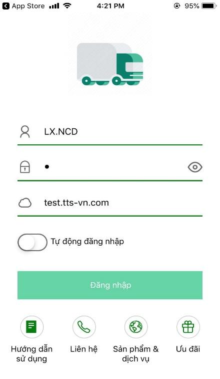
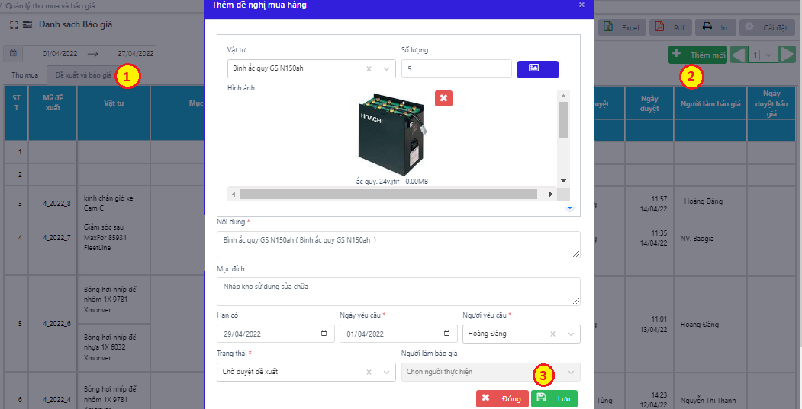

# 9. BỘ PHẬN LÁI XE

**BỘ PHẬN LÁI XE**

### **9.1 Tạo tài khoản đăng nhập cho lái xe** 

Khi tạo mới một xe trong Danh sách xe (mục Thông tin chung), phần mềm tự động tạo một tài khoản đăng nhập cho theo số xe. Các tài khoản theo số xe được đưa vào nhóm Lái xe, để người dùng phân quyền sử dụng trên mobile app.

Ngoài ra quản trị viên cũng có thể thêm mới trực tiếp tài khoản mobile trong Quản lý hệ thống🡪 Quản lý người dùng.

Bước 1: Vào bảng TTC 🡪 Nhân viên 🡪 Khai báo nhân viên với vị trí Lái xe

.png>)

Bước 2: Tại mục Quản lý hệ thống\_Quản lý nhóm 🡪 Tìm nhóm Lái xe (Thực hiện Thêm mới nếu chưa có) 🡪 Nhấn nút .png>)

Bước 3: Chọn tab Quyền 🡪 Tích chọn phân quyền cho tài khoản Mobile 🡪 Cập nhật

.png>)

Bước 4: Vào mục Quản lý người dùng 🡪 Thêm mới tài khoản🡪 Gán nhân viên Lái xe vừa tạo, chọn nhóm LÁI XE 🡪 Lưu

.png>)

### **9.2 Đăng nhập** 

Bước 1: Tải ứng dụng TTS Express trên điện thoại

Bước 2: Nhập các thông tin để đăng nhập:

* Tên tài khoản: Tên đăng nhập được tạo trên phần mềm
* Mật khẩu: Người tạo tài khoản cung cấp
* Mã bảo mật: tencongty.tts-vn.com

Bước 3: Lựa chọn xe cần quản lý thông tin

 .png>)

_Màn hình đăng nhập trên điện thoại Các chức năng chính trên app mobile_

### **9.3 Hướng dẫn theo dõi và cập nhập chuyến hàng** 

Bước 1: Nhấn chọn Kế hoạch VC 🡪 Chọn chuyến vận chuyển

Bước 2: Chọn ngày muốn kiểm tra, chọn chuyến hàng trong ngày muốn xem hoặc cập nhật thông tin.

.png>)

_Màn hình danh sách chuyến hàng_

Bước 3: Nhấp chọn chuyến hàng trong ngày muốn xem hoặc cập nhật thông tin.

_Màn hình quản lý chi tiết một chuyến hàng_

#### **9.3.1 Thông tin hàng hóa** 

Trên màn hình thông tin hàng hóa, người dùng có thể cập nhật trạng thái đơn hàng bằng cách chọn trên thanh trạng thái rồi nhấn nút Cập nhật.

Người dùng có thể cập nhật thông tin hàng hóa như: Cân tổng lái xe nhận, cân tổng lái xe giao, số cont (hàng cont), lượng lái xe giao, lượng lái xe nhận (hàng rời), số kiện (hàng kiện).

Nếu có biên bản, nhấn thu biên bản.

Khi lái xe tích trạng thái Đã nhận hàng, Đã giao hàng trên app lái xe thì sẽ ghi nhận thời gian này sẽ link lại vào cột Thời gian nhận hàng, giao hàng trên phần mềm và phần mềm sẽ tự động tính thời gian đóng trả của 1 chuyến hàng trong Bảng kê chi tiết vận chuyển

#### **9.3.2 Thông tin chuyến xe** 

Trên màn hình chi tiết vận chuyển chọn thông tin chuyến xe để xem, cập nhật thông tin về Tuyến đường, Tiền đường và Cước phí.

Ở thanh tab dưới màn hình, người dùng nhấn để chọn đến các màn hình Tuyến đường, Tiền đường và Cước phí.

.png>)

_Màn hình tiền đường_

Để thay đổi quyền chỉnh sửa thông tin Tiền đường và Lưu ca của lái xe, người dùng thực hiện thay đổi trên web:

* _**Cách 1:**_ Chỉ cho các doanh nghiệp sử dụng Điều xe gộp cước

Bước 1: Tại mục Điều hành, chọn Điều xe gộp cước

Bước 2: Tìm lô muốn đổi quyền, nhấn nút .png>) 🡪 Chuyển trạng thái Trả cước sang:

* Lái xe được nhập: Lái xe được phép nhập Tiền Đường, Số ngày lưu ca, Giá lưu ca và Cước phải thu.
* Lái xe nhận: Lái xe được ủy quyền thu hộ, trên màn hình Lưu ca lái xe có thể nhập Ngày thu cước, nhấn chọn Đã thu cước và nhấn nút Xác nhận để xác nhận thu cước. Sau khi nhấn Xác nhận, trạng thái chuyến hàng được chuyển về Lái xe đã nhận và lái xe không thể thay đổi Ngày thu cước và chọn Đã thu cước được nữa.
* Các trạng thái khác: chỉ cho phép lái xe theo dõi số liệu đã định mức trên web, không cho phép sửa thông tin.

.png>)

Cách 2: Lựa chọn từ Hệ điều hành/QL cước VC, chọn chuyến xe muốn sửa và thay đổi trạng thái cột Trả cước:

.png>)

#### **9.3.3 Chi trả hộ** 

Bước 1: Nhấn nút Chi trả hộ🡪 Nhấn .png>) để thêm các loại phí thu chi phát sinh

Bước 2: Chọn tên chi phí, nhập giá tiền 🡪 nhấn Lưu

 .png>)

_Màn hình thông tin và nhập thu chi phát sinh_

Thông tin lái xe nhập sau đó sẽ được trả về web, trong mục Lái xe 🡪 Quản lý thu chi lái xe và các báo cáo liên quan.

.png>)

_Màn hình quản lý thu chi lái xe trên web_

#### **9.3.4 Ảnh chứng từ** 

Bước 1: Nhấn nút Ảnh chứng từ 🡪 Nhấn .png>) để thêm ảnh

Bước 2: Chọn ảnh từ thư viện hoặc chụp trực tiếp 🡪 Nhấn Tải lên để đưa ảnh vào lưu trữ

.png>)

_Màn hình tải ảnh chứng từ trên mobile app_

Ảnh chứng từ vừa tải lên sẽ được quản lý trên web, tại:

* Mục Lái xe – Quản lý phơi phiếu
* Mục Báo cáo🡪 Báo cáo trucking🡪 Báo cáo vận chuyển

### **9.4 Sửa chữa** 

.png>)

_Thao tác khai báo đề xuất sửa chữa_

Bước 1: Tại màn hình trang chủ, chọn chức năng Sửa chữa

Bước 2: Màn hình xuất hiện 2 chức năng là Đề xuất sửa chữa và Hóa đơn sửa chữa

Bước 3: Vào Đề xuất sửa chữa -> Nhấn 🡪 Nhập nội dung cần sửa chữa 🡪 Nhấn Lưu. Các Yêu cầu sửa chữa sẽ hiển thị vào mục Danh sách công việc trên Phần mềm. Quản lý sẽ duyệt các yêu cầu nào cho sửa, yêu cầu nào huỷ. Quản lý thao tác xong thì thông tin sẽ tự động thông báo lại App Mobile cho lái xe theo dõi. Nếu duyệt thì sẽ bắt đầu sửa. (Đối với các yêu cầu sửa chữa lớn)

Vào Hóa đơn sửa chữa -> Nhấn 🡪 Thêm mới, nhập thông tin sửa chữa -> Nhấn Lưu -> Khi Quản lý duyệt thì các thông tin về sửa chữa sẽ tự động link vào Thay thế, sửa chữa. (Đối với các yêu cầu sửa chữa nhỏ)

_Màn hình trang chủ Màn hình thêm mới HĐ SC Màn hình thêm mới ĐX SC_

_**Sửa nội dung hóa đơn**_

Bước 1: Trong Danh sách hóa đơn, dùng tay kéo từ phải sang trái tại hóa đơn cần chỉnh sửa

Bước 2: Chọn Sửa hoặc Xóa hóa đơn

Bước 3: Trong trường hợp sửa hóa đơn🡪 thay đổi nội dung🡪 Nhấn nút **Thêm** để lưu lại chỉnh sửa.

_Màn hình sửa thông tin hóa đơn Sửa chữa_

_**Sửa chi tiết hóa đơn**_

Bước 1: Trong Danh sách hóa đơn, chọn hóa đơn có chi tiết cần sửa

Bước 2: Tại chi tiết muốn sửa, dùng tay kéo từ phải sang trái, chọn Sửa hoặc Xóa

Bước 3: Cập nhật lại nội dung cần thay đổi🡪 Nhấn nút **Thêm** để lưu lại.

_Màn hình chỉnh sửa chi tiết Hóa đơn sửa chữa_

### **9.5 Khai báo đổ dầu** 

Bước 1: Tại trang chủ mobile app, chọn nhút Xăng dầu

Bước 2: Nhấn 🡪 Khai báo thông tin dầu cấp cho xe 🡪 Nhấn Lưu

Ngoài ra, người dùng có thể chỉnh sửa thông tin dầu cấp bằng cách dùng tay kéo từ phải sang trái, chọn Sửa hoặc Xóa 🡪 Cập nhật lại nội dung cần thay đổi và lưu lại.

_Màn hình khai báo dầu cấp Màn hình Quản lý dầu cấp_

### **9.6 Theo dõi thông báo, cảnh báo** 

Người dùng mobile app có thể nhận và theo dõi thông báo gửi về điện thoại từ phần mềm trên web. Thông báo bao gồm: Thông báo liên quan về chuyến hàng, lô hàng, người dùng và Cảnh báo bảo đến hạn bảo dưỡng.

Thông báo cho chuyến/lô hàng/ người dùng: Dữ liệu từ mục Điều hành🡪 Quản lý thông báo

Cảnh báo bảo dưỡng: Dữ liệu từ mục Sửa chữa🡪 Bảo dưỡng

Bước 1: Đăng nhập bằng tài khoản mobile app

Bước 2: Tại màn hình trang chủ, nhận chọn vào mục thông báo được kí hiệu bằng hình quả chuông🡪 chọn xem các thông báo

&#x20; &#x20;

<figure><figcaption>
<em>Màn hình hiển thị thông báo</em>
</figcaption></figure>

