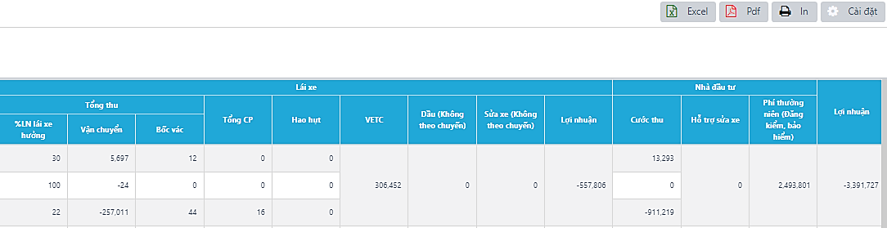

# QUẢN LÝ LÁI XE

**QUẢN LÝ LÁI XE**

### **Quản lý thu chi lái xe theo chuyến** 

Quản lý các chi phí do lái xe khai báo từ ứng dụng điện thoại trong quá trình vận chuyển, theo từng chuyến.

.png>)

_Màn hình Quản lý thu chi lái xe_

#### **Quản lý tạm ứng lái xe** 

Bước 1: Trong mục Lái xe 🡪 Chọn Quản lý thu chi lái xe

Bước 2: Tại cột chức năng của bảng Quản lý tạm ứng, nhấn nút .png>)🡪 Nhập thông tin tạm ứng 🡪 Lưu.

.png>)

_Màn hình thêm mới tạm ứng lái xe_

Sau khi lái xe khai báo các chi phí lên phần mềm từ điện thoại, kế toán có thể nhập phần phí thu tương ứng cho khách hàng, bằng cách đánh giá tiền trực tiếp tại ô Thu khách hàng🡪 Kéo xuống cuối trang và nhấn Lưu

#### **Quản lý thanh toán lái xe** 

**Thêm mới chi phí thanh toán**

Bước 1: Tại cột chức năng của bảng Quản lý chi phí, nhấn nút 

Bước 2: Nhập thông tin các chi phí vào bảng 🡪 Lưu

.png>)

_Màn hình thêm mới chi phí thanh toán_

**Cập nhật quá trình thanh toán**

Người dùng thực hiện việc kiểm soát các chi phí theo chứng từ lái xe gửi về. Nếu có thay đổi về con số, người dùng có thể chỉnh số liệu trực tiếp tại các phần chữ màu xanh.

Ngoài ra, người dùng cập nhật thêm trạng thái và ngày thanh toán khi hoàn thành quyết toán chi phí với lái xe.

.png>)

### **Quản lý lương lái xe** 

#### **Quản lý các khoản chi phí lương** 

Quản lý chi phí lương lái xe hàng tháng. Có 2 cách tính lương trên phần mềm:

* Tính theo từng chuyến
* Tính theo tháng

.png>)

_Màn hình quản lý lương_

**Cách 1: Lương tính theo chuyến**

| Lương khoán           | = Tổng lương chuyến của các chuyến gán lái xe                                                                                                                                                                |
| --------------------- | ------------------------------------------------------------------------------------------------------------------------------------------------------------------------------------------------------------ |
| Phụ cấp               | nhập trong TTC, chi tiết của thông tin nhân viên. Có thể chỉnh sửa trực tiếp                                                                                                                                 |
| Tổng lương            | = Lương khoán + Phụ cấp                                                                                                                                                                                      |
| Công đoàn             | = Lương cơ bản \* 1% (mặc định). Có thể chỉnh sửa trực tiếp                                                                                                                                                  |
| BHXH                  | = Lương cơ bản \* 10,5% (mặc định). Có thể chỉnh sửa trực tiếp                                                                                                                                               |
| Tiền hàng             | = Tổng thành tiền trong Bảng lương tiền hàng lái xe (H1)                                                                                                                                                     |
| Dầu âm                | = Nhập tay trực tiếp theo thực tế.                                                                                                                                                                           |
| Bảo lãnh              | = Khấu hao tháng. Là tiền bảo lãnh nộp hàng tháng, nhập trong TTC, chi tiết của thông tin nhân viên. Tiền bảo lãnh sẽ được mặc định tính dựa trên thời hạn khấu hao đã khai báo. Có thể chỉnh sửa trực tiếp. |
| Khác                  | = Tổng tiền nhập trực tiếp trong Bảng lương khoản giảm trừ tiền hàng lái xe (H2)                                                                                                                             |
| Tổng giảm             | = Tổng tiền các khoản giảm trừ                                                                                                                                                                               |
| Còn nhận              | = Tổng lương – Tổng giảm trừ. Nhấn chi tiết để xem Bảng lương lái xe. (H3)                                                                                                                                   |
| Trạng thái nhận lương | Phụ thuộc vào việc lái xe tích Đã nhận lương trên app mobile                                                                                                                                                 |
| Ngày XN nhận lương    | Ngày lái xe tích chọn trên app mobile                                                                                                                                                                        |

.png>)

_H1. Bảng lương tiền hàng lái xe_

.png>)

_H2. Màn hình các khoản giảm trừ tiền hàng lái xe_

.png>)

_H3. Màn hình Bảng lương lái xe_

Cách 2: Tính lương theo tháng: Thông tin các cột giống với lương chuyến. Tuy nhiên, riêng trường lương khoán = lương cơ bản đã khai báo trong TTC, bảng Nhân viên.

#### **Quyết toán lương** 

Người dùng kiểm soát lại chi phí lương theo các danh mục mô tả tại 4.2.1, cập nhập bằng cách chỉnh sửa số liệu tại các phần chữ số màu xanh.

Sau khi đã kiểm tra xong, người dùng nhấn:

Sau khi chốt lương trên phần mềm, lái xe có thể kiểm tra và xác nhận thông tin nhận lương trên mobile app.

_Lưu ý: Thao tác xác nhận lương của lái xe được hướng dẫn tại mục Bộ phận Lái xe_

### **Quản lý phơi phiếu** 

Quản lý thông tin chuyến xe, cho phép in lệnh điều xe ở 2 mẫu: không VAT và có VAT.

Điều kiện in mẫu có VAT: trong mục Quản lý lô hàng đủ/ rút gọn 🡪 khi khai báo, cập nhật thông tin lô hàng, người dùng điền thông số VAT ở trang Thông tin mở rộng.

Người dùng có thể in đồng thời nhiều lệnh điều xe bằng thao tác: Tích chọn các chuyến muốn in ở đầu dòng 🡪 Chọn **In lệnh điều xe**

.png>) .png>)

_Màn hình Quản lý phơi phiếu_

| Ngày tìm kiếm                        | Lấy theo ngày xe đi trong mục Điều xe                                                                                                                                                                                                                                                                                                                                                 |
| ------------------------------------ | ------------------------------------------------------------------------------------------------------------------------------------------------------------------------------------------------------------------------------------------------------------------------------------------------------------------------------------------------------------------------------------- |
| Tên khách hàng                       | Tên viết tắt                                                                                                                                                                                                                                                                                                                                                                          |
| Tuyến đường                          | Địa chỉ mở rộng – địa chỉ chi tiết (địa chỉ mở rộng lấy theo TTC 🡪 địa chỉ)                                                                                                                                                                                                                                                                                                          |
| Chi phí phát sinh                    | Cột Chi phí phát sinh trong Tiền đường, mục Ql chi phí vc                                                                                                                                                                                                                                                                                                                             |
| Lượng nhận/ giao                     | Lượng lái xe nhận/ giao                                                                                                                                                                                                                                                                                                                                                               |
| Hao hụt                              | = Lượng nhận – lượng giao                                                                                                                                                                                                                                                                                                                                                             |
| Hao hụt cho phép                     | % hao hụt cho phép, theo thông tin khai báo trong lô hàng                                                                                                                                                                                                                                                                                                                             |
| Giảm trừ                             | = Hao hụt công ty chịu, lấy từ bảng Tiền lương🡪 chi tiết tiền hàng. Có thể chỉnh sửa trực tiếp.                                                                                                                                                                                                                                                                                      |
| Đơn giá                              | Đơn giá hao hụt khi khai báo lô hàng                                                                                                                                                                                                                                                                                                                                                  |
| Lái xe chịu                          | = Hao hụt – \[((Lượng lx nhận- Lượng lx giao) – (Lượng lx nhận \* Hao hụt cho phép)) + Giảm trừ]                                                                                                                                                                                                                                                                                      |
| Thành tiền                           | = Đơn giá \* Lái xe chịu                                                                                                                                                                                                                                                                                                                                                              |
| Ngày trả phơi phiếu                  | Nhập tay trong bảng cập nhật (nhấn nút .png>))                                                                                                                                                                                                                                                                                                          |
| Đã chuyển phơi phiếu cho KH          | Nhập tay trong bảng cập nhật (nhấn nút .png>))                                                                                                                                                                                                                                                                                                          |
| Lái xe đã nhận tiền đường, Ngày nhận | Theo thông tin gửi từ mobile app lên hệ thống                                                                                                                                                                                                                                                                                                                                         |
| Dầu thực tế                          | Lượng dầu định mức trong Ql chi phí vc.                                                                                                                                                                                                                                                                                                                                               |
| Dầu VAT                              | = (Tổng km chiều đi và về \* Định mức dầu bổ sung) + Dầu phát sinh                                                                                                                                                                                                                                                                                                                    |
| Tiền đường                           | = Tổng tiền đường – lương chuyến                                                                                                                                                                                                                                                                                                                                                      |
| Tiền đường VAT                       | = Tiền vé + Định mức phí                                                                                                                                                                                                                                                                                                                                                              |
| Trạng thái đề xuất                   | Trạng thái theo đề xuất công việc (mục Danh sách công việc- đề xuất thanh toán tương ứng)                                                                                                                                                                                                                                                                                             |
| Ghi chú                              | Theo ghi chú Điều xe                                                                                                                                                                                                                                                                                                                                                                  |
| Chức năng                            | 
- In phơi phiếu: Nhấn nút  🡪 cho phép in có VAT/ không VAT. Chỉ dùng cho các chuyến lái xe đã tích nhận tiền đường

- Đề xuất: Nhấn nút  🡪 Đề xuất tự động chuyển sang danh sách công việc.

- Gửi mail: nhấn nút 
 |

* **Cách gửi ảnh qua mail**

Bước 1: Nhấn vào nút .png>)🡪 nhấn biểu tượng chọn ảnh

Bước 2: Chọn dải thời gian tìm kiếm🡪 Tích chọn ảnh

Bước 3: Điền thêm thông tin và nhấn gửi thư

.png>)

### **Quản lý tạm ứng lái xe** 

Quản lý các khoản tạm ứng, thu – chi cho từng lái xe theo ngày, không phụ thuộc vào chuyến vận chuyển.

#### **Quản lý tạm ứng và hoàn ứng lái xe** 

.png>)

_Màn hình Quản lý tạm ứng lái xe_

Bước 1: Tại mục Lái xe, chọn Quản lý tạm ứng lái xe

Bước 2: Nhấn nút Thêm mới 🡪 Nhập thông tin vào bảng 🡪 Lưu

#### **Thanh toán cho lái xe** 

Các chi phí được lấy từ khai báo chi trả hộ của lái xe trên mobile app hoặc thêm mới trực tiếp trong bảng.

_Màn hình thanh toán chi phí với lái xe_

* **Các bước thêm mới chi phí:**

Bước 1: Nhấn nút Thêm mới 🡪 Nhập thông tim phí cần thêm

Bước 2: Nhấn Lưu hoặc Lưu và tiếp tục.

* **Các bước thanh toán chi phí:**

Bước 1: Chọn nhân viên – Người nhận thanh toán

Bước 2: Tích chọn tại cột Thanh toán, chứng từ (nếu có). Có thể nhập số hóa đơn và ghi chú trực tiếp tại đây 🡪 Nhấn nút . Thông tin sau khi nhấn Lưu được đưa sang quản lý trong bảng Quản lý tạm ứng.

_Lưu ý:_

_- Các khoản chữ màu đen là các khoản tiền được thêm mới trực tiếp trong bảng. Khoản chữ màu xanh là chi phí đưa sang sau khi làm thanh toán._

_- Phí Chi của lái xe được trừ vào với tiền đã tạm ứng, phí thu của lái xe được cộng dồn vào tiền ứng._
