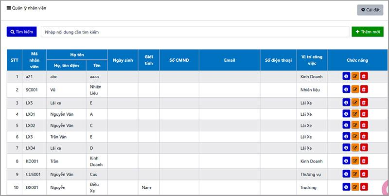
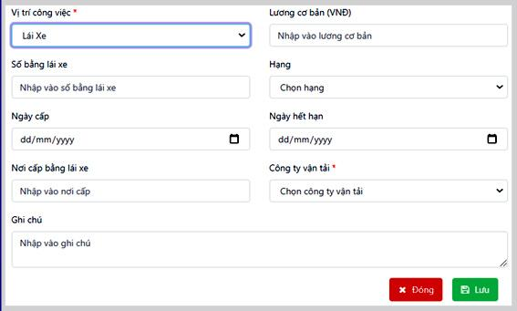
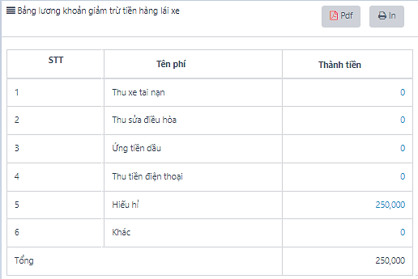
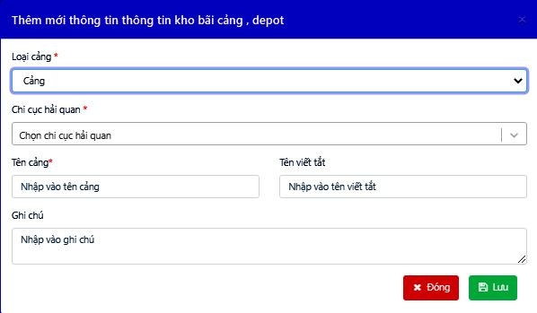
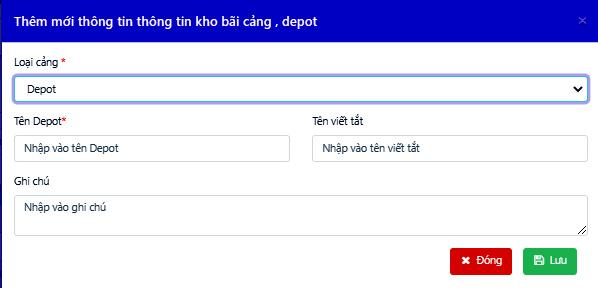
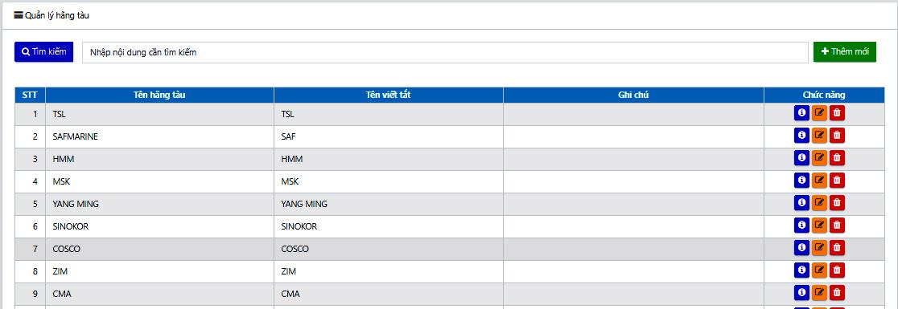
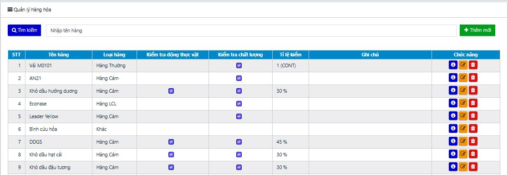

# NHẬP THÔNG TIN CHUNG

Thông tin chung là mục dữ liệu nhập 1 lần và sử dụng chung cho toàn bộ các nhóm trong phần mềm bao gồm các trường thông tin: Nhân viên, Tài xế, khách hàng, điểm đi, điểm đến, cảng bãi, kho vận, thông tin xe, các định mức tuyến đường, xăng dầu, …

Việc khai báo đầy đủ các thông tin chung theo dữ liệu hiện có của các công ty giúp việc sử dụng phần mềm được thuận tiện, tiết kiệm thời gian nhập liệu, đầy đủ và chính xác thông tin.

#### **1. Quản lý thông tin nhân viên** 

Chủ doanh nghiệp cần nhập toàn bộ số lượng và thông tin nhân viên hiện có trong doanh nghiệp của mình lên hệ thống để thuận tiện trong việc phân quyền và giao việc.

**Các bước thêm mới nhân viên:**

Bước 1: Vào Thông tin chung, chọn danh mục Nhân viên.

Bước 2: Nhấn nút  và Nhập thông tin Nhân viên vào bảng thêm mới. Nhấn .png>) để lưu thông tin nhân viên mới tạo.

_Lưu ý:_

* _Đối với Lái xe, chủ doanh nghiệp cần điền thêm Công ty vận tải để kiểm soát đơn vị chủ quản lái xe._
* _Để tính toán được lương nhân viên, cần nhập: Ngày bắt đầu làm việc + Lương cơ bản (+ phụ cấp nếu có)._

#### **2.  Quản lý thông tin đối tác** 

Quản lý thông tin đối tác của doanh nghiệp, bao gồm 5 loại đối tác:

* Khách hàng: Tạo đơn hàng trong Quản lý lô hàng, lên Quyết toán, …
* Đơn vị vận tải: Phục vụ cho việc lên thông tin Kế hoạch điều vận, Báo cáo vendor, …
* NCC Nhiên liệu: Quản lý kho dầu nhập- xuất, cấp dầu cho xe, …
* NCC phí thường niên: Quản lý nhà cung cấp các phí khấu hao, dịch vụ thường niên, …
* NCC vật tư: Quản lý thông tin nhà cung cấp các phụ tùng cho sửa chữa, các kho hàng, vật tư văn phòng, …

.png>)

**Các bước thêm đối tác vào danh sách:**

Bước 1: Chọn mục **Thông tin chung**, sau đó chọn tiếp mục **Đối tác**

Bước 2: Chọn **Thêm mới🡪** Chọn **Loại đối tác**

Bước 3: Nhập các thông tin đối tác vào các trường dữ liệu. Sau đó nhấn **Lưu** để hoàn thành.

_Lưu ý : Người dùng có thể chọn nhiều hơn 01 loại đối tác cho cùng một doanh nghiệp. Khi chọn loại đối tác là NCC Nhiên liệu, bảng thêm mới xuất hiện thêm ô chọn là Nhà cung cấp nhiên liệu của công ty. Trường hợp bỏ tích chọn, phần mềm tự động hiểu thông tin thêm mới là một cây dầu của công ty để tính lượng dầu trong kho._

.png>)

#### **3. Quản lý nhóm Khách hàng** 

Chức năng hoạt động trên cơ chế phân quyền nhóm người dùng vào quản lý từng nhóm khách hàng riêng biệt. Thông qua chức năng này, cá nhân/ bộ phận có thể dễ dàng và độc lập quản lý tệp khách hàng mà mình được phân công. Đồng thời, nhà quản lý sẽ đánh giá được hiệu suất công việc của từng cá nhân/ bộ phận theo ngày, theo tháng, …; đánh giá được nhóm khách hàng tiềm năng cho doanh nghiệp.

<figure><figcaption>
<em><strong>Màn hình quản lý Khách hàng theo nhóm</strong></em>
</figcaption></figure>

**Các bước quản lý:**

Bước 1: Tạo nhóm quyền bằng cách nhấn nút Thêm mới

Bước 2: Đặt tên nhóm, chọn nhóm người dùng vào nhóm, thêm mô tả nếu có

Bước 3: Trong bảng Đối tác, với phân loại Khách hàng, khi thêm mới, chọn nhóm khách hàng tương ứng đã tạo.

Như vậy, những nhóm người dùng sẽ chỉ tập trung vào từng nhóm Khách hàng được phân công khi thực hiện các công việc thuộc mục Điều hành (bao gồm quản lý lô hàng, điều xe, quản lý cước, thông báo)

<figure><figcaption>
<em><strong>Màn hình thêm mới Nhóm KH (</strong><strong><code>Bước</code></strong><strong> </strong><strong>1-2)</strong></em>
</figcaption></figure>

<figure><figcaption>
<em><strong>Màn hình phân nhóm khách hàng (Bước 3)</strong></em>
</figcaption></figure>

#### **4. Quản lý thông tin Rơ mooc** 

Thông tin rơ mooc được quản lý và sử dụng trong các công việc như: Gán mặc định theo xe (gán khi thêm danh sách xe), gán theo xe khi điều vận, tính toán định mức chi phí vận chuyển, tính toán định mức cước, …

Ngoài ra, thông số trọng lượng được sử dụng trong để tính toán tải trọng an toàn xe cũng như tối ưu trong lượng chở các xe khi sắp xếp hàng.

.png>)

**Các bước thêm Rơ-mooc vào phần mềm:**

Bước 1: Truy cập phần mềm quản lý vận tải

Bước 2: Chọn mục **Thông tin chung**, sau đó chọn tiếp mục **Danh sách** **Rơ-mooc**

Bước 3: Chọn **Thêm mới** để nhập thêm thông tin một Rơ-mooc mới

Bước 4: Nhập các thông tin vào các trường dữ liệu. Sau đó nhân **Lưu** để hoàn thành.

#### **5. Quản lý thông tin xe** 

Quản lý thông tin xe giúp doanh nghiệp quản lý chi tiết các dữ liệu liên quan đến xe như: Chủ xe, phòng ban, Số xe, Lái xe, trạng thái xe, thông số tải trọng…

Giống với quản lý mooc, danh sách xe trên phần mềm cũng quản lý thêm cả các thông số liên quan tới tải trọng xe, làm cơ sở dữ liệu tính toán tải trọng an toàn, sắp xếp hàng hóa lên xe của bộ phận điều xe.

<figure><figcaption>
<em><strong>Màn hình chính của mục quản lý xe</strong></em>
</figcaption></figure>

**Các bước thêm xe vào phần mềm:**

Bước 1: Chọn mục **Thông tin chung**, sau đó chọn tiếp mục **Danh sách xe**

Bước 2: Nhấn nút Thêm mới để nhập thêm thông tin một xe

Bước 3: Nhập các thông tin vào các trường dữ liệu. Thông tin Chủ xe lấy từ bảng **Đối tác** với phân loại là Công ty vận tải. Sau khi nhập đủ các thông tin yêu cầu, nhấn Lưu để hoàn thành.

_Lưu ý: Mỗi một xe của chủ doanh nghiệp được thêm mới tương ứng với một tài khoản mobile được tạo. Chức năng và cách sử dụng app mobile cho lái xe được hướng dẫn trong phần **10. Ứng dụng mobile app.**_

#### **6. Quản lý thông tin Cảng/ Depot** 

Quản lý thông tin cảng, depot, kho CFS và các chi cục tương ứng; phục vụ cho việc lên đơn hàng (Quản lý lô hàng) và lên chi phí đơn hàng tự động (Định mức hải quản – tạm ứng lô hàng).

<figure><figcaption>
<em><strong>Màn hình danh sách các cảng và depot</strong></em>
</figcaption></figure>

**Các bước thêm mới thông tin:**

Bước 1: **Thêm mới** thông tin với 4 lựa chọn là: Cảng, Kho CFS, Depot, Cảng Nội địa. Lưu ý khi chọn Cảng, Kho CFS, người sử dụng cần nhập thêm thông tin của Chi cục Hải quan.

\+ Thêm mới Cảng, Kho CFS:

\+ Hoặc thêm mới depot/ Cảng nội địa

Bước 2: Nhập các trường dữ liệu. Sau đó nhấn **Lưu** để hoàn thiện.

#### **7. Quản lý thông tin Hãng tàu** 

Thông tin hãng tàu được quản lý để phục vụ cho việc lên thông tin đơn hàng (Quản lý lô hàng), và lên kế hoạch vận tải biển (đối với các đơn vị có nghiệp vụ vận tải qua biển).

<figure><figcaption>
<em><strong>Màn hình Danh sách hãng tàu</strong></em>
</figcaption></figure>

Bước 1: Truy cập phần mềm quản lý vận tải

Bước 2: Chọn mục Thông tin chung, sau đó chọn tiếp mục Hãng tàu

Bước 3: Chọn Thêm mới để nhập thêm thông tin 1 hãng tàu mới

Bước 4: Nhập các thông tin vào các trường dữ liệu. Sau đó nhân Lưu để hoàn thành

#### **8. Quản lý thông tin Hàng hóa** 

Hỗ trợ doanh nghiệp quản lý các loại hàng hóa nhập, xuất, vận chuyển: Loại hàng, Tên hàng, Kiểm tra động thực vật, Kiểm tra chất lượng, Tỉ lệ kiểm, Ghi chú.

Thông tin trong bảng được phục vụ cho việc: lên thông tin đơn hàng (Quản lý lô hàng) và kế hoạch vận chuyển, lên định mức tạm ứng làm hàng (tạm ứng dịch vụ hải quan, tạm ứng chi trả hộ), …

<figure><figcaption>
<em><strong>Màn hình Danh sách hàng hóa</strong></em>
</figcaption></figure>

**Các bước thêm mới thông tin hàng hóa:**

Bước 1: Từ **Thông tin chung,** chọn danh mục **Hàng hóa** 🡪 nhấn nút Thêm mới

Bước 2: Nhập thông tin hàng hóa.

_Lưu ý: Việc Lựa chọn hàng hóa có kiểm tra và tỉ lệ kiểm sẽ được phần mền xử lý dữ liệu để tính chi phí tạm ứng với các lô hàng có loại hàng tương ứng._

Bước 3: Nhấn Lưu để lưu lại thông tin hàng hóa vừa tạo.

.jpeg>)

#### **9. Quản lý Thông tin địa chỉ** 

Việc thêm thông thông tin địa chỉ giúp người dùng: Quản lý thông tin đơn hàng (Quản lý lô hàng), lên kế hoạch điều vận, lên định mức chi phí vận chuyển, cước, …

_**Cách thêm mới địa chỉ:**_

* _Cách 1:_

Bước 1: Tại **Thông tin chung**🡪 Chọn mục **Thông tin địa chỉ** 🡪 Nhấn nút Thêm mới

Bước 2: Nhập địa chỉ vào bảng 🡪 Nhấn lưu

Lưu ý: Trong trường hợp đơn vị tính toán chi phí vận chuyển theo khu vực, người dùng chọn thêm địa chỉ Mở rộng cho các địa chỉ chi tiết đã nhập. Khi đó, các địa chỉ chi tiết có cùng địa chỉ mở rộng sẽ có cùng mức chi phí vận chuyển.

<figure><figcaption>
<em><strong>Màn hình Danh sách địa chỉ</strong></em>
</figcaption></figure>

* _Cách 2:_

Bước 1: Chọn mục điều hành🡪 Chọn Lô hàng hoặc Kế hoạch vận chuyển

Bước 2: Tại các ô nhập địa chỉ Lấy/ giao hàng, Lấy/ Hạ vỏ, chọn Địa chỉ khác🡪 Nhập địa chỉ🡪 Nhấn tạo mới “tên địa chỉ”. Địa chỉ thêm mới sẽ được tự động lưu lại vào Thông tin chung.

<figure><figcaption>
<em><strong>Màn hình thêm mới địa chỉ trong Lô hàng</strong></em>
</figcaption></figure>

#### **10. Quản lý tuyến đường** 

Chức năng cho phép người sử dụng quản lý các thông tin liên quan đến tuyến đường, giúp tính định mức khoảng cách, định mức nhiên liệu, … trong quá trình lên kế hoạch vận chuyển, điều xe.

Các thông tin bao gồm: Tên tuyến đường, điểm đi, điểm đến, khoảng cách, ghi chú.

**Cách thêm mới tuyến đường:**

* _Cách 1:_

Bước 1: Đăng nhập hệ thống

Bước 2: Chọn mục Thông tin chung🡪 Chọn Tuyến đường

Bước 3: Nhấn nút Thêm mới🡪 Nhập tuyến đường🡪 Nhấn Lưu.

<figure><figcaption>
<em><strong>Màn hình Danh sách tuyến đường</strong></em>
</figcaption></figure>

* _Cách 2:_

Bước 1: Chọn mục điều hành🡪 Chọn Kế hoạch điều xe

Bước 2: Tại các ô nhập Tuyến đường 🡪 Chọn hoặc nhập mới địa chỉ🡪Thêm khoảng cách tuyến đường. Tuyến đường mới lưu trực tiếp vào Thông tin chung.

<figure><figcaption>
<em><strong>Màn hình thêm kế hoạch điều xe- Thêm trực tiếp tuyến đường</strong></em>
</figcaption></figure>

#### **11. Định mức dầu** 

Mục định mức dầu giúp người dùng quản lý thông tin định mức xăng dầu theo xe. Hỗ trợ tính toán lượng dầu và chi phí nhiên liệu cho các chuyến xe trong **QL Cước vận VC** (quản lý cước vận chuyển).

Phần mềm linh động trong chức năng tính định mức dầu theo đặc thù vận hành của từng doanh nghiệp:

* Công thức 1: Tính theo khoảng cách\* định mức (lít/100km), phụ thuộc vào xe và trạng thái chở hàng/không trở hàng
* Công thức 2: Tính theo tuyến (lít/tuyến)
* Công thức khác: Dựa theo cách tính của khách hàng cung cấp

_Màn hình Danh sách định mức dầu theo xe (theo CT1)_

**Các bước nhập thông tin định mức dầu:**

Bước 1: Trong mục Thông tin chung, tại danh mục Định mức dầu, nhấn Thêm mới.

Bước 2: Nhập thông tin theo bảng Thêm mới.

<figure><figcaption>
<em><strong>Màn hình thêm mới định mức xăng dầu</strong></em>
</figcaption></figure>

Bước 3: Nhấn Lưu để lưu lại thông tin định mức vừa tạo.

#### **12. Quản lý thông tin Chi phí Hải quan** 

Các loại chi phí hải quan sẽ được phần mềm lấy làm dữ liệu tính toán và hiển thị tại chi tiết tạm ứng cho lô hàng. Điều kiện hiển thị các chi phí định mức hải quan trong tạm ứng có thể phụ thuộc vào loại hàng, hình thức vận chuyển hoặc chi cục hải quan, hàng có kiểm dịch/ không kiểm dịch…

Thông tin Giá thanh toán được sử dụng để làm tạm ứng và quyết toán nội bộ, trong khi Giá hợp đồng được sử dụng để làm quyết toán khách hàng. Người dùng có thể theo dõi và quản lý 2 mức giá, chênh lệch giá trong phần **Báo cáo 🡪 Báo cáo tổng hợp🡪 Báo cáo lô hàng.**

<figure><figcaption>
<em><strong>Màn hình danh sách chi phí định mức hải quan</strong></em>
</figcaption></figure>

**Các bước nhập thêm chi phí Hải Quan:**

Bước 1: Tại danh mục **Chi phí Hải Quan**, nhấn Thêm mới.

Bước 2: Nhập thông tin theo bảng Thêm mới

Bước 3: Nhấn Lưu để lưu lại thông tin tuyến đường vừa tạo.

#### **13. Quản lý thông tin Chi phí chi, trả hộ** 

Thông tin chi phí chi, trả hộ là cơ sở dữ liệu tính toán cho tạm ứng các lô hàng. Việc hiển thị các chi phí chi, trả hộ trong tạm ứng phụ thuộc vào khai báo Đơn vị tính và Tên cảng.

Các trường dữ liệu bao gồm: Tên chi phí trả hộ, Đơn vị tính, Loại cảng, Tên cảng/depot, Giá thanh toán, Giá hợp đồng, Ghi chú.

Cách sử dụng Giá thanh toán và Giá hợp đồng giống như trong quản lý chi phí hải quan.

<figure><figcaption>
<em><strong>Màn hình danh sách Chi phí chi, trả hộ</strong></em>
</figcaption></figure>

**Các bước nhập thêm chi phí chi, trả hộ:**

Bước 1: Tại danh mục **Chi phí chi, trả hộ**, nhấn nút Thêm mới.

Bước 2: Nhập thông tin theo yêu cầu.

Bước 3: Nhấn Lưu để lưu lại thông tin chi phí chi, trả hộ.

#### **14. Quản lý thông tin cước vận chuyển** 

Quản lý thông tin định mức giá cước vận chuyển theo thanh toán và trên hợp đồng của từng chuyến hàng. Các thông tin gồm: Tuyến đường, Khách hàng, Hình thức hàng, Loại cont, Giá cước, Ghi chú,...

\+ Đơn giá thanh toán được sử dụng trên phần mềm để tính toán chi phí cước và làm quyết toán nội bộ (QTNB).

\+ Đơn giá hợp đồng được sử dụng trên phần mềm để tính toán chi phí cước và làm quyết toán khách hàng (QTKH).

<figure><figcaption>
<strong>Màn hình danh sách Cước vận chuyển</strong>
</figcaption></figure>

**Các bước nhập thông tin cước vận chuyển:**

Bước 1: Tại danh mục **Cước vận chuyển**, nhấn Thêm mới.

Bước 2: Nhập thông tin theo bảng Thêm mới.

Bước 3: Nhấn Lưu để lưu lại thông tin cước vận chuyển theo hợp đồng.

_Lưu ý:_

_Cách tính cước vận chuyển cũng được linh hoạt theo hoạt động của đơn vị sử dụng phần mềm, tương tự như cách đặt công thức của Định mức dầu. Đơn vị sử dụng có thể cung cấp mẫu cách tính Cước của mình để kỹ thuật hỗ trợ cài đặt trên phần mềm._

#### **15. Quản lý thông tin tiền đường** 

Định mức Tiền đường được tính chia thành: tiền vé, tiền ăn, tiền làm luật, lương chuyến và các chi phí phát sinh khác. Thông tin được sử dụng làm dữ liệu tính toán tham khảo trong bảng Ql chi phí vận chuyển, tiền đề để tạo các báo cáo thanh quyết toán theo chuyến xe.

<figure><figcaption>
<em><strong>Màn hình Quản lý tiền đường</strong></em>
</figcaption></figure>

**Các bước nhập thông tin tiền đường:**

Bước 1: Tại danh mục **Tiền đường**, nhấn Thêm mới.

Bước 2: Nhập thông tin theo bảng Thêm mới

Bước 3: Nhấn Lưu để lưu lại thông tin tiền đường.

<figure><figcaption>
<em><strong>Màn hình Quản lý tiền đường</strong></em>
</figcaption></figure>

_Lưu ý: Cách tính tiền đường cũng có thể cài đặt công thức như Định mức dầu và Cước vận chuyển._

#### **16. Quản lý thông tin Giá cược vỏ container** 

Trong kế hoạch vận chuyển, phần tiền cược vỏ được tính là tạm ứng cho Ops đi làm việc cùng với các chi phí hải quan và chi trả hộ. Khi quyết toán, phần tiền cược vỏ Container được quản lý riêng trong Quản lý cược vỏ.

<figure><figcaption>
<em><strong>Màn hình danh sách Giá cược vỏ</strong></em>
</figcaption></figure>

**Các bước tạo thông tin cược vỏ container mới:**

Bước 1: Tại danh mục **Giá cược vỏ Container**, nhấn Thêm mới.

Bước 2: Nhập thông tin theo yêu cầu:

Bước 3: Nhấn Lưu để lưu lại thông tin giá cược vỏ container.

#### **17. Quản lý thông tin Giá dầu** 

Tính năng giúp doanh nghiệp theo dõi giá xăng dầu lên xuống của từng loại. Từ đó doanh nghiệp tính toán chuẩn sát chi phí nhiên liệu đi đường của từng xe. Đây cũng là cơ sở tính doanh thu, chi phí theo xe sau này.

<figure><figcaption>
<em><strong>Màn hình danh sách Giá dầu</strong></em>
</figcaption></figure>

**Các bước tạo thông tin giá dầu mới:**

Bước 1: Tại danh mục **Giá dầu**, nhấn Thêm mới.

Bước 2: Nhập thông tin theo yêu cầu:

Bước 3: Nhấn Lưu để lưu lại thông tin.

Ngoài ra, trong trường hợp giá dầu có sự thay đổi sau khi đã lên kế hoạch vận chuyển và tính toán chi phí định mức, phần mềm cung cấp thêm dịch vụ cập nhật giá dầu đồng thời cho các chuyến trong khoảng thời gian lựa chọn cài đặt.

**Các bước cập nhật giá dầu:**

Bước 1: Nhấn nút Cập nhật lại giá dầu

Bước 2: Nhập thông tin loại dầu, đơn giá, khoảng thời gian áp dụng 🡪 Nhấn Cập nhật

* phần mềm tự động lọc toàn bộ các chuyến điều xe có Ngày xe đi theo khoảng thời gian đã chọn và cập nhập đơn giá dầu mới.

<figure><figcaption>
<em><strong>Màn hình cập nhật giá dầu</strong></em>
</figcaption></figure>

#### **18. Quản lý cước thuê ngoài** 

Chức năng nhằm quản lý định mức cước vận chuyển khi thuê xe ngoài doanh nghiệp. Dữ liệu thiết lập được sử dụng làm thông tin tham khảo trong Ql cước vận chuyển, cơ sở để lên các báo cáo thanh quyết toán công nợ vendor, …

<figure><figcaption>
<em><strong>Màn hình quản lý định mức cước thuê ngoài</strong></em>
</figcaption></figure>

**Các bước thêm mới định mức cước ngoài:**

Bước 1: Tại mục **Cước thuê ngoài**, nhấn nút Thêm mới

Bước 2: Nhập các thông tin liên quan đến định mức vào bảng 🡪 Nhấn Lưu.

Người dùng có thể nhấn nút  để bổ sung thêm dòng nhập dữ liệu.

<figure><figcaption>
<em><strong>Màn hình thêm mới định mức cước thuê ngoài</strong></em>
</figcaption></figure>

_Lưu ý: Mỗi lần thao tác nhập định mức từ excel, phần mềm tự động làm mới lại toàn bộ bảng dữ liệu và chỉ tải lên thông tin theo file vừa chọn._

1. **Phí theo khách hàng**

Tính năng giúp tính phí theo từng khách hàng; trong khi chi phí hải quan và chi phí chi, trả hộ được tính theo từng đầu mục phí riêng biệt. Thông tin chi phí sẽ được đưa trực tiếp vào trong mục Kế toán – Quyết toán khách hàng dùng để thanh quyết toán với khách hàng.

<figure><figcaption>
<em><strong>Màn hình Dịch vụ khách hàng</strong></em>
</figcaption></figure>

**Các bước thêm mới Phí theo khách hàng:**

Bước 1: Tại màn hình **Dịch vụ khách hàng**, nhấn nút Thêm mới

Bước 2: Nhập các thông tin liên quan đến Phí khách hàng 🡪 Nhấn Lưu.

<figure><figcaption>
<em><strong>Màn hình thêm mới Phí dịch vụ khách hàng</strong></em>
</figcaption></figure>

1. **Định mức cước biển**

Chức năng nhằm quản lý định mức cước biển đối với các doanh nghiệp có vận chuyển theo đường biển. Dữ liệu thiết lập được sử dụng làm thông tin tham khảo về Cước thực thu và Cước hợp đồng trong mục Vận tải biển, làm cơ sở để lên Báo cáo cước Vận tải biển.

<figure><figcaption>
<em><strong>Màn hình Quản lý cước vận tải biển</strong></em>
</figcaption></figure>

**Các bước tạo thông tin định mức cước:**

Bước 1: Tại màn hình cước vận tải biển, nhấn Thêm mới.

Bước 2: Nhập thông tin theo yêu cầu.

Bước 3: Nhấn Lưu để lưu lại thông tin.

<figure><figcaption>
<em><strong>Màn hình thêm mới cước vận tải biển</strong></em>
</figcaption></figure>
